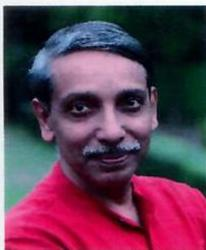
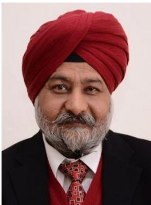
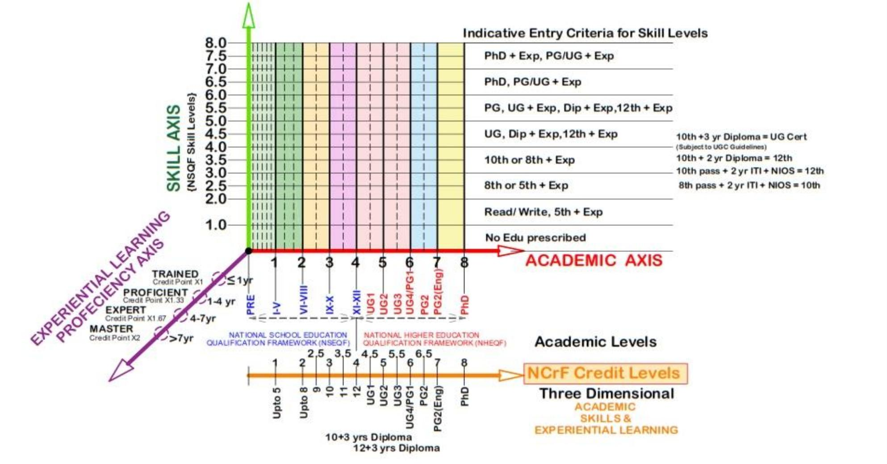

# NATIONAL CREDIT FRAMEWORK

# The Report of the High-Level Inter-Ministerial Committee on National Credit Accumulation & Transfer Framework

September 2022

# Draft Report of National Credit Framework

# Draft Report of National Credit Framework INDEX - NATIONAL CREDIT FRAMEWORK

Foreword . ... 5   
PREFACE .. ... 7   
GLOSSARY.. .... 9   
CONSTITUTION OF COMMITTEE ON CREDIT FRAMEWORK... ..................................................... ..... 10   
THE NATIONAL CREDIT FRAMEWORK 2022:. .. 13   
EXECUTIVE SUMMARY . . 13

1. Section 1: OVERVIEW... . 17

1.1. INTRODUCTION..... . 17

1.2. CREDITS IN INDIAN CONTEXT. . 18

1.2.1. School Education . . 18   
1.2.2. Higher Education.. . 19   
1.2.3. Vocational education and Training/ Skilling .............................. ................. 21

2.1. NEED FOR A NATIONAL CREDIT FRAMEWORK... . 22

2.2. NATIONAL CREDIT FRAMEWORK- ENABLING EFFECTIVE IMPLEMENTATION OF NEP  
2020 AND EDUCATIONAL REFORMS.. . 23

# 2.3. BENEFITS AND ADVANTAGES of NATIONAL CREDIT FRAMEWORK . . 24

2.3.1. Removal of Hard Separation Between General and Vocational education............... 24   
2.3.2. Establishing Equivalence Between General and Vocational education and training/   
skilling 24   
2.3.3. Mobility Between and Within General and Vocational education and training/ skilling 25   
2.3.4. Enabling Provisions for Lifelong Learning Through Multiple Entry and Exit Options 25   
2.3.5. Integration and Mixing of Education, Skilling and Work Experience . . 26   
2.3.6. Enabling Educational Acceleration . . 27

3. SECTION 3: DEVELOPING THE NATIONAL CREDIT FRAMEWORK.. . 28

# 3.1. FORMULATION OF HIGH LEVEL COMMITTEE AND PREVIOUS WORK DONE................. 28

3.2. THE NATIONAL CREDIT FRAMEWORK: THE MOTHER FRAMEWORK AND BASIC

PRINCIPLES... . 29

3.2.1. National Credit Framework (NCrF) to be an Umbrella Framework . . 29   
3.2.2. Defining Credit and Calculating Credit Points . .. 32   
3.2.3. Total Learning Hours in a Year for Calculation of Credit. . 32   
3.2.4. Credit Levels in the National Credit Framework and Level Descriptors... .. 37   
3.2.5. Credits Against Total Notional Hours ... .. 38   
3.2.6. Credits for Additional Learning... .. 39   
3.2.7. Assessment Band.. .. 39   
3.2.8. Major Dimensions of National Credit Framework.. .. 42

# 3.3. ASSIGNMENT OF CREDITS IN NATIONAL CREDIT FRAMEWORK... ...... 45

3.3.1. Credits Assigned by Virtue of Academic Education ..... ... 45 3.3.2. Credits Assigned by Virtue of undergoing Vocational Education and Training/ Skilling 47 3.3.3. Credits Assigned by the Virtue of Relevant Experience/ Proficiency Acquired..... 55

3.4. CREDIT ACCUMULATION AND TRANSFER (OPERATIONALIZATION OF CREDIT

FRAMEWORK).. .. 56

3.4.1. Establishing Equivalence Between General Education and Vocational Education and Training/ Skilling.. .. 57 3.4.2. Establishing Entry Eligibility Through Credit Framework . . 68 3.4.3. Establishing Multiple Entry and Multiple Exit (ME-ME) Pathways... . 69

3.5. CREDIT STORAGE AND REDEMPTION THROUGH ACADEMIC BANK OF CREDIT ......... 70

# Draft Report of National Credit Framework

3.5.1. Mechanism for Credit Storage. ... 70   
3.5.2. Accumulation and Storage... ............................................................................... .. 71   
3.5.3. Verification... ................................................................... ..... 71   
3.5.4. Redemption of Accumulated Credits.. ............................................................................ . 71   
3.5.5. Credit Expiry and Renewal.. ... 72

4. Section 4: SPECIAL PROVISIONS IN NATIONAL CREDIT FRAMEWORK .. . 73

4.1. Provisions for Creditisation of Special Cases of learning: Educational Accelerations 73 4.2. Provision for Recognition for Prior Learning ...... ... 74 4.3. Provision for special events like Hackathon, Olympiads ................. ...... 76

5. BENEFITS OF THE PROPOSED NATIONAL CREDIT FRAMEWORK: REALISING THE VISION OF

NATIONAL EDUCATION POLICY 2020.. . 77

Bibliography/ Sources/ References ........... ..... 80

Annexure I: MULTIPLE ENTRY MULTIPLE EXIT options by UGC & AICTE.. .. 81

# Foreword

Educational opportunities and effective skilling are the driving force of economic growth and social development forany country. India is the world's youngest nation in terms of youth population with a burgeoning economy. The benefits of these strengths can be evenly spread across the country only when the youth is well educated and appropriately skilled. Quality education that meets the need of the industry and enhances employment, therefore, is a pressing need. Emphasizing that there should be no hard separation among curricular and extracurricular or co-curricular or between vocational or academic streams, the National Education Policy (NEP) 2020 stressed upon the need for vocational education through integration and mainstreaming of vocational education with general education. This calls for re-engineering of education system.

The High-Level Committee constituted by the Government to formulate a unified credit accumulation& transfer framework for both vocational and general education,from school education to higher education, has developed “National Credit Framework" encompassing three main components such as credits earned from academic grade, skill programme and relevant experience. This framework will enable establishing equivalence and mobility between general education and vocational education so that lifelong learning,recognition of prior learning,multiple entry and exit,and continuous professional development are encouraged in the system.

Icongratulate the High-Level Committee underthechairmanship of DrN.S.Kalsi, Chairman, NCVETfor taking on this chalenging task of drafting the“National Credit Framework". Iam sure this framework willmake studies and courses more transparent,flexible and provide skilled manpower for India's economy to achieve inclusive and equitable growth.

# Draft Report of National Credit Framework

# PREFACE

National Education Policy (NEP), 2020, envisioned under the dynamic leadership of our Hon’ble Prime Minister, Shri Narendra Modi, is a reflection of the aspiration of the students, teachers and citizens of the country. The NEP is rooted in bhartiyata and is in sync with the culture and heritage of our nation while assimilating global knowledge and perspective.

The National Education Policy 2020, lays emphasis on of making the education more holistic and effective by integration of general (academic) and vocational education while ensuring the vertical and horizontal mobility of students and learners between academic and vocational streams. Built on the foundational pillars of access, equity, quality, affordability and accountability, NEP strives to transform India into a vibrant knowledge society to become a global knowledge superpower (vishwa guru).

To realise the intent and objectives of National Education Policy 2020, the National Credit Framework (NCrF), has been jointly developed by a High Level Committee constituted by the Government with members from UGC, AICTE, NCVET, NIOS, CBSE, NCERT, Department of School Education and Learning & Department of Higher Education, Ministry of Education, DGT, and Ministry of Skill Development under the guidance of Shri Dharmendra Pradhan, Hon’ble Minister of Education and Minister of Skill Development & Entrepreneurship. NCrF is a comprehensive credit framework encompassing elementary, school, higher, and vocational education & training, integrating creditisation of learning on the -axis i.e. academics, vocational skills and Experiential learning including relevant experience and professional levels acquired.

The NCrF provides for creditisation of all learning and assignment, accumulation, storage, transfer & redemption of credits, subject to assessment; removes distinction and establishes academic equivalence between vocational $\&$ general education; enables mobility within & between them, and its operationalising through the Academic Bank of Credits (ABC).

The NCrF relies on a unified approach across the education and skilling frameworks enabling the education and skilling ecosystem in implementing a comprehensive credit-based framework. While catering to multi-disciplinarity and holistic education across sciences, social sciences, arts, humanities and sports, NCrF enables multiple entry $-$ multiple exit (MEME) pathways in general & vocational education; ensures flexibility for students to choose their learning trajectories and career choices, including option for mid-way course correction or modification, as per their talents and interests;

NCrF also recognizes blended and online learning, thus promotes extensive use of technology in teaching and learning, especially in vocational education, training and skilling for removing barriers while also improving access and opportunities for Divyangs.

Implementation of NCrF will promote Internationalization of education by enabling equivalence of courses and qualifications, provisions of credit transfer, and encourage international exchange of students and faculty with foreign universities.

NCrF has provisions for educational acceleration for gifted students with special learning abilities as also for Recognition of Prior Learning for workforce those have acquired the knowledge and skills informally, through family inheritance, work experience, traditional or other methods, thereby allowing them progression and mobility into the formal education and learning ecosystem.

NCrF will enable transformation of India by providing high quality education opportunities integrated with effective skills to reap the demographic dividend making education and skilling truly aspirational.

TheNational Credit Framework (NCrF) isan enabling framework and may not be construed asa regulation. Itempowers,facilitates and allows the stakeholders with the required flexibility forcreating to their specificacademicand skillneeds. It shallactasabroad enabling framework for allregulatory organizations,and autonomous institutions who may, wherever required,notifying their detailed implementation guidelines within this Framework.I am confident that NCrF willbecome a gamechanger by mainstreaming the skill education and Experiential learning including relevant experience and professional levels acquired,making thesean integral partof theeducationsystem thereby ensuring thatthe youth is provided with educational opportunities with quality skills.

Asapart ofthe framework formulation and finalisation process extensive consultations,besides MoEand MSDE，have been made with multiple stakeholders of the education and skill ecosystems,including the presentations and discussions on the contours of National Credit Framework withIIs,,s,s,ERs,Is,Universities,HEs/EngineeringColleges, School Boards,Technical Education Boards,among many others.

Iam thankfultoall the esteemed members of the High-Level Committee Shri Atul Kumar Tiwari, nowSecretary,MinistryofSkillDevelopmentand Entrepreneurship,Shri Manoj Ahuja,thethen Chairman CBSE,ShriVineetJoshi,Additional Secretary,DoHE&DirectorGeneral NTA,Chairman CBSE,Shri.Maneesh Garg,Joint Secretary,DoSEL,MoE,Ms.Nidhi Chhibber,Chairperson CBSE, Prof.M.PPoonia,Vice-Chairman,AICTE,Prof.Rajnish Jain,Secretary,UGC,Prof.(Dr.) aroj Sharma,Chairperson,NIOS,Dr.Dinesh Prasad Saklani,Director,NCERT and Dr Sridhar Srivastava,ofciating Director,NCERT and Dr.Biswajit Saha,Director(Training& Skill Education),CBSE,Member-Secretary of the commitee for workingrelentlessly on this framework,providing theirvaluable inputs,insightsand supportand bringing outthis report.I acknowledge their invaluable contribution in formulation of this framework in such a short timeframe.

This framework would have not been possible without the valuable guidance and unstinted supportofProfJagadesh Kumar,Chairman UGCand Prof.Anil Sahastrabudhe,the then Chairman AICTE.Iwhole heartedly thank them.Iam also thankful for the valuable support of Sh Rajesh Aggarwal,the then Secretary Ministryof Skill Developmentand Entrepreneurship,Sh.Sanjay Murthy,Secretary DepartmentofHigher Education,Smt Anita Karwal,Secretary Departmentof School Educationand Learning,Ministry of Educationand Ministry of Education in bringing out thispolicy.Iwould also liketo thank Dr.Vinita Aggarwal,Dr.NeenaPahuja the Executive Members，Lt Col Gunjan Chowdhary Director，Ms.Sarika Dixit& Mr.Shourya Sangam, consultants at NCVETfor their persistent helpand assistance in preparing this document.

Mybestwishes toallthe stakeholders foreffectiveand effcient implementation ofthismuch awaited framework which will help change the educationand skillinglandscape of the country for not only country's growth but also making education and skilling aspirational and making India the skill capital of the world by our global recognition in the education and skilling domain.

Nirmaljeet Singh Kalsi, Chairperson,NVET

# GLOSSARY

AICTE - All India Institute of Technical Education

CBCS – Choice Based Credit System

CBSE- Central Board of Secondary Education

CITS: Craftsman Instructor Training Scheme

CTS - Craftsman Training Scheme

DGT - Directorate General of Training

HEIs: Higher Education Institutes

MSDE - Ministry of Skill Development and Entrepreneurship

NAC- National Apprenticeship Certificate

NCERT - National Council for Educational Research and Training

NCrF – National Credit Framework

NCVET - National Council for Vocational Education and Training

NEP - National Education Policy

NSEQF- National School Education Qualification Framework

NHEQF - National Higher Education Qualification Framework

NIOS - National Institute of Open Schooling

NSQF - National Skill Qualifications Framework

NTA - National Testing Agency

NTC - National Trade Certificate

SAMVAY - Skill Assessment Matrix for Vocational Advancement of Youth

SDG - Sustainable Development Goals

UGC - University Grants Commission

VET – Vocational Education and Training

The Government of India has approved the constitution of a High-Level Committee, vide order dated $1 8 ^ { \mathrm { t h } }$ November 2021, to develop a National Credit Accumulation & Transfer Framework for both Vocational and General Education. The Credit Framework would enable the integration of academic and vocational domains/components of learning and ensure flexibility and mobility between the two. The composition of the Committee is as follows:

<table><tr><td rowspan=1 colspan=1>1.</td><td rowspan=1 colspan=1>Dr. Nirmaljeet Singh Kalsi, Chairperson, NCVET</td><td rowspan=1 colspan=1>Chairman</td></tr><tr><td rowspan=1 colspan=1>2.</td><td rowspan=1 colspan=1>Shri Atul Kumar Tiwari, Addl Secretary, MSDE</td><td rowspan=1 colspan=1>Member</td></tr><tr><td rowspan=1 colspan=1>3.</td><td rowspan=1 colspan=1>Shri Vineet Joshi Addl Secretary DoHE &amp; Director GeneralNTA, Chairman, CBSE</td><td rowspan=1 colspan=1>Member</td></tr><tr><td rowspan=1 colspan=1>4.</td><td rowspan=1 colspan=1>Shri. Maneesh Garg, Joint Secretary, DoSEL, MoE</td><td rowspan=1 colspan=1>Member</td></tr><tr><td rowspan=1 colspan=1>5.</td><td rowspan=1 colspan=1>Smt. Neelam Shammi Rao, Addl Secretary &amp; DG, DGT, MSDE</td><td rowspan=1 colspan=1>Member</td></tr><tr><td rowspan=1 colspan=1>6.</td><td rowspan=1 colspan=1>Prof. Rajnish Jain, Secretary, UGC</td><td rowspan=1 colspan=1>Member</td></tr><tr><td rowspan=1 colspan=1>7.</td><td rowspan=1 colspan=1> Shri Manoj Ahuja, Chairman, CBSE</td><td rowspan=1 colspan=1>Member</td></tr><tr><td rowspan=1 colspan=1>8.</td><td rowspan=1 colspan=1>Prof. (Dr.) Saroj Sharma, Chairperson, NIOS</td><td rowspan=1 colspan=1>Member</td></tr><tr><td rowspan=1 colspan=1>9.</td><td rowspan=1 colspan=1>Prof. M.P Poonia, Vice- Chairman,AICTE</td><td rowspan=1 colspan=1>Member</td></tr><tr><td rowspan=1 colspan=1>10.</td><td rowspan=1 colspan=1>Dr Sridhar Srivastava, Director, NCERT</td><td rowspan=1 colspan=1>Member</td></tr><tr><td rowspan=1 colspan=1>11.</td><td rowspan=1 colspan=1>Dr. Biswajit Saha, Director (Training &amp; SkillEducation), CBSE</td><td rowspan=1 colspan=1>Member-Secretary</td></tr></table>

# TERMS OF REFERENCE

i. Assign credit value to academic and skill courses taught at various levels

a. School education,   
b. Higher Education,   
c. Skilling Ecosystem, Vocational Training and Education d. Distance/ Blended Learning, etc.

ii. Identify ways of Credit Accumulation for:

a. School Education   
b. Higher Education.   
c. Vocational education and Training

iii. Propose Credit Transfer Model for:

a. Vocational and School Education and vice-versa b. Vocational and Higher Education and vice-versa iv. Establish academic equivalence between Vocational and General Education at all

levels.

v. Develop the unified credit framework for integration of vocational education and training/ skilling into school and higher education in line with the National Education Policy 2020 to enable vertical and horizontal mobility between education and skilling   
vi. Identify the mechanism for accumulation and storage of credits through a Credit Bank   
vii. Any other matter relating to the development and functioning of the unified credit framework

The Final Report has agreement and signature of all the esteemed members of the High level Committee.

# Draft Report of National Credit Framework NATIONALCREDITFRAMEWORK

Wethe undersigned members of the High Level Committee on the National CreditAccumulationand TransferFrameworkfor both Vocationaland General Education constituted by Ministry of Skill Development and Entrepreneurship, Government of India vide orderNo Coord-11/01/2021-P&Cdated $1 8 ^ { \mathrm { m } }$ November 2021,herebysubmitourreport:-

# Manifesting the National Education Policy 2020

To fulfil the vision of National Education Policy 2020, making education more holistic and effective and lay emphasis on the integration of general (academic) education, vocational education and Experiential learning including relevant experience and professional levels acquired, it becomes imperative to establish and formalize a national credit accumulation and transfer system which will integrate both general & vocational education while ensuring mobility of candidates between the two systems.

The National Credit Framework (NCrF) has been jointly developed by UGC, AICTE, NCVET, NIOS, CBSE, NCERT, Ministry of Education, DGT, and Ministry of Skill Development to achieve this vision and intent of NEP. NCrF is a comprehensive framework encompassing elementary, school, higher, and vocational education & training, integrating learning on all dimensions i.e. academics, vocational skills and experiential learning including relevant experience and professional levels acquired.

The National Credit Framework (NCrF) shall be an inclusive umbrella Framework to seamlessly integrate the credits earned through school education, higher education and vocational & skill education. For creditisation and integration of all learning, the National Credit Framework (NCrF) shall encompass the qualification frameworks for higher education, vocational & skill education and school education, namely National Higher Education Qualification Framework (NHEQF), National Skills Qualification Framework (NSQF) and National School Education Qualification Framework (NSEQF) also popularly known as National Curricular Framework (NCF) respectively.

The implementation of NCrF would be a game changer in realising the vision and intent of NEP by removing distinction, ensuring flexibility & mobility and establishing academic equivalence between general and vocational education. Such integration shall open numerous options for further progression of students and inter-mingling of school & higher education with vocational education & Experiential learning including relevant experience and professional levels acquired, to further enable entry and re-entry from vocational stream to general education and vice-versa, thus mainstreaming the vocational education and skilling.

The National Credit Framework (NCrF) provides for broad based, multi-disciplinary, holistic education, allowing imaginative and need based curricular structures and enabling creative combinations of subjects and disciplines. The Framework has been built on the strength of existing regulations, guidelines and qualification frameworks of UGC, AICTE, NCVET, NCERT, CBSE & NIOS so that the options for Multiple Entry-Multiple Exit (ME-ME) are accessible and applicable across the higher education, school education and vocational education.

The National Credit Framework (NCrF) provides for Assignment, Accumulation, Storage, Transfer & Redemption of Credits. The NCrF paves way for multidisciplinary education and empowers students through flexibility in choice of courses for choosing their own learning trajectories and programmes, and thereby choose their paths in life with appropriate career choice, including option for mid-way course corrections, according to their talents and interests. NCrF fully enables the students with opportunities to catch up and re-enter education ecosystem in case they have fallen behind or dropped out at any stage. NCrF also fully supports educational acceleration for students with gifted learning abilities and Recognition of Prior Learning for workforce that has acquired knowledge and skills informally through the traditional family inheritance, work experience or other methods, thereby allowing them progression and mobility into formal education ecosystem.

The total Notional Learning Hours for assignment of credits across school education, higher education and vocational education /skilling have been agreed to be 1200 Hrs per year for which the students/ learners shall be awarded 40 Credits. For the purpose of credit calculations under National Credit Framework (NCrF), 30 notional learning hours will be counted as one Credit. However, the assignment of credits is independent of the education streams, subjects or type of learning, subject to assessment. The students/ learners may take additional courses/ programs/subjects/projects beyond 40 credits to get additional credits for the same.

NCrF recognises no hard separation between different areas of learning, i.e. arts and sciences, vocational and academic streams, curricular and extra-curricular for the purpose of assignment of credits and credit levels. In the true spirit of National Education Policy 2020, the total learning hours can be creditised, subject to assessment, and may include class room teaching/ learning, laboratory work/ innovation labs/ class projects/ assignments/ tutorials; sports and games, yoga, physical activities, performing arts, music, handicraft work, social work, NCC, bag less days; examinations/ class tests/ quizzes/ assessments; vocational education, training and skilling, minor/ major project work/ field visits in skill education as well as on the job training (OJT)/ internship/ apprenticeship/ Experiential learning including relevant experience and professional levels acquired etc. Such an approach would also close the gap in achievement of learning outcomes by shifting the classroom education to competency and learning outcome-based education and learning.

Under the National Credit Framework (NCrF) every learning can be creditised subject to its assessment. Under NCrF, the Credit levels to be assigned across school/ higher/ vocational education/ skilling, (independent of the streams, subjects etc) will be based on the cumulative numbers of years of learning with assessment. For earning credits, the course/ qualification should be qualification framework aligned and approved with a defined NCrF level and clearly describing the desired competency and learning outcome expected. Also the learning outcome shall be assessed after completing the course/ qualification for assignment of credits.

Draft Report of National Credit Framework The assessment is thus mandatory for earning credits for all types of learning and progression to the next assessment band. The Assessment Bands are the stages at which the student/ learner needs to be formally assessed for progression in academic/ vocational/ skilling streams. (e.g. 10th/ 12th board exams, DGT’s assessment and exams for CTS, UG/ PG semester exams). The NCrF Credits for the two courses/ qualifications/ programs may be added to each other and accumulated in ABC if these are earned in the same assessment band, subject to the guidelines of the respective regulators.

The NCrF credit levels for school education are upto level 4, while for higher education from Level 4.5. to level 8 [Under Graduate Levels 4.5, 5.0, 5.5 & 6.0, Post Graduate Levels 6.0, 6.5 & 7.0, and PhD Level 8] and for vocational education & training level 1 to level 8.

The total Credit Points earned by the student could be obtained by multiplying the credits earned with the NCrF Level at which the credits have been earned. The credit points may be redeemed as per the guidelines of Academic Bank of Credit (ABC) for entry or admission in school, higher, technical or vocational education programs/ courses at multiple levels enabling horizontal and vertical mobility with various lateral entry options.

In addition to the credits for higher education, the Academic Bank of Credit (ABC) shall also be expanded for credits earned through school education, vocational education and skilling, apprenticeships, internships, project work etc. ABC could digitally store the academic and other credits earned from recognized institutions so that credits could be redeemed and the relevant award granted taking into account the credits earned at various NCrF levels. The credits may also be linked to Digi locker for easy verification and portability.

The National Credit Framework (NCrF) also enables creditisation of Experiential learning including relevant experience and professional levels acquired, based on the weightage for relevant experience and proficiency levels achieved, subject to assessment.

Assignment of Credits has been enabled for online, digital and blended learning in vocational education and skilling to expand the open /distance learning options and to promote extensive use of technology in learning & skilling. This would help in overcoming the constraints of physical infrastructure & scalability while enhancing access, equity, and affordability and ensuring quality and accountability. The blended learning option shall also enhance accessibility of learning in Indian language for $9 0 \%$ non-English medium students as well as for Divyangs.

National Credit Framework (NCrF) will encourage Internationalization of education through credit transfer provisions thus enabling wider international equivalence, recognition and acceptance of Indian education and skilling by other countries, promoting exchange with foreign universities and institutions.

Thus, there would be only one credit Framework for higher education, school education and skill education, namely the National Credit Framework (NCrF) which would be the mother framework document notified for integrating the creditisation of learning in

# Draft Report of National Credit Framework

various dimensions of academics, skilling and experiential learning including relevant experience and professional levels acquired and only single credit system would be operationalised through Academic Bank of Credits (ABC). The qualification frameworks for school, higher education and skills would be addendum to NCrF and aligned with it. The basic principles and provisions of National Credit Framework (NCrF) would be applicable to all the qualification frameworks.

National Credit Framework (NCrF) shall act as a broad enabling framework for all regulatory organizations (UGC, AICTE, NCVET, NCERT etc.), and autonomous institutions, including Universities, INIs, CBSE, NIOS, State School Boards, State Technical Education Boards, etc. who may, wherever required, notifying their detailed implementation guidelines within this Framework. The NCrF empowers institutions and enables them with the required flexibility for catering to their specific academic requirements for creating imaginative and flexible curricular structures, creative combinations of disciplines and other special needs.

Thus, there would be only one credit framework for higher education, school education and skill education, namely the National Credit Framework (NCrF) which would be the mother framework document notified for integrating the creditisation of learning in various dimensions of academics, skilling and Experiential learning including relevant experience and professional levels acquired and only single credit system would be operationalised through Academic Bank of Credits (ABC). The qualification frameworks for school, higher education and skills would be part of and addendum to NCrF. The basic principles and provisions of National Credit Framework (NCrF) would be applicable to all the qualification frameworks (NHEQF and NSQF are already aligned with NCrF).

Thus the NCrF shall not only enable effective implementation of National Education Policy 2020 through integration of various policy endeavours under general education and vocational education, but will also be a game changer to establish a benchmark for holistic education and learning integrated with skills, by removal of barriers, infusion of flexibility and creating lifelong learning opportunities. NCrF will enable transformation of India by providing high quality education opportunities integrated with effective skills to reap the demographic dividend making education and skilling truly aspirational.

# 1. Section 1: OVERVIEW

# 1.1. INTRODUCTION

Education is fundamental for achieving full human potential, developing an equitable society and promoting national development. Providing universal access to quality education is the key to India’s continued ascent and leadership on the global stage in terms of economic growth, social justice & equality, scientific advancement, national integration, and cultural preservation. Universal high-quality education opportunities integrated with effective skills is the best way forward for developing and maximizing our country's rich talents and resources for the good of the individual, the society, the country, and the world.

Today, India is one of the youngest nations in the world with more than $6 2 \%$ of its population in the working-age group (15-59 years), and over $5 4 \%$ of its total population below 25 years of age. Its population pyramid is expected to bulge across the 15–59 age groups over the next decade. This is a huge opportunity and at the same time poses a formidable challenge. To reap this demographic dividend India needs to equip its workforce with knowledge and employable skills so that they can contribute substantively to the economic growth and development of the country. Our ability to provide high-quality educational opportunities to the youth will determine the future of our country.

Not only the educational opportunities but effective skilling is also the driving force of economic growth and social development for any country. Countries with higher levels and standards of skills adjust more effectively to the challenges and opportunities in domestic and international job markets. The United Nations in the epic summit of 2015 on ‘Transforming our World: the 2030 Agenda for Sustainable Development’ defined 17 Sustainable Development Goals (SDGs) which places emphasis on ‘skill’ apart from the ‘basic necessities’ for people across the world. The SDGs have defined skill development requirement as – ‘to promote sustained, inclusive and sustainable economic growth, full and productive employment and decent work for all’. The SDGs report 2018 by the United Nations shows that $4 2 \%$ of the world population is young with a global youth unemployment rate of $1 3 \%$ , which can be brought down drastically by skilling the youth. The global education development agenda reflected in the Goal 4 (SDG4) of the 2030 Agenda for Sustainable Development, adopted by India in 2015 seeks to ‘ensure inclusive and equitable quality education and promote lifelong learning opportunities for all’ by 2030. Such a lofty goal will require the entire education system to be reconfigured to support and foster learning, so that all of the critical targets and goals (SDGs) of the 2030 Agenda for Sustainable Development can be achieved. Efforts made in this direction should meet the needs of the all sectors of economy including primary, industry and the service sectors. Such efforts should also be learner centric to make the entire skilling movement aspirational. Skill training needs to be considered as a complementary and essential part of mainstream education, rather than being regarded as a secondary alternative, as also envisaged under the National Education Policy (NEP), 2020.

# Draft Report of National Credit Framework

This National Education Policy, 2020 envisions an education system rooted in Indian ethos that contributes directly to transforming India, into an equitable and vibrant knowledge society, by providing high-quality education to all and thereby making India a global knowledge superpower. The Policy envisages that the curriculum and pedagogy of our institutions must develop among the students a deep sense of respect towards the Fundamental Duties and Constitutional values, bonding with one’s country and a conscious awareness of one’s roles and responsibilities in a changing world.

The vision of this policy is to instil among the learners a deep-rooted pride in being Indian, not only in thought, but also in spirit, intellect, and deeds, as well as to develop knowledge, skills, values, and dispositions that support responsible commitment to human rights, sustainable development & living, and global well-being, thereby reflecting a truly global citizen. Education with effective skilling is a great leveller and is the best tool for achieving economic and social mobility, inclusion, and equality. These elements must be incorporated taking into account the local and global needs of the country, and with a respect for and deference to its rich diversity and culture.

The National Education Policy seeks to provide to all students, irrespective of their place of residence, a quality education system, with particular focus on historically marginalized, disadvantaged, and under-represented groups. Instilling knowledge of India and its varied social, cultural, and technological needs, its inimitable artistic, language, and knowledge traditions, and its strong ethics in India’s young people is considered critical for purposes of national pride, self-confidence, self-knowledge, cooperation, and integration. This may be achieved by a number of factors and an important one amongst these being establishing equivalence and mobility between general education and vocational education and training/ skilling so that lifelong learning, recognition of prior learning, multiple entry and exit, and continuous professional development is encouraged in the system.

# 1.2. CREDITS IN INDIAN CONTEXT

At present, there is no established credit mechanism for regular school education. However, under the open schooling system, the National Institute of Open Schooling (NIOS) follows the following credit system:

i. Each subject is assigned 240 hours for self-study. Total 5 subjects are required at the Secondary and Senior Secondary level which makes it of 1200 hours and 40 credits in one year   
ii. 1 credit is equivalent to 30 hours of total study i.e. each subject is of 8 credits.

# I. CHOICE BASED CREDIT SYSTEM (CBCS) BY UGC

Under the CBCS system, the requirement for awarding a degree or diploma or certificate is prescribed in terms of number of credits to be earned by the students. This framework is being implemented in several universities across States in India. The main highlights of CBCS are as below:

 The CBCS provides flexibility in designing curriculum and assigning credits based on the course content and learning hours. The CBCS provides for a system wherein students can take courses of their choice, learn at their own pace, undergo additional courses and acquire more than the required credits, and adopt an interdisciplinary approach to learning. CBCS also provides opportunity for vertical mobility to students from a bachelor’s degree programme to masters and research degree programmes.

The detailed Guidelines for Choice Based Credit System is available at https://ugc.ac.in/pdfnews/8023719_Guidelines-for-CBCS.pdf

# II. SKILL ASSESSMENT MATRIX FOR VOCATIONAL ADVANCEMENT OF YOUTH (SAMVAY) BY AICTE

The scheme on Skill Assessment Matrix for Vocational Advancement of Youth (SAMVAY) is a credit framework for skill based vocational courses which was launched by MHRD on 11th November, 2014. The SAMVAY defines the rules for credit allotment and follows the NSQF regulatory framework while stating the credit assessment requirements for skills. The skill based courses, under SAMVAY, generally, have both the skills and general education components.

The following formula may be used for the credit calculation in general education component of the courses:

i. General Education credit refers to a unit by which the course work is measured. It determines the number of hours of instructions required per week. One credit is equivalent to one hour of teaching [lecture or tutorial] or two hours of practical work/field work per week. Accordingly, one Credit would mean equivalent of 14-15 hrs of theory or 28 - 30 hrs of workshop/ lab work.   
ii. One Credit is equivalent to 14-15 periods of 60 minutes each, for theory, or 28-30 periods of 60 minutes for workshop/labs and tutorials;   
iii. For internship/field work, the credit weightage for equivalent hours is $5 0 \%$ of that for lectures/tutorials;

# Draft Report of National Credit Framework

iv. For self-learning, based on e-content or otherwise, the credit weightage for equivalent hours of study is $5 0 \%$ or less of that for lectures/tutorials.

For the ease of calculation, the break -up of credit wrt general education component is as in the table below:

Table1: Break-Up of Credits   

<table><tr><td rowspan=1 colspan=1>Theory1 Credit = 15 hours</td><td rowspan=1 colspan=1>Practical1 Credit = 30 hours</td><td rowspan=1 colspan=1>Experiential learningincluding relevantexperience andprofessional levels acquired1 Credit = 40-45 hours</td></tr><tr><td rowspan=1 colspan=1>·In each theory class,a newconcept is taught and thestudent     is     learningsomething new throughoutthe class.·Italsoinvolvesself-learning.</td><td rowspan=1 colspan=1>· The practical is dependenton theory and experimentsperformed are based onconcepts learned in theoryclass.·Repetition of an alreadylearned               concept.Observationsaretakenagain and again</td><td rowspan=1 colspan=1>Experiential           learningincluding               relevantexperience and professionallevels acquired activities likefield visits,industrial visits,etc carry lesser weightagebecauseitisjustanobservation             and/orapplicationof conceptslearned in theory.</td></tr></table>

As per SAMVAY, the credits regarding skill component may be awarded in terms of NSQF level certification which will have more than $5 0 \%$ weightage of total credits of the course based on the assessment in a manner prescribed by the concerned regulatory body.

The latest SAMVAY guidelines are available at : SAMVAY_1_.pdf (aicte-india.org)

# III. UGC GUIDELINES FOR PROVIDING SKILL-BASED EDUCATION UNDER NATIONAL SKILL QUALIFICATION FRAMEWORK

Under these guidelines, the skill-based programmes shall have a mix of general and skill components in which $3 0 { - } 4 0 \%$ of the total content shall be of general nature including language courses while the remaining $6 0 \%$ (extendable up to $7 0 \%$ ) of the content shall be on skill development. In such programs the following formula is used for conversion of time into credit hours.:

a. Skill Component: The skill component should have a minimum of $6 0 \%$ (extendable up to a maximum of $7 0 \%$ ) of the total credits. The skill component will include practical classes in laboratories / workshops, internships, apprenticeships and any other forms of hands on training.

# Draft Report of National Credit Framework

b. General Education Component: The balance credits of the program i.e. $3 0 { - } 4 0 \%$ are of general component. This will include curricula which are supportive to the core trade in addition to communication skills, soft skills, digital skills, critical thinking, problem solving skills, environmental studies and value education.

The detailed guidelines can be accessed at 6556003_Guidelines-for-providing-Skill-BasedEducation-under-NSQF.pdf (ugc.ac.in) and summary document at NSQF New Guidelines.pdf (ugc.ac.in)

# IV. CREDITS STRUCTURE FOR AUTONOMOUS INSTITUTIONS LIKE IIT/IIMS

The autonomous institutions like IIT/IIMs in India are independent and each institute implements its unique credit system. Education at such institute/s is generally organized around the semester-based credit system of study. There is a process of continuous evaluation of a student’s performance/progress and flexibility is allowed to students to progress at an optimum pace suited to their ability or convenience, subject to fulfilling minimum requirements for continuation and within the maximum allowable period for completion of a degree.

# 1.2.3. Vocational education and Training/ Skilling

# I. NATIONAL SKILLS QUALIFICATION FRAMEWORK (NSQF)

The National Skills Qualification Framework (NSQF) was notified on 27th December 2013, by the Ministry of Finance, pursuant to the decision of the Cabinet Committee on Skill Development held on 19th December 2013.

NSQF is a national competency-based skill framework that provides for multiple pathways, horizontal as well as vertical to facilitate mobility both within vocational education and training/ skilling and between vocational education and training/ skilling and general education thus linking one level of learning to another higher level. The NSQF is also a quality assurance framework as it organizes qualifications in a series of 8 levels based on professional knowledge, professional skills, core skills and responsibilities, in the increasing order of complexity and competency. These levels are defined in terms of learning outcomes which are an explicit description of what a learner should know, understand and be able to do as a result of learning, regardless of whether these competencies were acquired through formal, non-formal or informal learning. This enables learners to acquire desired competency levels, transit to the job market, and at an opportune time, return for acquiring skills as required to further upgrade their competencies.

The NSQF is based on an outcome based approach wherein each level is defined and described in terms of competency levels that are to be achieved, thereby enabling clear provisions for mobility (both vertical & horizontal) and making progression pathways transparent for students, institutions and employers. The NSQF has resulted in development of quality qualifications applicable both in school education and higher education and has

# Draft Report of National Credit Framework

also helped in alignment of Indian qualifications to international qualifications through existing qualification frameworks of other countries. The NSQF facilitates the awarding of credit and supports credit transfer and progression routes within the Indian Education and Training system.

NSQF is anchored in National Council for Vocational Education and Training and is implemented through national Skills Qualification Committee (NSQC) which is set up as a permanent secretariat in NCVET and has from Central Ministries, NITI Aayog, regulators like AICTE, UGC and CBSE, State Skill Development Missions, Awarding bodies like the Directorate General of Training (DGT), Sector Skill Councils (SSCs) and select industry representatives.

The detailed NSQF notification can be accessed at https://www.ncvet.gov.in/nsqfnotification

# 2. SECTION 2: GENESIS OF A NATIONAL CREDIT FRAMEWORK

# 2.1. NEED FOR A NATIONAL CREDIT FRAMEWORK

The National Education Policy 2020, lays emphasis on the integration of the general (academic) education and vocational education & training/skilling with provision for seamless horizontal and vertical mobility between the two for lifelong learning. Such integration shall enable desired reforms in the education and skilling systems. In addition, this integration of vocational education and training/ skilling programmes into mainstream education at all levels, as is highlighted in NEP 2020, will lead to removal of distinction between general and vocational education and training/ skilling while at the same time enable establishing academic equivalence between the two which is the most important way of making the vocational education and training/ skilling aspirational’ for the youth. The integration would also lead to emphasizing the dignity of labour and importance of various vocations.

To fulfil the vision of National Education Policy 2020, making education more holistic and effective and to lay the emphasis on the integration of general (academic) education and vocational education including Experiential learning including relevant experience and professional levels acquired it becomes imperative to establish and formalize a national credit accumulation and transfer system which will integrate both general & vocational education while ensuring mobility of candidates between the two systems.

The detailed National Education Policy is available at https://ncert.nic.in/pdf/nep//NEP_2020.pdf

# Draft Report of National Credit Framework 2.2. NATIONAL CREDIT FRAMEWORK- ENABLING EFFECTIVE IMPLEMENTATION OF NEP 2020 AND EDUCATIONAL REFORMS

The National Education Policy (NEP) 2020, is the first education policy of the 21st century and aims to address the many growing developmental imperatives of our country. The NEP proposes the revision and revamping of all aspects of the education structure, including its regulation and governance, to create a new system that is aligned with the aspirational goals of 21st century education, including Sustainable Development Goal (SDG), while building upon India’s heritage, traditions and value systems. The National Education Policy lays particular emphasis on the development of the creative potential of each individual. It is based on the principle that education must develop not only cognitive capacities - the ‘foundational capacities’ of literacy & numeracy and ‘higher-order’ cognitive capacities, such as critical thinking and problem solving but also social, ethical, and emotional capacities and dispositions. Built on the foundational pillars of Access, Equity, Quality, Affordability and Accountability, the policy aims to transform India into a vibrant knowledge society and global knowledge superpower by making both school and college education more holistic, flexible and multidisciplinary.

NEP 2020 proposes that curriculum content will be reduced in all subject to its core essentials, to make space for critical thinking and more holistic, inquiry-based, discoverybased, discussion-based, and analysis based learning. The mandated content will focus on key concepts, ideas, applications, and problem solving. Teaching and learning will be conducted in a more interactive manner; questions will be encouraged, and classroom sessions will regularly contain more fun, creative, collaborative, and exploratory activities for students for deeper and more Experiential learning including relevant experience and professional levels acquired. In all stages of education, Experiential learning including relevant experience and professional levels acquired will be adopted, including hands-on learning, arts-integrated and sports-integrated education, story-telling-based pedagogy, among others, as standard pedagogy within each subject, and with explorations of relations among different subjects. To close the gap in achievement of learning outcomes, classroom transactions will shift, towards competency-based learning and education.

The NEP 2020 while highlighting the importance of flexible learning states that ‘imaginative and flexible curricular structures will enable creative combinations of disciplines for study and would offer multiple entry and exit points and thus, removes the currently prevalent rigid boundaries. These would create new possibilities for students to choose and learn the subject(s) of their choice, while changing the educational institute as per their preference, convenience, or necessity’. NEP shall also help to achieve universal participation in educational institutes by carefully tracking students, as well as their learning levels, in order to ensure that they (a) are enrolled in and attending educational institutes, and (b) have suitable opportunities to catch up and re-enter educational institutes in case they have fallen behind or dropped out.

# Draft Report of National Credit Framework

NEP 2020, highlights the need for multidisciplinary study from the secondary education stage. It lays particular emphasis on empowering students through flexibility in course choices so that the learners could choose their learning trajectories and programmes, and thereby choose their paths in life according to their talents and interests. The NEP 2020 also proposes to establish an ‘Academic Bank of Credit’ (ABC) which could digitally store the academic credits earned from recognized institutions so that the degrees can be awarded taking into account credits earned.

Given the premise, a well-defined and robust credit framework will be instrumental in enabling seamless integration and coordination across institutions and all stages of education and skilling as envisioned in NEP. The credit framework will enable broad based, multi-disciplinary, holistic education with flexible curricula, creative combinations of subjects, integration of vocational education and training/ skilling and multiple entry and exit points with appropriate certification.

# 2.3. BENEFITS AND ADVANTAGES of NATIONAL CREDIT FRAMEWORK

# 2.3.1. Removal of Hard Separation Between General and Vocational education

NEP 2020 highlights that, holistic development and a wide choice of subjects and courses should be the new distinguishing feature of secondary school education and there should be no hard separation among ‘curricular’, ‘extracurricular’, or ‘co-curricular’, among ‘arts’, ‘humanities’, and ‘sciences’, or between ‘vocational’ or ‘academic’ streams.

Learning is a process that takes into account multi-dimensions of cognitive, emotional, social and physical learning as well. To ensure holistic learning of students, it is desirable that they are allowed to choose subjects according to their interests irrespective of the nature of course (academic or vocational). The educational institutes are meant to prepare students for handling life challenges and upheavals and it is only through this flexibility of choice with a range of elective subjects available that will help learner/students make more informed career choices.

The proposed credit system will take into account the learning hours put in by a learner irrespective of the stream of education (general and vocational).

# 2.3.2. Establishing Equivalence Between General and Vocational education and training/ skilling

Equivalency, in general, determines the level of education and number of years of study completed along with the upward progression in accordance with candidate’s field of study. By equivalence, it is understood that the evaluation of a curriculum followed by the holder of the educational award (certificate/ diploma etc.) and its compatibility with the national education system in terms of the learning outcomes and the gained competencies are aligned to other curriculums and therefore considered at parity.

# Draft Report of National Credit Framework

In order to establish such equivalence, it is important that each program within general education and vocational education and training/ skilling has a measurable criteria including the outcomes and competencies backed by proper assessment which is possible only through a robust credit framework. Such framework should enable assignment of a measurable criteria for both general education and vocational education and training/ skilling with due emphasis on the content of the study, duration and achievement of requisite competencies.

The credit framework shall also allow for identifying measurable outcomes through a welldefined assessment process in order to bring equivalence of a vocational education and skilling program with general education programs with or without any additional academic learning. It will remove the need for equivalence certification for academic programs that meet the NCrF requirements and facilitate interoperability, mobility and transfer of students between schools, boards, colleges and universities, empowering greater choice and means for students to pursue knowledge and skills of their interests, aptitude and circumstances.

# 2.3.3. Mobility Between and Within General and Vocational education and training/ skilling

One of the major advantages of the national credit framework will be to enable establishment of eligibility criteria for various qualifications being implemented both in general education and vocational education and training/ skilling in terms of accumulated credit points at certain credit levels. These credit points can be used to determine the eligibility for taking admission in various programs at multiple levels, subject to fulfilment of the broad principles laid down under National Credit Framework (NCrF) and the acceptance of the credit points by the concerned agencies. This mobility, will be an outcome of the equivalence that is established between general and vocational education and training/ skilling based on the criterion laid by NCrF without the need for further certification of equivalence of academic qualifications of students.

# 2.3.4. Enabling Provisions for Lifelong Learning Through Multiple Entry and Exit Options

Flexible learning is important to choose one’s learning pathway leading to the award of certificate, diploma, and degree. There are occasions when learners pursue alternative schooling, home-schooling, online schooling or have to give up their education mid-way for various reasons. The national credit framework will act as an enabler in this regard and regulators shall be required to define the entry and exit criteria of the programs being offered by them. This would also help in fragmenting an entire program into smaller units with due acknowledgement being given to each unit of learning.

The credit transfer mechanism will also enable a student to enter, exit and re-enter the educational ecosystem both general and vocational at any point of time. In such cases due weightage is proposed to be given to work experience gained or any other training

# Draft Report of National Credit Framework

undertaken by the learner, in offline or online mode, subject to assessment. The proposed equivalence by virtue of this national credit framework enables a learner (whether from a general education background or from a vocational education and training/ skilling background) to accumulate necessary credits that will allow him/her to re-enter the mainstream education. The ME-ME is possible when the entire education ecosystem especially in case of higher education is divided into yearly independent modules.

The multiple entry and exit option or the lifelong learning will serve the following objectives:

Remove rigid boundaries and facilitate new possibilities for learners. Recognises no hard separation between different areas of learning, i.e. arts and sciences, vocational and academic streams, curricular and extra-curricular for the purpose of assignment of credits and credit levels.   
 Offer creative combinations of disciplines of study that would enable multiple entry and exit points.   
 Offer flexibility in curriculum and novel course options to students in addition to discipline specific specializations.   
 Offers flexibility in choice of courses to the students for choosing their own learning trajectories and programmes, and thereby choose their paths in life with appropriate career choice, including option for mid-way course corrections, according to their talents and interests   
 every type of learning can be creditised subject to its assessment. Also enables creditisation of Experiential learning including relevant experience and professional levels acquired, based on the weightage for relevant experience and proficiency levels achieved, subject to assessment.   
 Enable credit accumulation and transfer along with provision of evaluation.   
 Validation of non-formal and informal learning (like alternative/ home/open/ online/distance learning from primary education to PhD) for the award of a certificates, diploma, degree and encourage lifelong learning; and   
 Facilitate encashing credits earned against a qualification/ degree when the learner resumes his/her programmes of study.

# 2.3.5. Integration and Mixing of Education, Skilling and Work Experience

The proposed credit framework provides for a comprehensive and practical approach to include all dimensions learning i.e. academic education, skilling and experiential learning including relevant experience and professional levels acquired. Such seamless mixing of Education, Skilling and Work Experience would enable a student/learner take full benefit of the option of Multiple Entry-Multiple Exit wherein, the student exits an academic program, undertakes a skill based training followed by a relevant work experience, acquires corresponding credits and then returns back for further education/ higher education.

This also enables a student/learner to get benefit of all kinds of learning whether acquired from academic education, vocational education & training/skilling or through Experiential

# Draft Report of National Credit Framework

learning including relevant experience and professional levels acquired by engaging in a work place.

# 2.3.6. Enabling Educational Acceleration

This framework will also aim to address the educational acceleration of gifted students which is when students move through traditional curriculum at rates faster than normal pace and includes grade/class skipping, early entrance to school or college and/ or subject based acceleration.

Within the broad principles of NCrF, the regulator may define the specific modalities for catering to such gifted students, subject to defining special assessment criteria. Such an approach may also be extended and special provisions must be enabled for Hackathons, Olympiads and students showing exemplary performance in Sports, Fine Arts and other activities. The NCrF also envisions to be a competency framework which shall, in addition to the established processes of formal education and certification, shall also enable the gifted learners with exceptional learning abilities/ capabilities/ competencies to move up the education and skilling ladder without going through the prescribed established formal education / learning hours by assessing the learning outcomes for assignment of credits and the credit levels. However, the such specialised assessment methods have to be very strict, objective, above board and adhere to high-standard so as to keep the credibility of the NCrF intact.

# Draft Report of National Credit Framework 3. SECTION 3: DEVELOPING THE NATIONAL CREDIT FRAMEWORK

# 3.1. FORMULATION OF HIGH LEVEL COMMITTEE AND PREVIOUS WORK DONE

In order to fulfil the vision of NEP, 2020 and to facilitate its effective implementation, it was felt that it is important to formulate a comprehensive framework which caters to both General Education and Vocational Education and Training/ Skilling and also seamlessly aligns and integrates them. This was further emphasized upon by the Hon’ble Minister MSDE and MoE who suggested that the credit frameworks made in silos will not be conducive to address the challenges existing in the entire educational and skilling ecosystem and hence it is imperative that a national credit framework be developed across academics (school education, higher education) and vocational education & skilling.

Accordingly, a High-Level Committee, with well-defined ToRs was constituted by MSDE vide Order dated $1 8 ^ { \mathrm { t h } }$ November 2021, to develop a National Credit Accumulation and Transfer Framework for both General and Vocational Education and Training/ skilling. This framework should enable integration of academic and vocational domains of learning and ensure flexibility and mobility between the two. The Committee had representation from heads/ senior officials of Ministry of Education (including school and higher education), UGC, AICTE, NCERT, NIOS, CBSE, Ministry of Skill Development and Entrepreneurship (MSDE), NCVET and DGT. The committee was to be Chaired by Dr. Nirmaljeet Singh Kalsi, IAS Retd., Chairperson, National Council of Vocational Education and Training (NCVET).

The ToR of the Committee and scope is also detailed below:

To formulate a framework for allocation of credits to every component of learning i.e. theory, practical, extracurricular, and experiential for general as well as vocational education and training/ skilling, to facilitate mobility within VET and from VET to general education. This framework is envisaged to cater to the following specific objectives:

i. To define credit, components of credit and corresponding credit value   
ii. To devise a formula for calculating the credit/s for School Education, Higher Education, and VET.   
iii. To formulate a framework for credit accumulation for School Education, Higher Education, and VET.   
iv. To formulate a framework for credit transfer for VET & School Education, and viceversa; and VET & Higher Education, and vice-versa.

v. Establish Academic Equivalence:

 Between General Education and Vocational (both for School and Higher Education)   
 Within Vocational education and training/ skilling

vi. Identify the mechanism for accumulation, storage, and redemption of credit through Credit Bank

# 3.2. THE NATIONAL CREDIT FRAMEWORK: THE MOTHER FRAMEWORK AND BASIC PRINCIPLES

The National Credit Framework (NCrF) is a comprehensive framework encompassing elementary, school, higher, and vocational education & training, integrating the learning on three-axis i.e. academics, vocational skills and Experiential learning including relevant experience and professional levels acquired which has been jointly developed by UGC, AICTE, NCVET, NIOS, CBSE, NCERT, Ministry of Education, DGT, and Ministry of Skill Development.

The NCrF has been build and developed on the existing regulations guidelines and qualification frameworks of UGC, AICTE, NCVET, NCERT & NIOS so that the options for Multiple Entry-Multiple Exit (ME-ME) are accessible and applicable across the higher education, school education and vocational education.

The National Higher Education Qualifications Framework (NHEQF) has been formulated by UGC to achieve the objectives of NEP with detailed level descriptors and learning outcomes. The NHEQF and National Skills Qualifications Framework (NSQF) are in sync with each other to ease the integration of vocational education into higher education. The National Credit Framework (NCrF) seamlessly integrates higher education and vocational education and is totally aligned with the NHEQF and NSQF while also integrating school education [National School Education Qualifications Framework (NSEQF)] in continuum. Till now there was no credit framework in place for school education.

The National Credit Framework (NCrF) is the mother framework which enables seamless integration and coordination across regulators and institutions to enable broad based, multi-disciplinary, holistic education across sciences, social sciences, arts, humanities and sports, allows imaginative and flexible curricular structures, enables creative combinations of disciplines and integration of vocational education & skilling into academics with multiple entry and exit options.

# 3.2.1. National Credit Framework (NCrF) to be an Umbrella Framework

The National Credit Framework (NCrF) shall be an inclusive umbrella framework to integrate the credits earned through school education, higher education and vocational & skill education. It shall also act as umbrella framework to cater to the needs of all HEIs/ institutions including the autonomous institutions and institutes of National Importance including IITs, IIMs, IIITs, IISERs, and NITs as these institutions may also take the advantage of NCrF. Moreover, for creditisation and integration of all learning, the National Credit Framework (NCrF) shall encompass the qualification frameworks for higher education, vocational & skill education and school education, namely National Higher Education Qualification Framework (NHEQF), National Skills Qualification Framework (NSQF) and National School Education Qualification Framework (NSEQF) respectively.

Accordingly, the integration of all qualification frameworks into NCrF document has been discussed and deliberated at various levels. After detailed deliberations, it has been decided

# Draft Report of National Credit Framework

that the National Credit Framework (NCrF) will be the mother document integrating the credits in the dimensions of academics, skilling and also the experiential learning including relevant experience and professional levels acquired.

Thus, there would be only one credit framework for higher education, school education and skill education, namely the National Credit Framework (NCrF) which would be the mother framework document for integrating the creditisation of learning in dimensions of academics, skilling and Experiential learning including relevant experience and professional levels acquired and only single credit system would be operationalised through Academic Bank of Credits (ABC). The qualification frameworks for school, higher education and skills would be addendum to NCrF and aligned with it. The basic principles and provisions of National Credit Framework (NCrF) would apply to all the qualification frameworks (NHEQF and NSQF are already aligned with NCrF), particularly to the following aspects:

a. Provision for creditisation of all types of learnings; Assignments of Credit levels for all learnings for seamless integration,   
b. Provision for integration of learning in all dimensions of academics and skilling along with experiential learning including relevant experience and professional levels acquired;   
c. Assignment of one single Credit levels i.e. NCrF Credits Levels applicable across all qualification frameworks; no other separate Credit levels to be assigned by any stakeholders;   
d. Assignment, Accumulation, Storage, Transfer & Redemption of Credits. Assignment of credits to be independent of the streams, subjects or any learning, of course subject to assessment;   
e. Assignment of Credits also for online, digital and blended learning;   
f. Credit system to be operationalised through Academic Bank of Credits (ABC);   
g. The total Notional Learning Hours for assignment of credits to be uniform across school education, higher education and vocational education & training/skilling;   
h. The assessment is mandatory for earning credits.   
i. Academic equivalence of vocational education and skilling programmes;   
j. Multiple entry and exit options; ensuring horizontal and vertical mobility;   
k. Provision of multi-disciplinary and holistic education across sciences, social sciences, arts, humanities and sports;   
l. No hard separation between different areas of learning, i.e. arts and sciences, vocational and academic streams, curricular and extra-curricular for the purpose of assignment of credits and credit levels;   
m. Allow imaginative and flexible curricular structures, enables creative combinations of disciplines; redesigning the curriculum and pedagogy to not only capture the emerging technology but also include heritage & traditional knowledge to ensure education is relatable, relevant, interesting, and effective for students.

Draft Report of National Credit Framework n. Provision for integration of vocational education & skilling into academic education at all levels; o. Empowerment of students for flexibility in choice of courses/choosing their own learning trajectories and programme. Option for mid-way course corrections; p. Provision for Recognition of Prior Learning, and NCrF credit levels and credit assignment for the same for main-streaming the learners who are out of formal education and skilling ecosystem. q. Supports educational acceleration for students with gifted learning abilities; r. Provision for RPL with or without upskilling

However, the credits are to be integrated from the different qualification frameworks i.e. school education (NSEQF), higher education including technical education (NHEQF) as well as vocational education, training & skilling (NSQF). A qualifications framework is a formalized structure in which learning level descriptors and qualifications are used in order to define and understand learning outcomes. Therefore, these Qualification Frameworks would be necessary to be maintained, inter-alia, for the following purposes for implementation of the intent of National Education Policy (NEP) 2020 as also for the operationalisation of the National Credit Framework (NCrF) by the school education, higher education and vocational education & skilling:

a. The curricular structure for accreditation/ approval of qualifications;   
b. Planning and delivery of education/ skilling programmes;   
c. Developing, designing of curriculum, courses, qualifications;   
d. Developing syllabus, content, pedagogy, teaching and learning resources;   
e. Information about the broad equivalence of qualifications;   
f. Defining Learning outcomes, which the learner must possess, (regardless of whether they were acquired through formal, non-formal or informal learning);   
g. The level descriptors for school education, higher education and vocational education & skilling. These levels are defined in terms of learning outcomes;   
h. Defining entry criteria and academic equivalence;   
i. Nomenclature and award of certificates, diplomas and degrees.

The National Credit Framework (NCrF) shall act as a broad enabling framework for all regulatory organizations (UGC, AICTE, NCVET, NCERT etc.), and autonomous institutions, including Universities, INIs, CBSE, NIOS, State School Boards, State Technical Education Boards, etc. who may, wherever required, notifying their detailed implementation guidelines within this Framework. Thus, the National Credit Framework (NCrF) is an enabling framework which empowers institutions and enables them with the required flexibility for catering to their specific academic requirements for creating imaginative and flexible curricular structures, creative combinations of disciplines and other special needs.

Draft Report of National Credit Framework While the NCrF lays down broad framework and enabling provisions and basic guidelines for achieving the intent of NEP has been included in this document, the responsibility of implementing the provisions defined in the NCrF through detailed operational guidelines viz. Multiple Entry, Multiple Exit, entry and exit modules for implementing ME-ME, SOPs for credit assignment, transfer and redemption, credit validation and expiry, creditisation of digital/ online learning, flexible curricular structures, ratios of skill/ multi-disciplinary credits vs. academic/ other credits to be earned under a program, assessment methods for educational acceleration, Recognition of Prior Learning, establishing entry criteria for various programs etc, shall lie with the concerned regulator and/or autonomous organizations, as applicable.

# 3.2.2. Defining Credit and Calculating Credit Points

‘Credit’ is recognition that a learner has completed a prior course of learning, corresponding to a qualification at a given level. For each such prior qualification, the student would have put in a certain volume of institutional or workplace learning, and the more complex a qualification, the greater the volume of learning that would have gone into it. Credits quantify learning outcomes that are subject to valid, reliable methods of assessment.

The credit points give learners, employers, and institutions a means of describing and comparing the learning outcomes achieved. The credit points can be calculated as credits attained multiplied with the credit level.

# 3.2.3. Total Learning Hours in a Year for Calculation of Credit

In line with the philosophy of NEP 2020, which emphasizes on considering any kind of learning as part of the overall learning and doing away with the distinction between curricular, co-curricular, and extra-curricular, it was felt that the overall notional learning hours across the academic classes including pre-school, school and higher education should be aligned. This would lead to consistency and standardisation in the entire education and vocational ecosystem, mainstreaming both formal and informal education system and also smoothen the implementation of the proposed credit framework.

Accordingly, it has been agreed by all stakeholders that under the National Credit Framework (NCrF) the total Notional Learning Hours for assignment of credits across school education, higher education and vocational education & training/skilling have been agreed to be 1200 Hrs per year (except for pre-school up to grade $5 ^ { \mathrm { t h } }$ wherein the learning hours range from 800 to 1000 hours) for which the students shall be awarded 40 Credits. Thus 20 Credits shall be awarded for a six-months semester with 600 Notional Learning Hours. For the purpose of calculations under the National Credit Framework (NCrF) 30 notional learning hours will be counted as one Credit. However, the assignment of credits is independent of the streams, subjects or any learning subject to assessment. The students also have a choice to take additional courses/ programs/subjects/projects beyond 40 credits to get additional credits.

NCrF recognises no hard separation between different areas of learning, i.e. arts and sciences, vocational and academic streams, curricular and extra-curricular for the purpose of assignment of credits and credit levels. Accordingly, the learning shall not be limited to only instructional hours but also encompass all other activities in the educational institutions, earlier categorised as curricular, co-curricular, and extra-curricular. In the true spirit of National Education Policy 2020, the total outcome based learning hours for credits shall, subject to assessment, include:

i. Classroom teaching/ learning hours   
ii. Lab work/ innovation labs/ projects   
iii. Yearly and half-yearly examinations/ class tests/ quiz/ assessments including formative assessments   
iv. Experiential learning including relevant experience and professional levels acquired activity hours a. Performing arts, music, handicraft work, b. Debate and Discussion/ Essay Writing / Recitation Competition c. Story Writing competition d. Celebration of festivals in institutes, music performance, Drama. e. Other Contests

v. Sports/ games / physical activity / yoga vi. Life skills including employment skills vii. Social/ community work/ NCC/ shramdan: School cleaning, building, decoration viii. Bag less days, field visits organised by the institution ix. vocational education/ training, skilling, minor/ major project work, assignments x. Field visits/ Industry attachment by institutions xi. Internship and apprenticeship hours, on the job training (OJT), and Experiential learning including relevant experience and professional levels acquired xii. Blended/ online/ digital learning xiii. Self-study/ Home assignments (for NIOS) xiv. Any other type of learning as may be notified by the regulators concerned

Such an approach would also close the gap in achievement of learning outcomes, shifting the classroom education towards competency and learning outcome-based learning and education.

Thus under the National Credit Framework (NCrF) every learning can be creditised subject to its assessment. For earning credits, the course/ qualification should be NSQF/ NHEQF aligned and approved with a defined NCrF level, clearly indicating the desired outcomes expected. Also the learning outcome shall be assessed after completing the course/

# Draft Report of National Credit Framework

qualification for assignment of credits. It will be under the purview of respective regulator/ institution to determine the content/ curriculum of a program. The basis of assessing credits related to sports, fine arts etc shall be defined and determined by the concerned regulator/ school board. The curriculum must align with principles as defined in NEP including life skills such as communication, cooperation, teamwork, and resilience; which are included as part of NSQF and NHEQF in form of employability skills (ES).

A snapshot of learning hours across grades (from pre-school to Ph.D) is given in table below.

Draft Report of National Credit Framework Table 2: Learning hours across academic classes   

<table><tr><td colspan="1" rowspan="1">S.No.</td><td colspan="1" rowspan="1"> Stakeholders of Education,Higher Education, TechnicalEducation,and Vocational education and training/ skilling System</td><td colspan="1" rowspan="1"></td><td colspan="1" rowspan="1">Total Notional LearningHours in/by the Institution per year*</td><td colspan="1" rowspan="1">Remarks</td></tr><tr><td colspan="1" rowspan="1">1.</td><td colspan="1" rowspan="1"> School Education: Foundational stage (5 Years) (3 years ofAnganwadi/ pre-school/Balvatika) (Ages 3-6) +2Years (Class1&amp; 2) (Ages 6-8)</td><td colspan="1" rowspan="1"></td><td colspan="1" rowspan="1">800</td><td colspan="1" rowspan="1"></td></tr><tr><td colspan="1" rowspan="1">2.</td><td colspan="1" rowspan="1"> School Education: Preparatory Stage: 3 Years, (Class 3 to 5)(Age 8-11)</td><td colspan="1" rowspan="1"></td><td colspan="1" rowspan="1">1000</td><td colspan="1" rowspan="1"></td></tr><tr><td colspan="1" rowspan="1">3.</td><td colspan="1" rowspan="1"> School Education: Middle Stage:3 Years, (Class 6 to 8)(Age 11-14)</td><td colspan="1" rowspan="1"></td><td colspan="1" rowspan="1">1200</td><td colspan="1" rowspan="1">1000 Hours of Educational Learning+ 200 Hours oflearning throughother activities</td></tr><tr><td colspan="1" rowspan="1">4.</td><td colspan="1" rowspan="1">School Education: SecondaryStage: 4 Years, (Class 9 to 12),(Age 14-18)</td><td colspan="1" rowspan="1"></td><td colspan="1" rowspan="1">1200</td><td colspan="1" rowspan="1">1080 Hours ofEducational Learning+ 120 Hours oflearning throughother activities</td></tr><tr><td colspan="1" rowspan="1">5.</td><td colspan="1" rowspan="1">NIOS: 8th Grade/ 10th Grade/ 12th Grade (with a gap of 2 yearsbetween each)</td><td colspan="1" rowspan="1"></td><td colspan="1" rowspan="1">1200</td><td colspan="1" rowspan="1">8th/ 10th or 12thcertificate fromNIOS/ School Board</td></tr><tr><td colspan="1" rowspan="1">6.</td><td colspan="1" rowspan="1">DGT: 1-Year ITI after 8th PlusNIOS</td><td colspan="1" rowspan="1"></td><td colspan="1" rowspan="1">1200+ 240 hrs(NIOS**/STT***) +150 hrof project</td><td colspan="1" rowspan="1">NTC + 9th Classcertificate fromNIOS/ School Board</td></tr><tr><td colspan="1" rowspan="1">7.</td><td colspan="1" rowspan="1"> DGT: 2-Years ITI After 8th grade plus NIOS or 1-Year ITI plus 1- Year NAC after 8th plus NIOS</td><td colspan="1" rowspan="1"></td><td colspan="1" rowspan="1">1200+ 240 hrs(NIOS/ STT)+150 hr ofproject</td><td colspan="1" rowspan="1"> NTC + 10th Classcertificate fromNIOS/ School Board</td></tr><tr><td colspan="1" rowspan="1">8.</td><td colspan="1" rowspan="1"> DGT: 1-Year ITI after 10th PlusNIOS</td><td colspan="1" rowspan="1"></td><td colspan="1" rowspan="1">1200+ 240 hrs(NIOS/ STT)+150 hr of project</td><td colspan="1" rowspan="1"> NTC + 11th Classcertificate fromNIOS/ School Board</td></tr><tr><td colspan="1" rowspan="1">9.</td><td colspan="1" rowspan="1"> DGT: 2-Years ITI After 10th plus NIOS or 1-Year ITI plus 1-Year NAC After 10th plus NIOS</td><td colspan="1" rowspan="1"></td><td colspan="1" rowspan="1">1200+ 240 hrs(NIOS/ STT)+150 hr of project</td><td colspan="1" rowspan="1"> NTC + 12th Classcertificate fromNIOS/ School Board</td></tr><tr><td colspan="1" rowspan="1">10.</td><td colspan="1" rowspan="1"> AICTE: 3 Years Diploma after10th</td><td colspan="1" rowspan="1"></td><td colspan="1" rowspan="1">1200</td><td colspan="1" rowspan="1">This does not include self-study hours but includes industry</td></tr><tr><td colspan="1" rowspan="1"></td><td colspan="1" rowspan="1"></td><td colspan="1" rowspan="1"></td><td colspan="1" rowspan="1"></td><td colspan="1" rowspan="1">attachments/internships</td></tr><tr><td colspan="1" rowspan="1">11.</td><td colspan="1" rowspan="1"> DGT: 1-Year to 2-Year ITI after12th</td><td colspan="1" rowspan="1"></td><td colspan="1" rowspan="1">1200</td><td colspan="1" rowspan="1">This does not include self-study hours but includes industryattachments/ internships</td></tr><tr><td colspan="1" rowspan="1">12.</td><td colspan="1" rowspan="1">AICTE: 2-Years Diploma after12th</td><td colspan="1" rowspan="1"></td><td colspan="1" rowspan="1">1200</td><td colspan="1" rowspan="1">This does not include self-study hours but includes industryattachments/internships</td></tr><tr><td colspan="1" rowspan="1">13.</td><td colspan="1" rowspan="1">AICTE: 3-Years Bachelor'sdegree in Vocation (B.Voc) after12th</td><td colspan="1" rowspan="1"></td><td colspan="1" rowspan="1">1200</td><td colspan="1" rowspan="1">This does not include self-study hours but includes industryattachments/ internships</td></tr><tr><td colspan="1" rowspan="1">14.</td><td colspan="1" rowspan="1">AICTE: 4-Years Bachelor'sdegree in Engineering/Technology after 12th</td><td colspan="1" rowspan="1"></td><td colspan="1" rowspan="1">1200</td><td colspan="1" rowspan="1">This does not include self-study hours but includes industryattachments/internships</td></tr><tr><td colspan="1" rowspan="1">15.</td><td colspan="1" rowspan="1">AICTE: - Year Post GraduationDiploma after Bachelor's degree</td><td colspan="1" rowspan="1"></td><td colspan="1" rowspan="1">1200</td><td colspan="1" rowspan="1"> This does not include self-study hours butincludes industryattachments/internships</td></tr><tr><td colspan="1" rowspan="1">16.</td><td colspan="1" rowspan="1">AICTE: 2-Years Master's Degreeafter Bachelor's degree</td><td colspan="1" rowspan="1"></td><td colspan="1" rowspan="1">1200</td><td colspan="1" rowspan="1">This does not include self-study hours but includes industryattachments/internships</td></tr><tr><td colspan="1" rowspan="1">17.</td><td colspan="1" rowspan="1">UGC: 1-Year UndergraduateCertificate after 12th</td><td colspan="1" rowspan="1"></td><td colspan="1" rowspan="1">1200</td><td colspan="1" rowspan="1">This does not include self-study hours butincludes industry attachments/internships</td></tr><tr><td colspan="1" rowspan="1">18.</td><td colspan="1" rowspan="1">UGC: 2-Years UndergraduateDiploma after 12th</td><td colspan="1" rowspan="1"></td><td colspan="1" rowspan="1">1200</td><td colspan="1" rowspan="1">This does not include self-study hours butincludes industry attachments/internships</td></tr><tr><td colspan="1" rowspan="1">19.</td><td colspan="1" rowspan="1"> UGC: 3-Yyears Bachelor's degreeafter 12th</td><td colspan="1" rowspan="1"></td><td colspan="1" rowspan="1">1200</td><td colspan="1" rowspan="1">This does not include self-study hours butincludes industryattachments/internships</td></tr></table>

Draft Report of National Credit Framework   

<table><tr><td rowspan=1 colspan=1>20.</td><td rowspan=1 colspan=1>UGC: 4-year UG with Honours /Honours with Research,after12th</td><td rowspan=1 colspan=1></td><td rowspan=1 colspan=1>1200</td><td rowspan=1 colspan=1>This does not includeself-study hours butincludes industryattachments/internships</td></tr><tr><td rowspan=1 colspan=1>21.</td><td rowspan=1 colspan=1>UGC: 1-Year Post-GraduateDiploma after 3-years Bachelor&#x27;sdegree</td><td rowspan=1 colspan=1></td><td rowspan=1 colspan=1>1200</td><td rowspan=1 colspan=1>This does not includeself-study hours butincludes industryattachments/internships</td></tr><tr><td rowspan=1 colspan=1>22.</td><td rowspan=1 colspan=1>UGC: 2-Years Master&#x27;s Degreeafter 3-years Bachelor&#x27;s degreeOR1-Years Master&#x27;s Degree 4-yearUG with Honours /Honours withResearch</td><td rowspan=1 colspan=1></td><td rowspan=1 colspan=1>1200</td><td rowspan=1 colspan=1>This does not includeself-study hours butincludes industryattachments/internships</td></tr><tr><td rowspan=1 colspan=1>23.</td><td rowspan=1 colspan=1>UGC: Doctoral program - Ph.D. (3to 5 Years) after Master&#x27;s degree</td><td rowspan=1 colspan=1></td><td rowspan=1 colspan=1>1200</td><td rowspan=1 colspan=1></td></tr></table>

\* These hours will not include the self-study hours except in case of except in the case of distance education, home-schooling, alternative schooling, online education and open education (NIOS) where it is part of the overall learning hour

\*\* NIOS is National Institute of Open Schooling. In NIOS, self-study forms a major component for a learner as the study material in ODL system specifically of NIOS is called Self Learning Material (SLM) which are quite exhaustive in content and not Text Book. The face to face classroom teaching is limited to Personal Contact Programme (PCPs) which are conducted during weekends or on holidays in order to facilitate learners from various heterogeneous group having understanding issues/doubts during their selflearning/study. In case of NIOS, the 1200 hours per year is assigned for self-study $+ P C P$ $+$ Assignments +Internal $^ +$ Theory +Practical +Portfolio +projects +Internship.

\*\*\* STT is Short Term Vocational education and training/ skilling

# 3.2.4. Credit Levels in the National Credit Framework and Level Descriptors

In order to align with the international best practices being followed wrt assigning credit levels, the NCrF has proposed that the maximum levels within this framework shall uniformly be upto level 8.

The credit level that can be attained after completion of school education i.e. grade $1 2 ^ { \mathrm { t h } }$ will be level 4.   
 The higher education shall be from credit levels of 4.5 and to level 8.   
 For the Vocational Education and Training/ skilling the NCrF credit levels are from level 1 to 8 wherein the level 1 is of lowest level of competence and complexity while level 8 indicates highest level of competence and complexity.

# Draft Report of National Credit Framework

The Credit levels to be assigned across school/ higher/ vocational education/ skilling, (independent of the streams, subjects etc) will be based on the cumulative numbers of years of learning with assessment.

The level descriptors for deciding the NCrF credit levels have been defined for every qualification framework. These descriptors describe the knowledge, skills and outcome based learning expected to be attained by a student/learner at various levels in the qualification framework. The learning outcomes could also be specific to disciplinary areas of learning Generic learning outcomes.

E.g. In case of National Skills Qualification Framework (NSQF), there are 5 level descriptors namely Professional Theoretical Knowledge, Professional and Technical Skills/ Expertise, Employment Readiness & Entrepreneurship Skills & Mind-set, Broad Learning Outcomes, and Responsibility for deciding the NCrF level to be assigned. NSQF also has entry requirements, notional hours, NCrF credit levels earned (which is in line with NCrF)

Similarly, for National Higher Education Qualification Framework (NHEQF), the element of the Descriptor includes knowledge and understanding, skills required to perform and accomplish tasks; application of knowledge and skills; generic learning outcomes; Constitutional, humanistic, ethical, and moral values; employment- ready skills and entrepreneurship skills and mindset; Credit requirements, Entry requirements for deciding the NCrF level to be assigned.

# 3.2.5. Credits Against Total Notional Hours

In accordance with the international best practice and the current recommendations of NHEQF, the framework proposes that the number of credits per year for 1200 learning hours will be 40. Accordingly, every semester will comprise of 20 credits. Any additional program/ course undertaken by the student/ learner beyond the 1200 learning hours or beyond the purview of the course syllabus, shall be considered for additional credits that can be earned by the student/ learner. Therefore, the minimum credits that a student/learner can earn in a year shall be 40.

The NCrF provides basic guidelines on total learning hours in a year or part thereof and credits to be allocated based on those learning hours. The assignment credits for learning hours may be further defined for theory, practical and Experiential learning including relevant experience and professional levels acquired for calculation of one credit, which shall be under the purview of the regulator concerned. However, these differential ways of credit assignment will conform to the basic principles of total notional hours in a year and total credits to be allocated within a year of study.

Wherever necessary, if the curriculum so demands, the concerned regulator/ autonomous institution may consider having more than 40 credits for a particular program. However, the minimum credits for any program against 1200 hours of learning in a year will be 40.

# 3.2.6. Credits for Additional Learning

Any additional program/ course undertaken by the student/ learner beyond the prescribed 1200 learning hours or beyond the purview of the course syllabus, shall be considered for assignment of additional credits that can be earned by the student/ learner. Such programs could be custom programs to cater to the industry requirements run either directly by the institutions of through the industry/ organization. Hence depending on his or her interest, talent and capability, a student may earn credits beyond the ceiling of 40 credits. This provision will enable the student to undertake the dual degree/ dual Qualification programs as notified by UGC/ permitted by NCVET. This shall also encourage and provide for other School Boards / Regulatory Bodies to offer students further flexibility, mobility and opportunities including ME-ME.

# 3.2.7. Assessment Band

The basic principle of the credit framework is that credits are a function of successful completion of a program of study/ vocational education/ training and assessment. No credit can be earned by the student unless the student is assessed for the achievement of the desired competencies and outcome of a program.

It is also clear that in case of academic education (both school and higher education) progression to the next grade is dependent on the assessment. For eg. unless a student clears $8 ^ { \mathrm { t h } }$ grade, the student cannot appear for $1 0 ^ { \mathrm { t h } }$ grade and unless the student clears $1 0 ^ { \mathrm { t h } } \ $ , the student cannot appear for 12th exam. Similarly, in case of higher education, for enrolling in a Higher Education Institute (HEI) “Certificate obtained after successful completion of Grade 12 or equivalent state of education” is a must. Hence, this becomes a mandatory assessment stage to clear for entry into higher education. Therefore, in general education there are major assessment stages which are mandatory before the student goes to the next step.

In addition, to enable implementation of multiple entry- multiple exit options, assessment is a compulsory element after each year of school, graduation and post-graduation and also after a skilling course. This means that the student will be earning credit/s after every year/ semester/ Qualification of education/ vocational education/ skilling which they go through and hence the framework needs to cater to this requirement.

The assessment is thus mandatory for earning credits for all types of learning and progression to the next assessment band. The Credits for the two courses/ qualifications/ programs may be accumulated and added to each other if these are earned in the same assessment band, subject to the guidelines of respective regulators. The regulator may also consider setting up of broad learning outcomes for each level and bands so defined.

The total Credit Points earned by the student could be obtained by multiplying the credits earned with the NCrF Level at which the credits have been earned. The credit points may be redeemed as per Academic Bank of Credit (ABC) guidelines for entry or admission in school,

# Draft Report of National Credit Framework

higher, technical or Vocational Education programs/ courses at multiple levels enabling horizontal and vertical mobility with various lateral entry options.

The National Credit Framework (NCrF) also enables creditisation of Experiential learning including relevant experience and professional levels acquired, based on the weightage for relevant experience and proficiency levels achieved, subject to assessment.

Accordingly, the assessment bands so formulated are as indicated in the Table 3.

able 3: NCrF levels for different academic grades/ Vocational Education & Training/ Skilling\* and Assessment Bands   

<table><tr><td rowspan=1 colspan=1>Academic Band/ Hours of Learning per year</td><td rowspan=1 colspan=1>Academic Grade/Levels-School Education &amp; Higher Education</td><td rowspan=1 colspan=1>Vocational Education Long Term Trg/ Short Term Trg (LTT/STT)</td><td rowspan=1 colspan=1>National CreditFramework (NCrF)Credit levels</td><td rowspan=1 colspan=1>CreditsEarned/year</td><td rowspan=1 colspan=1>CreditPointsEarned</td><td rowspan=1 colspan=1>Assessment Stage and equivalence</td></tr><tr><td rowspan=1 colspan=1>Doctoral Degree</td><td rowspan=1 colspan=1> PhD</td><td rowspan=1 colspan=1>NSQF Level 8 STT</td><td rowspan=1 colspan=1>8.0</td><td rowspan=1 colspan=1>40</td><td rowspan=1 colspan=1>320</td><td rowspan=1 colspan=1></td></tr><tr><td rowspan=2 colspan=1>PG degree (1/2 yrs)/ ME/ M Tech (1200Hrs/yr)</td><td rowspan=1 colspan=1> PG- 2nd (Eng).</td><td rowspan=1 colspan=1> NSQF Level 7 STT</td><td rowspan=1 colspan=1>7.0</td><td rowspan=1 colspan=1>.40</td><td rowspan=1 colspan=1>280</td><td rowspan=1 colspan=1> M.Tech. 2nd Yr,/ Engg PG Degree</td></tr><tr><td rowspan=1 colspan=1> PG - 2nd yr/ PG 1st yr (Eng)</td><td rowspan=1 colspan=1> NSQF Level 6.5 STT</td><td rowspan=1 colspan=1>6.5</td><td rowspan=1 colspan=1>40</td><td rowspan=1 colspan=1>260</td><td rowspan=1 colspan=1> PG Degree/ M.Voc / M.Sc (eng)</td></tr><tr><td rowspan=2 colspan=1> 4-year UG withhonours/ Honours with Research / B.E./</td><td rowspan=1 colspan=1> 4-year UG with honours/ Honours with Research / PG - 1st yr</td><td rowspan=1 colspan=1> NSQF Level 6 STT</td><td rowspan=1 colspan=1>6.0</td><td rowspan=1 colspan=1>40</td><td rowspan=1 colspan=1>240</td><td rowspan=1 colspan=1>UG- Degree (Hons)/ PG - Diploma/B.Tech/B.E</td></tr><tr><td rowspan=1 colspan=1> UG- 3rd Year</td><td rowspan=1 colspan=1> 10th+5-Yr NTC/NAC/CITS,12th+3-Yr NTC/NAC/CITS, NSQF Level 5.5 STT</td><td rowspan=1 colspan=1>5.5</td><td rowspan=1 colspan=1>40</td><td rowspan=1 colspan=1>220</td><td rowspan=1 colspan=1> UG- Degree/ B.Voc/ B.Sc Eng</td></tr><tr><td rowspan=2 colspan=1>B.Tech. OR 3 year UG (1200Hrs/yr)</td><td rowspan=1 colspan=1> UG- 2nd Year</td><td rowspan=1 colspan=1> 10th+4-Yr NTC/NAC/CITS,12th+2-Yr NTC/NAC/CITS, NSQF Level 5 STT</td><td rowspan=1 colspan=1>5.0</td><td rowspan=1 colspan=1>40</td><td rowspan=1 colspan=1>200</td><td rowspan=1 colspan=1> UG- Diploma/ Diploma-Eng</td></tr><tr><td rowspan=1 colspan=1> UG- 1st Year/equivalent</td><td rowspan=1 colspan=1>10th+3-Yr NTC/NAC/CITS,12th+1-Yr NTC/NAC/CITS, NSQF Level 4.5 STT</td><td rowspan=1 colspan=1>4.5</td><td rowspan=1 colspan=1>40</td><td rowspan=1 colspan=1>180</td><td rowspan=1 colspan=1> UG- Certificate</td></tr><tr><td rowspan=2 colspan=1> 2 year- Senior Secondary (1200Hrs/yr)</td><td rowspan=1 colspan=1> Class XII</td><td rowspan=1 colspan=1> 10th+2-Yr NTC/NAC/CITS,NSQF Level 4 STT</td><td rowspan=1 colspan=1>4.0</td><td rowspan=1 colspan=1>40</td><td rowspan=1 colspan=1>160</td><td rowspan=1 colspan=1>Class XII(thru CBSE/School Boards/_NIOS)</td></tr><tr><td rowspan=1 colspan=1>Class XI</td><td rowspan=1 colspan=1> 10th+1-Yr NTC/NAC/CITS, NSQF Level 3.5 STT</td><td rowspan=1 colspan=1>3.5</td><td rowspan=1 colspan=1>40</td><td rowspan=1 colspan=1>140</td><td rowspan=1 colspan=1>Class XI(thru CBSE/ School Boards/ NIOS)</td></tr><tr><td rowspan=1 colspan=1> 2 Year- Secondary</td><td rowspan=1 colspan=1>Class X</td><td rowspan=1 colspan=1>8th+2-Yr NTC/NAC, NSQF Level 3 STT</td><td rowspan=1 colspan=1>3.0</td><td rowspan=1 colspan=1>40</td><td rowspan=1 colspan=1>120</td><td rowspan=1 colspan=1>Class X(thru CBSE/School Boards/ NIOS).</td></tr><tr><td rowspan=1 colspan=1>(1200 Hrs/yr)</td><td rowspan=1 colspan=1>Class IX</td><td rowspan=1 colspan=1>8th+1-Yr NTC/NAC,NSQF Level 2.5 STT</td><td rowspan=1 colspan=1>2.5</td><td rowspan=1 colspan=1>40</td><td rowspan=1 colspan=1>100</td><td rowspan=1 colspan=1>Class IX(thru CBSE/ School Boards/ NIOS)</td></tr><tr><td rowspan=3 colspan=1> 3 year- Middle(1200 Hrs/yr)</td><td rowspan=1 colspan=1>Class VIII</td><td rowspan=1 colspan=1> NSQF Level 2 STT</td><td rowspan=1 colspan=1>2.0</td><td rowspan=1 colspan=1>40</td><td rowspan=1 colspan=1>80</td><td rowspan=1 colspan=1> Class VI (thru School Boards/ NIOS)</td></tr><tr><td rowspan=2 colspan=1> Class VII Class VI</td><td rowspan=1 colspan=1></td><td rowspan=1 colspan=1> 1.67</td><td rowspan=1 colspan=1> 40</td><td rowspan=1 colspan=1> 67.</td><td rowspan=1 colspan=1>--------------------------</td></tr><tr><td rowspan=1 colspan=1></td><td rowspan=1 colspan=1>1.33</td><td rowspan=1 colspan=1> 40</td><td rowspan=1 colspan=1> 53</td><td rowspan=1 colspan=1></td></tr><tr><td rowspan=3 colspan=1> 3 year- Preparatory(1000 Hrs/yr)</td><td rowspan=1 colspan=1> Class V</td><td rowspan=1 colspan=1>NSQF Level 1 STT</td><td rowspan=1 colspan=1>1.0</td><td rowspan=1 colspan=1>33</td><td rowspan=1 colspan=1>33</td><td rowspan=1 colspan=1>Class V (thru School Boards/ NIOS)</td></tr><tr><td rowspan=1 colspan=1>Class IV</td><td rowspan=1 colspan=1></td><td rowspan=1 colspan=1>0.8</td><td rowspan=1 colspan=1>33</td><td rowspan=1 colspan=1>26.4</td><td rowspan=1 colspan=1></td></tr><tr><td rowspan=1 colspan=1>Class III</td><td rowspan=1 colspan=1></td><td rowspan=1 colspan=1>0.6</td><td rowspan=1 colspan=1>33</td><td rowspan=1 colspan=1>19.8</td><td rowspan=1 colspan=1></td></tr><tr><td rowspan=3 colspan=1> 5 year Foundational(800 Hrs /yr)</td><td rowspan=1 colspan=1>Class II</td><td rowspan=1 colspan=1></td><td rowspan=1 colspan=1>0.4</td><td rowspan=1 colspan=1>27</td><td rowspan=1 colspan=1>10.8</td><td rowspan=1 colspan=1></td></tr><tr><td rowspan=1 colspan=1>Class I</td><td rowspan=1 colspan=1></td><td rowspan=1 colspan=1>0.2</td><td rowspan=1 colspan=1>27</td><td rowspan=1 colspan=1>5.4</td><td rowspan=1 colspan=1></td></tr><tr><td rowspan=1 colspan=1>Pre-School (3 years)</td><td rowspan=1 colspan=1></td><td rowspan=1 colspan=1>0.1x3</td><td rowspan=1 colspan=1>27x3=81</td><td rowspan=1 colspan=1>8.1</td><td rowspan=1 colspan=1></td></tr><tr><td></td><td></td><td></td><td></td><td></td><td></td><td></td></tr></table>

would include other entry criteria as well like min education and experience at that level. The equivalent criteria for NTC/NAC are detailed in table 9 below

The National Credit Framework encompasses the following main components/ dimensions of learning:

 Credits earned by virtue of completed academic education   
 Credits earned by virtue of undergoing vocational education, training/ skill program   
 Credit points earned by virtue of relevant Experiential learning including relevant experience and professional levels acquired

# a. Academic Education – School Education, Higher Education, Professional Education

At present, the school education system follows a system of progression of academic classes that is dependent on a student successfully clearing the requirements of a particular class/ grade to proceed to next. To formulate a comprehensive and holistic credit framework, that also takes into account the learning acquired during schooling and through informal modes either by homeschooling, open schooling or online schooling, it is necessary that a credit system at the school level is also developed.

For higher and professional education, frameworks namely CBCS and SAMVAY (for skill based programs) exist and largely the education ecosystem has been aligned with these frameworks. These frameworks however, were not able to fully address the requirements of assigning credits to vocational education and training/ skilling or school education and other forms of learning. The National Credit Framework therefore seeks to cater to all kinds/ types/ forms/ levels of academic education, be it school, higher/ professional or/ and vocational.

# b. Vocational Education and Training/ Skilling

With the emphasis on mainstreaming vocational education and training/ skilling under the National Education Policy 2020, it is important that the skill/vocational programs undertaken by students/learners are also assigned credits. One of the aims of the national credit framework is to creditise vocational education and training/ skilling, thereby, enabling seamless integration of vocational education and training/ skilling with the general education through credit accumulation & transfer mechanism. This will specifically enable students who have to discontinue general education and undertake short-term skilling program(s) for early employment and to enable them to gain credits for vertical and horizontal mobility and further progression.

# c. Relevant Experience/ Proficiency

One of the most unique, practical & beneficial features of the National Credit Framework is assignment of credit points/ weightage to the Relevant experiential learning including relevant experience and professional levels acquired/ proficiency levels of a learner/

# Draft Report of National Credit Framework

student. This means that the experience attained by a person after undergoing a particular education (including vocational) shall be considered for assignment of credits.

The credit assigned by virtue of relevant experience would enable learners to progress in their career through the work hours put in during a job/employment. This experience/proficiency could be either an extension of the academic learning or Skill based learning and should be earned within the ‘same domain at the same level(s)’. Detailed modalities of the same have been explained in the later sections.

Thus the National Credit Framework (NCrF) provides for Assignment, Accumulation, Storage, Transfer & Redemption of Credits in alignment with the National Higher Education Qualification Framework (NHEQF), National School Education Qualifications Framework (NSEQF), which is a new concept, and National Skill Qualification Framework (NSQF) which are the comprehensive credit-based Academic & Skill Qualification frameworks.

A diagrammatic view of the dimensions of the credit assignment is in figure I below:

  
The3Dimensions of Credit Assignment-(NCrF)

# 3.3. ASSIGNMENT OF CREDITS IN NATIONAL CREDIT FRAMEWORK

# 3.3.1. Credits Assigned by Virtue of Academic Education

# I. School Education

Based on the principles defined in the sections above, the total credits attained by a student who has completed one year of education are 40. These 40 credits are earned on a yearly basis subject to successful completion of the assessment at that level/ class/ grade. Currently, National Skills Qualification Framework is totally in sync with the qualification framework being followed at school level and the same may be implemented till such time the National School Education Qualification Framework (proposed for School education) is formulated and notified. The assignment of credits at school level is given in the Table below:

Table 4: NCrF levels and credit assignment for school education   

<table><tr><td rowspan=1 colspan=1>S.No</td><td rowspan=1 colspan=1>S. No Academic EducationBand</td><td rowspan=1 colspan=1>SchoolEduGrade/Level</td><td rowspan=1 colspan=1>Numberof Hoursof study</td><td rowspan=1 colspan=1>Creditsfor hoursl/year</td><td rowspan=1 colspan=1>CreditLevels asper NCrF</td><td rowspan=1 colspan=1>CreditPointsEarned *</td></tr><tr><td rowspan=1 colspan=1>C-1</td><td rowspan=1 colspan=1>C-2</td><td rowspan=1 colspan=1>C-3</td><td rowspan=1 colspan=1>C-4</td><td rowspan=1 colspan=1>C-5</td><td rowspan=1 colspan=1>C-7</td><td rowspan=1 colspan=1>C-8 (C6 X C7)</td></tr><tr><td rowspan=1 colspan=1></td><td rowspan=1 colspan=1>Pre-Primary School</td><td rowspan=1 colspan=1></td><td rowspan=1 colspan=1>800X3</td><td rowspan=1 colspan=1>27x3</td><td rowspan=1 colspan=1>0.1</td><td rowspan=1 colspan=1>8</td></tr><tr><td rowspan=1 colspan=1>1</td><td rowspan=1 colspan=1>Primary School(I-V)</td><td rowspan=1 colspan=1>ClassI</td><td rowspan=1 colspan=1>800</td><td rowspan=1 colspan=1>27</td><td rowspan=1 colspan=1>0.2</td><td rowspan=1 colspan=1>5</td></tr><tr><td rowspan=1 colspan=1>2</td><td rowspan=1 colspan=1>Primary School(I-V)</td><td rowspan=1 colspan=1>Class II</td><td rowspan=1 colspan=1>800</td><td rowspan=1 colspan=1>27</td><td rowspan=1 colspan=1>0.4</td><td rowspan=1 colspan=1>11</td></tr><tr><td rowspan=1 colspan=1>3</td><td rowspan=1 colspan=1>Primary School(I-V)</td><td rowspan=1 colspan=1>Class III</td><td rowspan=1 colspan=1>1000</td><td rowspan=1 colspan=1>33</td><td rowspan=1 colspan=1>0.6</td><td rowspan=1 colspan=1>20</td></tr><tr><td rowspan=1 colspan=1>4</td><td rowspan=1 colspan=1>Primary School(I-V)</td><td rowspan=1 colspan=1>Class IV</td><td rowspan=1 colspan=1>1000</td><td rowspan=1 colspan=1>33</td><td rowspan=1 colspan=1>0.8</td><td rowspan=1 colspan=1>26</td></tr><tr><td rowspan=1 colspan=1>5</td><td rowspan=1 colspan=1>Primary School(1-V)</td><td rowspan=1 colspan=1>Class V</td><td rowspan=1 colspan=1>1000</td><td rowspan=1 colspan=1>33</td><td rowspan=1 colspan=1>1.0</td><td rowspan=1 colspan=1>33</td></tr><tr><td rowspan=1 colspan=1>6</td><td rowspan=1 colspan=1>MiddleSchool(VI-VII)</td><td rowspan=1 colspan=1>Class VI</td><td rowspan=1 colspan=1>1200</td><td rowspan=1 colspan=1>40</td><td rowspan=1 colspan=1>1.33</td><td rowspan=1 colspan=1>53</td></tr><tr><td rowspan=1 colspan=1>7</td><td rowspan=1 colspan=1>Middle School(VI-VII)</td><td rowspan=1 colspan=1>Class VII</td><td rowspan=1 colspan=1>1200</td><td rowspan=1 colspan=1>40</td><td rowspan=1 colspan=1>1.67</td><td rowspan=1 colspan=1>67</td></tr><tr><td rowspan=1 colspan=1>8</td><td rowspan=1 colspan=1>Middle School(VI-VII)</td><td rowspan=1 colspan=1>Class VIII</td><td rowspan=1 colspan=1>1200</td><td rowspan=1 colspan=1>40</td><td rowspan=1 colspan=1>2.0</td><td rowspan=1 colspan=1>80</td></tr><tr><td rowspan=1 colspan=1>9</td><td rowspan=1 colspan=1>High School (IX-X)</td><td rowspan=1 colspan=1>class IX</td><td rowspan=1 colspan=1>1200</td><td rowspan=1 colspan=1>40</td><td rowspan=1 colspan=1>2.5</td><td rowspan=1 colspan=1>100</td></tr><tr><td rowspan=1 colspan=1>10</td><td rowspan=1 colspan=1>High School (IX-X)</td><td rowspan=1 colspan=1>Class X</td><td rowspan=1 colspan=1>1200</td><td rowspan=1 colspan=1>40</td><td rowspan=1 colspan=1>3.0</td><td rowspan=1 colspan=1>120</td></tr><tr><td rowspan=1 colspan=1>11</td><td rowspan=1 colspan=1>Sr. Sec. School (XI-XII)</td><td rowspan=1 colspan=1>Class XI</td><td rowspan=1 colspan=1>1200</td><td rowspan=1 colspan=1>40</td><td rowspan=1 colspan=1>3.5</td><td rowspan=1 colspan=1>140</td></tr><tr><td rowspan=1 colspan=1>12</td><td rowspan=1 colspan=1>Sr.Sec. School (XI-XII)</td><td rowspan=1 colspan=1>Class XII</td><td rowspan=1 colspan=1>1200</td><td rowspan=1 colspan=1>40</td><td rowspan=1 colspan=1>4.0</td><td rowspan=1 colspan=1>160</td></tr></table>

\*rounded off to the nearest decimal

# II. Higher Education

In case of higher education, all one year programs offered will have notional learning hours of 1200 hours with 40 credits. The concerned regulator (UGC and AICTE) may add more programs in the one-year program thereby leading to increased learning hours beyond 1200 notional hours of learning and higher overall credits while ensuring that the broad contours of the National Credit Framework are adhered to. The regulators/ autonomous institution may consider having baskets of courses in addition to the flagship programs keeping in view the industry and user organizations.

Accordingly, the assignment of credits wrt Higher education as prescribed under NHEQF, for all streams including science/ commerce/ arts and Engineering (technical) is as given below:

Table 5: NCrF levels and Credit Assignment in Higher Education   

<table><tr><td rowspan=1 colspan=1>Sr.No</td><td rowspan=1 colspan=1>EXAMPLES OF HIGHER EDUCATION QUALIFICATIONS LOCATED WITHIN EACH LEVEL (Including Science/ Arts. Commerceand Vocational)</td><td rowspan=1 colspan=1>TOTALLEANINGHOURSPER YEAR</td><td rowspan=1 colspan=1>TOTALCREDITSPER YEAR</td><td rowspan=1 colspan=1>NATIONALCREDITFRAMEWORK(NCRF) CREDITLEVELS</td><td rowspan=1 colspan=1>CREDITSPOINTS</td></tr><tr><td rowspan=1 colspan=1>C-1</td><td rowspan=1 colspan=1>C-2</td><td rowspan=1 colspan=1>C-3</td><td rowspan=1 colspan=1>C-4</td><td rowspan=1 colspan=1>C-5</td><td rowspan=1 colspan=1>C-6 (C-4 XC-5)</td></tr><tr><td rowspan=1 colspan=1>1</td><td rowspan=1 colspan=1> Undergraduate Certificate Programme duration: first year (first two semesters)  of   any   undergraduateprogramme</td><td rowspan=1 colspan=1>1200</td><td rowspan=1 colspan=1>40</td><td rowspan=1 colspan=1>4.5</td><td rowspan=1 colspan=1>180</td></tr><tr><td rowspan=1 colspan=1>2</td><td rowspan=1 colspan=1>Undergraduate DiplomaProgramme duration: first two years(first    four    semesters)   of   anyundergraduate programme.</td><td rowspan=1 colspan=1>1200</td><td rowspan=1 colspan=1>40</td><td rowspan=1 colspan=1>5</td><td rowspan=1 colspan=1>200</td></tr><tr><td rowspan=1 colspan=1>3</td><td rowspan=1 colspan=1>Bachelor&#x27;s DegreeProgramme duration: three years (Sixsemesters)  of  any   undergraduateprogramme.</td><td rowspan=1 colspan=1>1200</td><td rowspan=1 colspan=1>40</td><td rowspan=1 colspan=1>5.5</td><td rowspan=1 colspan=1>220</td></tr><tr><td rowspan=1 colspan=1>4</td><td rowspan=1 colspan=1>Bachelor&#x27;s     Degree     (Honours/research/ Engineering). Programme duration: : four years (eightsemesters)  of  any   undergraduateprogramme.</td><td rowspan=1 colspan=1>1200</td><td rowspan=1 colspan=1>40</td><td rowspan=1 colspan=1>6</td><td rowspan=1 colspan=1>240</td></tr><tr><td rowspan=1 colspan=1>5</td><td rowspan=1 colspan=1>Post-Graduate Diploma.Programmeduration:Oneyear(2 semesters) after any bachelor&#x27;s degreei.    PGD after 3-year bachelor degree/2semesters of the 2-year master&#x27;s degreeprogramme.ii. PGD after 4 year bachelor degree</td><td rowspan=1 colspan=1>1200</td><td rowspan=1 colspan=1>40</td><td rowspan=1 colspan=1>i.6ii. 6.5</td><td rowspan=1 colspan=1>i.240ii. 260</td></tr><tr><td rowspan=1 colspan=1>6</td><td rowspan=1 colspan=1>Master&#x27;s Degree.Programme duration:One year (twosemesters) :） after obtaining a Bachelor&#x27;sdegree (Honours/Research).</td><td rowspan=1 colspan=1>1200</td><td rowspan=1 colspan=1>40</td><td rowspan=1 colspan=1>6.5</td><td rowspan=1 colspan=1>260</td></tr><tr><td rowspan=1 colspan=1>7</td><td rowspan=1 colspan=1>Master&#x27;s Degree.Programme duration: two years (foursemesters)  after  obtaininga3yrBachelor&#x27;s degree.</td><td rowspan=1 colspan=1>1200</td><td rowspan=1 colspan=1>40</td><td rowspan=1 colspan=1>6.5</td><td rowspan=1 colspan=1>260</td></tr></table>

# Draft Report of National Credit Framework

<table><tr><td rowspan=1 colspan=1>8</td><td rowspan=1 colspan=1>Master&#x27;s degree. Programme duration: two years(foursemesters) after obtaining a Bachelor&#x27;sEngineering degree.</td><td rowspan=1 colspan=1>1200</td><td rowspan=1 colspan=1>40</td><td rowspan=1 colspan=1>7.0</td><td rowspan=1 colspan=1>280</td></tr><tr><td rowspan=1 colspan=1>9</td><td rowspan=1 colspan=1>Doctoral degree</td><td rowspan=1 colspan=1>1200</td><td rowspan=1 colspan=1>40</td><td rowspan=1 colspan=1>8.0</td><td rowspan=1 colspan=1>320</td></tr></table>

# III. OTHERS LIKE ONLINE/ BLENDED/ OPEN & DISTANCE LEARNING

The Credit assignment is a function of total hours of learning put in by a student in a year versus total credits available in a year. The learning hours irrespective of the mode of learning (offline, online or blended) shall continue to follow the broad principles specified in previous sections which also form the core of the NCrF. The only exception being the hours may include the self-study hours, as applicable in the case of distance education, home-schooling, alternative schooling, and open education.

Assignment of Credits has also been enabled for online and blended learning in vocational education and skilling to expand the open /distance learning options and to promote extensive use of technology in learning & skilling. This would help in overcoming the constraints of physical infrastructure & scalability while enhancing access, equity, and affordability and ensuring quality and accountability. The blended learning option shall also enhance accessibility of learning in Indian language for $9 0 \%$ non-English medium students as well as for Divyangs.

# 3.3.2. Credits Assigned by Virtue of undergoing Vocational Education and Training/ Skilling

For the vocational education and training/ skilling ecosystem, wrt credit assignment, the following shall be applicable:

 Total notional learning hours in a year (for purpose of calculating credits): 1200  Credits to be allocated in a year with 1200 notional learning hours: 40  Therefore, number of notional hours leading to one credit unit $= 1 2 0 0 / 4 0 = 3 0$

The credit assignment for vocational/ skill education as per NSQF levels & credit assignment at different levels is reflected in the Table No. 6.

Table 6: NCrF Levels and Credit Assignment in Vocational Education and Training/ Skilling   

<table><tr><td colspan="1" rowspan="2">NSQF/NCrF levelat Entry/EquivalentGrade/years of Academic education</td><td colspan="1" rowspan="2">NSQF/NationalCreditFramework(NCrF)level attainedafter VET/Skill Trg(STT/ LTT)</td><td colspan="2" rowspan="1"> Minimum entry criteria for undergoing Short Term Training (STT) at thegiven level</td><td colspan="1" rowspan="1">Minimum Range ofNotional hours ofShort TermTraining/ STT(Theory + Practical+ OJT) (Notional Hours for each - InMultiple of 30) subject to assessment</td><td colspan="1" rowspan="1"> Long Term TrainingLTT Course viz. Craftsmen TrainingScheme (CTS) in Industrial TrainingInstitutes (ITIs)， Crafts Instructor Training Scheme(CITS) &amp; NationalApprenticeshipCertificate (NAC)</td><td colspan="1" rowspan="1">CreditPointsearned(NCrF/NSQFLevel X40)</td></tr><tr><td colspan="1" rowspan="1"> Min Education/ Skilling required</td><td colspan="1" rowspan="1">Minimum Req RelevantExperience*</td><td colspan="1" rowspan="1"></td><td colspan="1" rowspan="1"></td><td colspan="1" rowspan="1"></td></tr><tr><td colspan="1" rowspan="1">Fresher</td><td colspan="1" rowspan="1">Level 1</td><td colspan="1" rowspan="1">· No formal education prescribed</td><td colspan="1" rowspan="1"> No Experience required</td><td colspan="1" rowspan="1">150-210 HoursOR 600 hours of Apprenticeship</td><td colspan="1" rowspan="1"> No LTT course</td><td colspan="1" rowspan="1">40</td></tr><tr><td colspan="1" rowspan="2">Fresher orLevel 1</td><td colspan="1" rowspan="2">Level 2</td><td colspan="1" rowspan="1">· No formal education prescribed· May require ability to read and write for some qualifications</td><td colspan="1" rowspan="1"> No Experience required. However,1 year relevant experiencemay be desirable for somequalifications</td><td colspan="1" rowspan="2">210-270 HoursOR 750 hours of apprenticeship</td><td colspan="1" rowspan="2"> No LTT courses</td><td colspan="1" rowspan="2">80</td></tr><tr><td colspan="1" rowspan="1">· Previous relevant Qualification of NSQFLevel 1</td><td colspan="1" rowspan="1"> No Experience required</td></tr><tr><td colspan="1" rowspan="5">Level 2</td><td colspan="1" rowspan="5">Level 2.5</td><td colspan="1" rowspan="1">· 8th Grade pass· 8th Grade pass and pursuing continuousschooling</td><td colspan="1" rowspan="1">No Experience required</td><td colspan="1" rowspan="5">240-300 Hours</td><td colspan="1" rowspan="5"> 1-year Vocational education &amp; Training/Skilling (NTC/ NAC) after Grade 8 AND(for NTC only) 150 hours of project workAND (For NTC/NAC only) 240 hours of Languagecourse</td><td colspan="1" rowspan="5">100</td></tr><tr><td colspan="1" rowspan="1">· Grade 5</td><td colspan="1" rowspan="1"> 3 year relevant experience</td></tr><tr><td colspan="1" rowspan="1">· Ability to read and write</td><td colspan="1" rowspan="1"> 3 year relevant experience</td></tr><tr><td colspan="1" rowspan="1">· Previous relevant Qualification of NSQFLevel 2</td><td colspan="1" rowspan="1"> 6 months relevant experience</td></tr><tr><td colspan="1" rowspan="1">· Previous relevant Qualification of NSQF Level 1</td><td colspan="1" rowspan="1">1 year relevant experience</td></tr><tr><td colspan="1" rowspan="7">Level 2.5</td><td colspan="1" rowspan="7">Level 3</td><td colspan="1" rowspan="1">· Grade 9</td><td colspan="1" rowspan="1">No Experience required</td><td colspan="1" rowspan="7">270-390 Hours</td><td colspan="1" rowspan="7">2 years of Vocational education &amp; Training/Skilling (NTC/ NAC) after Grade 8 AND(for NTC only) 150 hours of projectwork AND (For NTC/NAC only) 240 hours of Languagecourse</td><td colspan="1" rowspan="7">120</td></tr><tr><td colspan="1" rowspan="1">· Grade 8 with one year of (NTC/ NAC) after 8th· Grade 8 pass and pursuing continuous schooling in regular school with vocational subject</td><td colspan="1" rowspan="1">No Experience required</td></tr><tr><td colspan="1" rowspan="1">· 8th grade pass</td><td colspan="1" rowspan="1">1 year relevant experience</td></tr><tr><td colspan="1" rowspan="1">· 5th grade pass</td><td colspan="1" rowspan="1"> 4 year relevant experience</td></tr><tr><td colspan="1" rowspan="1">· Ability to read and write</td><td colspan="1" rowspan="1"> 5 year relevant experience</td></tr><tr><td colspan="1" rowspan="1">· Previous relevant Qualification of NSQFLevel 2</td><td colspan="1" rowspan="1">1 year relevant experience</td></tr><tr><td colspan="1" rowspan="1">· Previous relevant Qualification of NSQFLevel 2.5</td><td colspan="1" rowspan="1"> 6 months relevant experience</td></tr><tr><td colspan="1" rowspan="6">Level 3</td><td colspan="1" rowspan="6">Level 3.5</td><td colspan="1" rowspan="1">· 10th Grade pass · 10th grade pass and pursuing continuousschooling</td><td colspan="1" rowspan="1"> No Experience required</td><td colspan="1" rowspan="6"> 360-420 Hours</td><td colspan="1" rowspan="6">1 year of Vocational education &amp; Training/Skilling (NTC/ NAC) After Grade 10 AND (for NTC only) 150 hours of projectwork AND (For NTC/NAC only)240 hours of Language course</td><td colspan="1" rowspan="6">140</td></tr><tr><td colspan="1" rowspan="1">· 8th grade pass with two years of NTC · 8th Grade pass with 1 year NTC plus 1 year NAC· 8th Grade pass with 1 year NTC plus 1year CITS</td><td colspan="1" rowspan="1"> No Experience required</td></tr><tr><td colspan="1" rowspan="1">· 8th Grade pass</td><td colspan="1" rowspan="1"> 2 year relevant experience</td></tr><tr><td colspan="1" rowspan="1">· 5th Grade pass</td><td colspan="1" rowspan="1">5 year relevant experience</td></tr><tr><td colspan="1" rowspan="1">· Previous relevant Qualification of NSQF Level 2.5</td><td colspan="1" rowspan="1"> 2 year relevant experience</td></tr><tr><td colspan="1" rowspan="1">· Previous relevant Qualification of NSQFLevel 3</td><td colspan="1" rowspan="1">1 year relevant experience</td></tr><tr><td colspan="1" rowspan="4">Level 3.5</td><td colspan="1" rowspan="4">Level 4</td><td colspan="1" rowspan="1">· 11th grade pass</td><td colspan="1" rowspan="1"> No Experience required</td><td colspan="1" rowspan="4"> 390-480 Notional Hours of Training</td><td colspan="1" rowspan="4">1 to 2 years ofVocational education &amp; Training/ Skilling(NTC/ NAC) (After10h) AND (for NTC only)</td><td colspan="1" rowspan="4">160</td></tr><tr><td colspan="1" rowspan="1">· Completed 1st year of 3-year diploma (after 10th) and pursuing regular diploma</td><td colspan="1" rowspan="1"> No Experience required</td></tr><tr><td colspan="1" rowspan="1">· 10th grade pass plus 1-year NTC/ NAC</td><td colspan="1" rowspan="1">No Experience required</td></tr><tr><td colspan="1" rowspan="1">· 8th grade pass plus 2-year NTC plus 1 Year NAC · 8th pass plus 1-year NTC plus 1-Year NAC plus CITS</td><td colspan="1" rowspan="1">No Experience required</td></tr><tr><td colspan="1" rowspan="4"></td><td colspan="1" rowspan="4"></td><td colspan="1" rowspan="1"> · 10th grade pass and pursuing continuousschooling</td><td colspan="1" rowspan="1"> No Experience required</td><td colspan="1" rowspan="4"></td><td colspan="1" rowspan="4"> 150 hours of project workAND (For NTC/NAC only) 240 hours of Language course</td><td colspan="1" rowspan="4"></td></tr><tr><td colspan="1" rowspan="1">· 10th Grade Pass</td><td colspan="1" rowspan="1"> 2 year relevant experience</td></tr><tr><td colspan="1" rowspan="1">· Previous relevant Qualification of NSQFLevel 3.0 with minimum education as 5th Grade pass</td><td colspan="1" rowspan="1"> 2 year relevant experience</td></tr><tr><td colspan="1" rowspan="1">· Previous relevant Qualification of NSQFLevel 3.5</td><td colspan="1" rowspan="1">1 year relevant experience</td></tr><tr><td colspan="1" rowspan="6">Level 4</td><td colspan="1" rowspan="6">Level 4.5</td><td colspan="1" rowspan="1">· 12th Grade Pass · Pursuing 1st year of UG</td><td colspan="1" rowspan="1"> No Experience required</td><td colspan="1" rowspan="6"> 450-510 NotionalHours of TrainingOR For UG Students - 450 Hours of Internship + projectwork withAssessment</td><td colspan="1" rowspan="6">1 year of Vocational education &amp; Training/ Skilling after 12th(NTC/ NAC/ CITS)OR 2 to 3 years of Vocational education after 10th (NTC/ NAC/CITS)AND(for NTC only) 150 hours of projectworkAND (For NTC/NAC only) 240 hours of Languagecourse</td><td colspan="1" rowspan="6">180</td></tr><tr><td colspan="1" rowspan="1">· Completed 2nd year ofthe 3-year diplomaafter 10 · Pursuing 3rd year of 3-year diploma after10th· Pursuing 1st year of 2- year diploma after12th</td><td colspan="1" rowspan="1">No Experience required</td></tr><tr><td colspan="1" rowspan="1"> 10th Grade pass plus 3 years of vocational education &amp; Training eg.· 10th grade pass with 2 year NTC plus 1 year NAC· 10th Grade pass with 1 year NTC plusNAC·10th grade pass with 1 year NTC plusCITS</td><td colspan="1" rowspan="1">No Experience required</td></tr><tr><td colspan="1" rowspan="1">· 8th Grade pass with 2 year NTC plus 1year NAC plus 1 year CITS</td><td colspan="1" rowspan="1"> No Experience required</td></tr><tr><td colspan="1" rowspan="1">· Previous relevant Qualification of NSQF Level 3.5 and with minimum education as 8th Grade pass</td><td colspan="1" rowspan="1"> 2 year relevant experience</td></tr><tr><td colspan="1" rowspan="1">· Previous relevant Qualification of NSQF Level 4 and with minimum education as 8th Grade pass</td><td colspan="1" rowspan="1">1 year relevant experience</td></tr><tr><td colspan="1" rowspan="1">Level 4.5</td><td colspan="1" rowspan="1">Level 5</td><td colspan="1" rowspan="1">· Completed 1st year of UG (UG Certificate)· Pursuing 2nd year of UG· Completed 1st year of diploma (after12th)</td><td colspan="1" rowspan="1"> No Experience required</td><td colspan="1" rowspan="1">480 to 570 Notional Hours of TrainingOR</td><td colspan="1" rowspan="1">1 to 2 years of Vocational education &amp; Training/ Skilling after 12th (NTC +NAC/ CITS)</td><td colspan="1" rowspan="1">200</td></tr></table>

<table><tr><td rowspan=7 colspan=1></td><td rowspan=1 colspan=1>· Pursuing 2nd year of 2-year diploma after12th</td><td rowspan=1 colspan=1></td><td rowspan=7 colspan=1>For UG Students - 510 Hours of Internship + project work withAssessment</td><td rowspan=7 colspan=1>OR 3 to 4 years of Vocational education &amp; Training/ Skilling after 10th (NTC/ NAC /CITS)</td><td rowspan=7 colspan=1></td></tr><tr><td rowspan=1 colspan=1>· 12th pass with 1 year Vocational Education &amp; training (NTC or NAC orCITS)</td><td rowspan=1 colspan=1> No Experience required</td></tr><tr><td rowspan=1 colspan=1>· Completed 3 year diploma after 10th</td><td rowspan=1 colspan=1>1 year relevant experience</td></tr><tr><td rowspan=1 colspan=1>· 12th Grade pass</td><td rowspan=1 colspan=1> 2 year relevant experience</td></tr><tr><td rowspan=1 colspan=1>· 10th Grade pass</td><td rowspan=1 colspan=1> 4 year relevant experience</td></tr><tr><td rowspan=1 colspan=1>· Previous relevant Qualification of NSQF Level 4 and with minimum education as8th Grade pass</td><td rowspan=1 colspan=1> 3 year relevant experience</td></tr><tr><td rowspan=1 colspan=1>· Previous relevant Qualification of NSQFLevel 4.5</td><td rowspan=1 colspan=1>1.5 year relevant experience</td></tr><tr><td rowspan=6 colspan=1>Level 5      Level 5.5</td><td rowspan=1 colspan=1>· Completed 2nd year of UG (UG Diploma)· Pursuing 3rd year of UG· Completed 2nd year diploma after 12th</td><td rowspan=1 colspan=1> No Experience required</td><td rowspan=6 colspan=1> 540 to 600 Notional Hours of TrainingOR For UG Students - 550 Hours of Internship + project work with Assessment</td><td rowspan=6 colspan=1>2 to 3 years of Vocational education &amp; Training/ Skilling/ Experiential learning including relevant experience and professional levelsacquired after 12th(NTC/ NAC/ CITS)OR 4 to 5 years of Vocational education &amp; Training/ Skilling/ Experiential learning including relevant experience and professional levels acquired after10th(NTC/ NAC/ CITS)</td><td rowspan=6 colspan=1>220</td></tr><tr><td rowspan=1 colspan=1>12th Grade Pass plus 2 years of vocational Education and Training. EG.· 12th grade pass with 2 year NTC/CITS/NAC · 12th grade pass with 1 year NTC plus1year NAC/CITS</td><td rowspan=1 colspan=1>1 year relevant experience</td></tr><tr><td rowspan=1 colspan=1>· 12th Grade pass with 1 year NTC/ NAC· Completed 3-year diploma (after 10th)</td><td rowspan=1 colspan=1>2 year relevant experience</td></tr><tr><td rowspan=1 colspan=1>· 12th Grade pass</td><td rowspan=1 colspan=1>3 year relevant experience</td></tr><tr><td rowspan=1 colspan=1>· Previous relevant Qualification of NSQFLevel 5</td><td rowspan=1 colspan=1>1.5 year relevant experience</td></tr><tr><td rowspan=1 colspan=1>· Previous relevant Qualification of NSQF Level 4.5</td><td rowspan=1 colspan=1> 3 years relevant experience</td></tr></table>

<table><tr><td colspan="1" rowspan="5">Level 5.5</td><td colspan="1" rowspan="5">Level 6</td><td colspan="1" rowspan="1">· Pursuing first year of 2-year PG program after completing 3 year UG degree· Pursuing PG diploma after 3 year UGdegree· Completed 3 year UG degree programafter 12th· Pursuing 4th year UG (in case of 4-yearUG with honours/honours with research)</td><td colspan="1" rowspan="1"> No Experience Required</td><td colspan="1" rowspan="5"> 570 to 660 Notional Hours of TrainingOR For UG/ PG Diploma Students - 600 Hours of Internship + project work withAssessment</td><td colspan="1" rowspan="5"></td><td colspan="1" rowspan="5">240</td></tr><tr><td colspan="1" rowspan="1">12th Grade Pass with 2 years of VocationalEducation &amp; Training. Eg.· 12th Grade with 1 year NTC plus 1 year NAC/CITS· 12th grade with 1 year NAC plus CITS</td><td colspan="1" rowspan="1"> 2 year relevant experience</td></tr><tr><td colspan="1" rowspan="1">· 12th grade pass</td><td colspan="1" rowspan="1"> 4 years relevant experience</td></tr><tr><td colspan="1" rowspan="1">· Previous relevant Qualification of NSQFLevel 5.5</td><td colspan="1" rowspan="1">1.5 years relevant experience</td></tr><tr><td colspan="1" rowspan="1">· Previous relevant Qualification of NSQFLevel 5</td><td colspan="1" rowspan="1">3 years relevant experience</td></tr><tr><td colspan="1" rowspan="2">Level 6</td><td colspan="1" rowspan="2">Level 6.5</td><td colspan="1" rowspan="1">· Completed 4 year UG program (UGhonours/research/ Eng)· Pursuing PhD (after 4 year UG honours with research)· Pursuing 2nd year of PG (after 3 year UGDregree) · Pursuing 1st year of PG (after 4 year UG Degree with Honours/ honors withResearch)· Pursuing 1st year of PG- Eng</td><td colspan="1" rowspan="1"> No Experience Required</td><td colspan="1" rowspan="2">630 to 690 Notional Hours of TrainingOR For PG Students - 660 Hours of Internship + project work withAssessment</td><td colspan="1" rowspan="2"></td><td colspan="1" rowspan="2">260</td></tr><tr><td colspan="1" rowspan="1">· 2-year Diploma after 12th Grade (in anyfield)</td><td colspan="1" rowspan="1"> 3 years of relevant experience</td></tr><tr><td colspan="1" rowspan="3"></td><td colspan="1" rowspan="3"></td><td colspan="1" rowspan="1">12 Grade Pass with 2 years of Vocational education and Training thereafter.Eg. · 12th Grade with 1 year NTC plus 1 yearNAC/CITS· 12th grade with 1 year NAC plus 1 yearCITS</td><td colspan="1" rowspan="1"> 3 years relevant experience</td><td colspan="1" rowspan="3"></td><td colspan="1" rowspan="3"></td><td colspan="1" rowspan="3"></td></tr><tr><td colspan="1" rowspan="1">· Previous relevant Qualification of NSQFLevel 6</td><td colspan="1" rowspan="1"> 1.5 years relevant experience</td></tr><tr><td colspan="1" rowspan="1">· Previous relevant Qualification of NSQFLevel 5.5</td><td colspan="1" rowspan="1"> 3 years relevant experience</td></tr><tr><td colspan="1" rowspan="6">Level 6.5</td><td colspan="1" rowspan="6">Level 7</td><td colspan="1" rowspan="1">· Pursuing PhD</td><td colspan="1" rowspan="1">No Experience Required</td><td colspan="1" rowspan="6">660 to 750 Notional Hours of TrainingOR For PG Students - 720 Hours of Internship + project work withAssessment</td><td colspan="1" rowspan="6"></td><td colspan="1" rowspan="6">280</td></tr><tr><td colspan="1" rowspan="1">· Pursuing 2nd year of 2 year PG- Eng</td><td colspan="1" rowspan="1">No Experience Required</td></tr><tr><td colspan="1" rowspan="1">· Completed 3 year UG degree</td><td colspan="1" rowspan="1">3 year of relevant experience</td></tr><tr><td colspan="1" rowspan="1">· Completed 4 year UG degree with Honours/ Honours with research</td><td colspan="1" rowspan="1">2 year of relevant experience</td></tr><tr><td colspan="1" rowspan="1">· Previous relevant Qualification of NSQFLevel 6.5</td><td colspan="1" rowspan="1"> 1.5 years of relevant experience</td></tr><tr><td colspan="1" rowspan="1">· Previous relevant Qualification of NSQFLevel 6</td><td colspan="1" rowspan="1"> 3 years of relevant experience</td></tr><tr><td colspan="1" rowspan="7">Level 7</td><td colspan="1" rowspan="7">Level 8</td><td colspan="1" rowspan="1">· PhD in the relevant field</td><td colspan="1" rowspan="1"> No Experience Required</td><td colspan="1" rowspan="7">750 onwardsNotional Hours ofTrainingOR810 Hours of Internship &amp; project</td><td colspan="1" rowspan="7"></td><td colspan="1" rowspan="7">320</td></tr><tr><td colspan="1" rowspan="1">· PhD in any field</td><td colspan="1" rowspan="1">1 year of relevant experience</td></tr><tr><td colspan="1" rowspan="1">· PG in any field</td><td colspan="1" rowspan="1">4 year of relevant experience</td></tr><tr><td colspan="1" rowspan="1">· UG in relevant field</td><td colspan="1" rowspan="1"> 5 year of relevant experience</td></tr><tr><td colspan="1" rowspan="1">· UG in any field</td><td colspan="1" rowspan="1">6 year of relevant experience</td></tr><tr><td colspan="1" rowspan="1">· Previous relevant Qualification of NSQFLevel 6.5</td><td colspan="1" rowspan="1"> 4 years of relevant experience</td></tr><tr><td colspan="1" rowspan="1">· Previous relevant Qualification of NSQFLevel 7</td><td colspan="1" rowspan="1"> 2 years of relevant experience</td></tr></table>

# NOTES:

<table><tr><td rowspan="7"></td><td></td><td>Relevant Experience may include On the Job training (OJT), Internship and Apprenticeship training.</td></tr><tr><td></td><td>OJTundertakenaspartofqualificationandredeemedintocreditsshallnotbeconsideredagainas partofrelevantwork experience.</td></tr><tr><td></td><td>ForestablisttExpc&amp;lecdlaibsce</td></tr><tr><td></td><td>certficatepreberoslpdisstetexpdgtcfoal experience &amp; OJT certificate may not be insisted upon.</td></tr><tr><td></td><td>However,forallNCrF/NSQF levels beyond 2.5 proper certificates establishingrelevant experience &amp;OJTshallberequired.</td></tr><tr><td></td><td>The additional hours of learning through project work and NIOS lead to additional credit.</td></tr><tr><td></td><td>CreditsincaseofSTTprogramsshallbedependentonnumberofhours calculatedontheprincipalof4creditsagainst12o0learghours.</td></tr><tr><td></td><td>ProvisionofReciu-liduettooedilladfr assignenofditelsttdoforithExpentialleangicudingeantexperieeadprofesioalesid</td></tr><tr><td>**</td><td>CompetentAuthrityshallthbdysapproved&amp;notifdbteeparmentofhoolEducatioandLearinginistryofducatonEfor assessment &amp; issuance of certificates of academic/ levels equivalence as mentioned</td></tr><tr><td>***</td><td>Creditsequiredforacademicequivalenceaeaccmulatedthroughskltrainingorelevantorkexperienceorlanguagcoursesbjectto successful completion of the same.</td></tr><tr><td></td><td>ItmayeensuredthatonesouldnotuseMonkeystairsusingentryQs+Exptogetshigerandigerlevelsfcertificateswitoutcomsurate outcome basedskils,whichareproperlyassessed.ABsconcernedshouldclearlyputsomepracticalchecksandbalances/riders /Liits.</td></tr><tr><td></td><td>ForRPofltalifcsldssdoubtooatssssmlloudse guidelines of NCVET</td></tr></table>

# 3.3.3. Credits Assigned by the Virtue of Relevant Experience/ Proficiency Acquired

One of the dimensions of assigning credit within the NCrF is through relevant experience/ proficiency. This relevant experience can be attained either through OJT/Apprenticeship or work experience post academic learning of vocational learning. Accordingly, the student/learner who has just finished a vocational course/ skill program or an academic grade and has less than one year of professional experience effectively gets a weightage of 1, which implies that no additional credit points wrt work experience have been earned by the student. Only the candidate/ trained person who takes up active employment for a defined number of years can earn additional credits as per the weightage assigned. The maximum weightage provided for under this dimension is two (2) i.e. a candidate/ trained person can at best earn credits equal to the credits acquired for the base qualification/ skill, provided he has more than certain number of years of work experience. This also means that a candidate/ trained person at the max can double his or her credits/ credits points earned by way of relevant Experiential learning including relevant experience and professional levels acquired and attaining proficiency levels. The redemption of credits so earned however, shall be based on the principle of assessment bands, which implies that the overall credit earned will be accumulated within the existing assessment band and will allow a learner to establish eligibility for the next assessment band or earn a certificate, diploma or degree at the same NCrF level.

The total Credit Points earned by the student could be obtained by multiplying the credits earned with the NCrF Level at which the credits have been earned. a candidate with work experience for a defined period, employed after completing certain education/ skilling shall have its overall credit points calculated as credit points earned multiplied with the weightage of relevant experience. The credit points may be redeemed as per Academic Bank of Credit (ABC) guidelines for entry or admission in school, higher, technical or Vocational Education programs/ courses at multiple levels enabling horizontal and vertical mobility with various lateral entry options

Example- a learner who has undertaken training of 1200 hours (40 credits) of level 3 program attains 120 credit points $( 4 0 ^ { * } 3 )$ . Presuming that this candidate works in a related field for 3 years, then the overall credit points earned shall be- $1 2 0 \times 1 . 3 3 { = } 1 5 9 . 6$ or rounded of to 160 credit points. Similarly, in case of student/ learner with more than 7 years’ experience, the maximum credit points earned will be $1 2 0 \times 2 = 2 4 0$ .

The principle of calculating credits acquired by a candidate by virtue of relevant Experiential learning including relevant experience and professional levels acquired and attaining proficiency levels (post completion of an academic grade/ skill based program) gained by the learner/student in the industry is given in the Table 7 below

Table 7: Credit acquired by virtue of relevant experience / proficiency   

<table><tr><td rowspan=1 colspan=4>Experience         Description of the relevant               Weightage/     No. of yearscum                    Experiential learning including        multiplication ofProficiency         relevant experience and                  Factor             experienceLevels                 professional levels acquired and                              (Only attaining proficiency levels                                       indicative)</td></tr><tr><td rowspan=5 colspan=1>Trained/QualificationattainedProficientExpertMaster</td><td rowspan=2 colspan=1>Someone who has completed thecoursework/ education/ training andhas been taught the skills and knowledge needed for a particular jobor activity</td><td rowspan=2 colspan=1>1</td><td rowspan=1 colspan=1>Less than or</td></tr><tr><td rowspan=1 colspan=1>equal to 1</td></tr><tr><td rowspan=1 colspan=1>Proficient would mean having thelevel of advancement in a particular profession, skillset, or knowledge</td><td rowspan=1 colspan=1>1.33</td><td rowspan=1 colspan=1>More than 1less than orequal to 4</td></tr><tr><td rowspan=1 colspan=1>Expert means having high level ofknowledge and experience in a tradeor profession</td><td rowspan=1 colspan=1>1.67</td><td rowspan=1 colspan=1>More than 4less than orequal to 7</td></tr><tr><td rowspan=1 colspan=1> Master is someone having exceptionalskill(orknowledge  ofasubject/domain</td><td rowspan=1 colspan=1>2</td><td rowspan=1 colspan=1>More than 7</td></tr></table>

# 3.4. CREDIT ACCUMULATION AND TRANSFER (OPERATIONALIZATION OFCREDIT FRAMEWORK)

# a. Credit Accumulation

The total credit points earned by a student/learner is a multiplication of total credits earned at a level of study/ skilling and NCrF level assigned to that level of skilling/ academic class. The Framework also envisions to take into account the cases wherein the student opts out of the education ecosystem and gains employment.

Such a student, if desirous of returning to mainstream education shall benefit as the experience gained by the student during his active employment shall also be assigned credits which can be redeemed to establish eligibility for further mobility in accordance with the assessment band. The weightage assigned to relevant experience shall be multiplied with the credit points to calculate the final credits available to a student.

Accordingly, at any point of time, the overall credit points accumulated by a student shall be calculated as ‘total credit points earned’ multiplied by the ‘weightage assigned to the relevant experience acquired by the student’.

# b. Credit Transfer

The transfer of Credits may be defined as the process of mutual acceptance of credits between two entities. This would mean that the competencies acquired by a learner/ student after completion of qualification/s are acknowledged in numerical values. The transfer of credits is possible only when credits are recognized by concerned awarding bodies and there is a mutual agreement on credits between the body allocating credits and the body accepting those credits.

While having the requisite number of credits shall make a learner fulfill the eligibility criteria for entry to a program, it would be the decision of the accepting institution to prescribe the modalities and process for admission which may include merit based listing, an entrance test/ examination or simply first come-first serve basis. In addition, it would be the responsibility of the regulator/ Autonomous institutions to define the need of an exit or entry module while defining the admission criterion.

The transfer of credits shall fulfil the following objectives:

i. Establishing equivalence between General education and Vocational Education and Training/ Skilling, without further certification of equivalence   
ii. Defining Entry criteria for various qualifications   
iii. Defining and establishing Multiple entry and exit possibilities   
iv. Other benefits like establishing minimum requirements for a job/ employment or projects, if applicable

# 3.4.1. Establishing Equivalence Between General Education and Vocational Education and Training/ Skilling

One of the objectives of the National Credit Framework is to establish equivalence between various streams of education by ensuring equivalence between different types of existing programs/ qualifications and this equivalence sets the base for establishing eligibility of students and/ or establishing multiple entry and exit pathways. The following are the basic principles to be followed while establishing equivalence:

i. The learner must have accumulated credit required for a particular level either through regular informal and formal education, vocational education and training/ skilling or through relevant work experience or a combination of all.   
ii. Equivalence is possible only within the same assessment band.   
iii. The learner would need to clear/pass the previous assessment band in order to move to the next assessment band   
iv. The accumulated credits are wrt to each assessment band.   
v. For establishing equivalence (including academic) for a level, the requirement of any additional learning will be defined by the concerned regulator.

Such an equivalence shall be applicable to all kinds of program including those being implemented within school education, Higher education (both general and technical) and vocational education (ITI-DGT based programs). This would mean that even a ITI pass out will be able to get academic equivalence to 9th, 10th, $1 1 ^ { \mathrm { t h } }$ and $1 2 ^ { \mathrm { t h } }$ grades, subject to additionally fulfilling the requirements for such equivalence/ equivalence criteria. The equivalence table (below) in addition to the existing equivalence post completion of 2 year ITI after $8 ^ { \mathrm { t h } }$ and 2 year ITI after $1 0 ^ { \mathrm { t h } }$ with $1 0 ^ { \mathrm { t h } }$ and $1 2 ^ { \mathrm { t h } }$ grade respectively also establishes requirements/ process for academic equivalence for ITI pass student for grade 9 and grade 11.

The matrix of equivalence between school education & vocational education and training/ skilling and higher education and vocational education and training/ skilling is detailed in the Table No. 8

# Draft Report of National Credit Framework

Table 8: The National Credit Framework Levels (NCrF), Academic Levels (National School Education, Higher Education Qualifications Framework), and Vocational Education and Skills Levels (National Skill Qualifications Framework) and conditions for academic equivalence

<table><tr><td colspan="1" rowspan="1">No ofearsofEdu</td><td colspan="1" rowspan="1">Stages/Band/EducationProgram</td><td colspan="1" rowspan="1">SchoolEducationgrade Passed /Credits Earnedper year/ NCrFCredits Levels</td><td colspan="1" rowspan="1">HigherEducationPrograms(General Edu)/ CreditsEarned</td><td colspan="1" rowspan="1">Higher EducationPrograms (TechEdu/AICTE)/Credits Earned</td><td colspan="1" rowspan="1">Vocationaleducation and training/ skillingPrograms (LongTerm)with Entry criterial</td><td colspan="1" rowspan="1">Vocational education and training/skilling Programs (Short Term)with Entry criteria/ Credits Earned</td><td colspan="1" rowspan="1">Additional requirement forAcademic Equivalenceof VET&amp; Skilling</td><td colspan="1" rowspan="1">CommonNationalCreditFrameworkLevels</td><td colspan="1" rowspan="1">CreditPointsearned</td></tr><tr><td colspan="1" rowspan="1">Col-1</td><td colspan="1" rowspan="1">Col-2</td><td colspan="1" rowspan="1">Col-3</td><td colspan="1" rowspan="1">Col-4</td><td colspan="1" rowspan="1">Col-5</td><td colspan="1" rowspan="1">Col-6</td><td colspan="1" rowspan="1">Col-7</td><td colspan="1" rowspan="1">Col-8</td><td colspan="1" rowspan="1">Col-9</td><td colspan="1" rowspan="1">Col-10</td></tr><tr><td colspan="1" rowspan="1"></td><td colspan="1" rowspan="1">SchoolEducation</td><td colspan="1" rowspan="1"></td><td colspan="1" rowspan="1"></td><td colspan="1" rowspan="1"></td><td colspan="1" rowspan="1"></td><td colspan="1" rowspan="1"></td><td colspan="1" rowspan="1"></td><td colspan="1" rowspan="1"></td><td colspan="1" rowspan="1"></td></tr><tr><td colspan="1" rowspan="1"></td><td colspan="1" rowspan="1"> 3 years ofPre- Primary800Hrs/Year</td><td colspan="1" rowspan="1">Balvatika/81/0.1 x 3</td><td colspan="1" rowspan="1">NA</td><td colspan="1" rowspan="1">NA</td><td colspan="1" rowspan="1">NA</td><td colspan="1" rowspan="1">NA</td><td colspan="1" rowspan="1"></td><td colspan="1" rowspan="1">0.1</td><td colspan="1" rowspan="1">8</td></tr><tr><td colspan="1" rowspan="1">1</td><td colspan="1" rowspan="1">PrimarySchoolGrade I &amp; I</td><td colspan="1" rowspan="1">Grade I/27/ 0.2</td><td colspan="1" rowspan="1">NA</td><td colspan="1" rowspan="1">NA</td><td colspan="1" rowspan="1">NA</td><td colspan="1" rowspan="5">· No formal education and· 150-210 hrs of Vocational educationand Training/ SkillingOR· 600 hours of apprenticeship</td><td colspan="1" rowspan="5"> In addition to (Col-7)Foundational literacy and numeracy at NSQF level 1/2 for grade 3or Grade 5 certificate by competent authority</td><td colspan="1" rowspan="1">0.2</td><td colspan="1" rowspan="1">5</td></tr><tr><td colspan="1" rowspan="1">2</td><td colspan="1" rowspan="4">800 Hrs/YearandGrade III, IV&amp;V 1000 Hrs/Year</td><td colspan="1" rowspan="1">Grade II/27/ 0.4</td><td colspan="1" rowspan="1">NA</td><td colspan="1" rowspan="1">NA</td><td colspan="1" rowspan="1">NA</td><td colspan="1" rowspan="1">0.4</td><td colspan="1" rowspan="1">11</td></tr><tr><td colspan="1" rowspan="1">3</td><td colspan="1" rowspan="1">Grade II/33/ 0.6</td><td colspan="1" rowspan="1">NA</td><td colspan="1" rowspan="1">NA</td><td colspan="1" rowspan="1">NA</td><td colspan="1" rowspan="1">0.6</td><td colspan="1" rowspan="1">20</td></tr><tr><td colspan="1" rowspan="1">4</td><td colspan="1" rowspan="1">Grade IV/33/0.8</td><td colspan="1" rowspan="1">NA</td><td colspan="1" rowspan="1">NA</td><td colspan="1" rowspan="1">NA</td><td colspan="1" rowspan="1">0.8</td><td colspan="1" rowspan="1">26</td></tr><tr><td colspan="1" rowspan="1">5</td><td colspan="1" rowspan="1">Grade V/33/ 1.0</td><td colspan="1" rowspan="1">NA</td><td colspan="1" rowspan="1">NA</td><td colspan="1" rowspan="1">NA</td><td colspan="1" rowspan="1">1.0</td><td colspan="1" rowspan="1">33</td></tr><tr><td colspan="1" rowspan="1">6</td><td colspan="1" rowspan="2">MiddleSchool 1200 Hrs/ Year</td><td colspan="1" rowspan="1"> Grade VI/40/ 1.33</td><td colspan="1" rowspan="1">NA</td><td colspan="1" rowspan="1">NA</td><td colspan="1" rowspan="1">NA</td><td colspan="1" rowspan="2">· No formal educationOR· Ability to read and write with one-year experience wherever job requiresAND</td><td colspan="1" rowspan="2"> In addition to (Col-7) Advance Literacy &amp; Numeracy Skills at NSQF level 2 or 3 through competent</td><td colspan="1" rowspan="1">1.33</td><td colspan="1" rowspan="1">53</td></tr><tr><td colspan="1" rowspan="1">7</td><td colspan="1" rowspan="1">Grade VII/40/ 1.67</td><td colspan="1" rowspan="1">NA</td><td colspan="1" rowspan="1">NA</td><td colspan="1" rowspan="1">NA</td><td colspan="1" rowspan="1">1.67</td><td colspan="1" rowspan="1">67</td></tr><tr><td colspan="1" rowspan="1">8</td><td colspan="1" rowspan="1"></td><td colspan="1" rowspan="1"> Grade VIII/40/2.0</td><td colspan="1" rowspan="1">NA</td><td colspan="1" rowspan="1">NA</td><td colspan="1" rowspan="1">NA</td><td colspan="1" rowspan="1">· 210-270 hrs of Vocational education &amp; Training/ SkillingOR· NSQF Level 1 and 210-270 hrs of Vocational education and Training/SkillingOR· 750 hours of apprenticeship</td><td colspan="1" rowspan="1">authority for grade 5th or grade 8th certificate</td><td colspan="1" rowspan="1">2.0</td><td colspan="1" rowspan="1">80</td></tr><tr><td colspan="1" rowspan="1">9</td><td colspan="1" rowspan="1">High School1200Hrs/Yr</td><td colspan="1" rowspan="1"> Grade Ix</td><td colspan="1" rowspan="1">NA</td><td colspan="1" rowspan="1">Completed1 year of ITl after8th class</td><td colspan="1" rowspan="1">8th Grade pass + 1year of Vocationaleducation &amp;Training/ Skilling(NTC/ NAC)AND (for NTConly)150 hours of|project work</td><td colspan="1" rowspan="1"> · Total 8-9 years of learning including academic education, vocational education, training and skilling and/or Experiential learning including relevant experience and professional levels acquired, subject to assessment·OR· 1 year relevant experience at NSQF Level 2 or 6 months' relevant experience at Level 1AND· 240-300 hrs of Vocational education &amp; Training/ Skilling</td><td colspan="1" rowspan="1"> In addition to(Col-6)Language skill at level 3 through competent authority for 9thCertificate In addition to(Col-7) Grade 8th certificate + Accumulated 40 creditsat level 2/3 plus Language Skills at level 3 by competentauthority for Grade 9thCertificate</td><td colspan="1" rowspan="1">2.5</td><td colspan="1" rowspan="1">100</td></tr><tr><td colspan="1" rowspan="1">10</td><td colspan="1" rowspan="1">High School1200Hrs/Yr</td><td colspan="1" rowspan="1"> Grade X</td><td colspan="1" rowspan="1">NA</td><td colspan="1" rowspan="1">Completed 2 Yearsof ITI after 8thClass</td><td colspan="1" rowspan="1">8th Grade pass + 2years of Vocationaleducation &amp;Training/ Skilling(NTC/ NAC)AND (for NTConly)+ 150 hours ofproject work</td><td colspan="1" rowspan="1">· Total 9-10 years of learning including academic education, vocational education, training and skilling and/or Experiential learning including relevant experience and professional levels acquired, subject to assessmentOR· 1 year relevant experience at NSQF Level 2 or 6 months' relevant experience at Level 2.5AND· 270-390 hrs of Vocational education &amp; Training/ Skilling·</td><td colspan="1" rowspan="1"> In addition to(Col-6)Language skill f level 3 through competent authority for 10thCertificate In addition to(Col-7)Grade 8th and/or Grade 9th certificate +Accumulated 40 creditsat level 3plus</td><td colspan="1" rowspan="1">3.0</td><td colspan="1" rowspan="1">120</td></tr><tr><td colspan="1" rowspan="1"></td><td colspan="1" rowspan="1"></td><td colspan="1" rowspan="1"></td><td colspan="1" rowspan="1"></td><td colspan="1" rowspan="1"></td><td colspan="1" rowspan="1"></td><td colspan="1" rowspan="1"></td><td colspan="1" rowspan="1"> Language Skill at level 3 through competentauthority for Grade 10thCertificate</td><td colspan="1" rowspan="1"></td><td colspan="1" rowspan="1"></td></tr><tr><td colspan="1" rowspan="1">11</td><td colspan="1" rowspan="1">Sr. Sec.School1200 Hrs/Yr</td><td colspan="1" rowspan="1"> Grade XI</td><td colspan="1" rowspan="1">NA</td><td colspan="1" rowspan="1">Completed1st Yr of Diploma after 10th[Certificate of Voc.(Eng))</td><td colspan="1" rowspan="1">10th Grade pass + 1year of Vocationaleducation &amp;Training/ Skilling(NTC/ NAC) (After10th）AND (for NTConly)+ 150 hours ofproject work</td><td colspan="1" rowspan="1">· Total 10-11 years of learning including academic education, vocational education, training and skilling and/or Experiential learning including relevant experience and professional levels acquired, subject to assessmentOR· 1 year relevant experience at NSQF Level 3 or 2 year relevant experience atlevel 2.5AND· 360 to 420 hrs of Vocational education &amp; Training/ SkillingOR · 10th Grade pass and pursuing continuous schooling in regular school with one vocational subject</td><td colspan="1" rowspan="1"> In addition to(Col 6) Language skill of level3.5/4 through competent authorityfor grade 11th Certificate In addition to(Col 7) Grade 10th certificate+ Accumulated 40 credits at level 3.5 plus Language Skill of level3.0/3.5 through competent authority for Grade 11th Certificate</td><td colspan="1" rowspan="1">3.5</td><td colspan="1" rowspan="1">140</td></tr><tr><td colspan="1" rowspan="1">12</td><td colspan="1" rowspan="1">Sr. Sec.School1200 Hrs/Yr</td><td colspan="1" rowspan="1"> Grade XII</td><td colspan="1" rowspan="1">NA</td><td colspan="1" rowspan="1">Completed2nd Yr of Diplomaafter 10th(IndustrialTraining Certificate(Eng.))</td><td colspan="1" rowspan="1">10th Grade pass + 1to 2 years ofVocationaleducation &amp;Training/ Skilling(NTC/ NAC) (After10th）AND (for NTConly) + 150 hours ofproject work</td><td colspan="1" rowspan="1">· Total 11-12 years of learning including academic education, vocational education, training and skilling and/or Experiential learning including relevant experience and professionallevels acquired, subject to assessmentOR· 2-year relevant experience at NSQF Level 3 or 1 Year experience at NSQFlevel 3.5 AND· 390 to 480 hrs of Vocational education &amp; Training/ Skilling</td><td colspan="1" rowspan="1"> In addition to(Col 6) Language skill at level3.5/4 competent authority for 12th Certificate In addition to(Col 7)Grade 11th certificateAccumulated 40 credits at level 4 plus Language Skill at level3.5/4 through competent authority</td><td colspan="1" rowspan="1">4.0</td><td colspan="1" rowspan="1">160</td></tr><tr><td colspan="1" rowspan="1"></td><td colspan="1" rowspan="1"></td><td colspan="1" rowspan="1"></td><td colspan="1" rowspan="1"></td><td colspan="1" rowspan="1"></td><td colspan="1" rowspan="1"></td><td colspan="1" rowspan="1"></td><td colspan="1" rowspan="1">for Grade 12th Certificate</td><td colspan="1" rowspan="1"></td><td colspan="1" rowspan="1"></td></tr><tr><td colspan="1" rowspan="1"></td><td colspan="1" rowspan="1">HigherEducation</td><td colspan="1" rowspan="1"></td><td colspan="1" rowspan="1"></td><td colspan="1" rowspan="1"></td><td colspan="1" rowspan="1"></td><td colspan="1" rowspan="1"></td><td colspan="1" rowspan="1"></td><td colspan="1" rowspan="1"></td><td colspan="1" rowspan="1"></td></tr><tr><td colspan="1" rowspan="1">13</td><td colspan="1" rowspan="1"> 3-Year UnderGraduate Program1200 Hrs/Yr</td><td colspan="1" rowspan="1">NA</td><td colspan="1" rowspan="1">Completed 1stYear of 3-yearUG/(UGCertificate)40 creditsORUG 1st Year forArmed ForcesProg byIGNOU/ 20Credits (+20credits fromskilling)</td><td colspan="1" rowspan="1">Completed 1 Yearof technicaleducation after12th plusinternship as perAICTE Policy40 creditsORCompleted 3 yeardiploma after 10th 40 credits(Eng-Certificate)</td><td colspan="1" rowspan="1">Total 1 year ofVocationaleducation &amp;Training/ Skillingafter 12th (NTC/NAC/ CITS)ORTotal 2 to 3 years ofVocationaleducation after10th (NTC/ NAC/CITS)AND (for NTConly)+150 hours of project work</td><td colspan="1" rowspan="1"> · Total 12 to 13 years of learning including academic education, Vocational education, Training and Skilling and/ or Experiential learning including relevant experience and professional levels acquired, subject toassessmentOR· 2 year relevant experience at NSQF Level 3.5 or 1year relevant experience at NSQF Level 4AND· 450-510 hrs of Vocational education &amp; Training/ Skilling</td><td colspan="1" rowspan="1"> For Armed Forces20 Credits from NHEQF courses at level 4.5 and Above&amp; 20 credits from NSQF aligned &amp; approved skill courses at level 4.5 or above For LTT &amp; STT with UG certificate 20 credit from NCrFlevel 4.5 or above STT/LTT courses&amp; 20 credits from UGC/AICTE approved NHEQFcourses at level 4.5 andabove</td><td colspan="1" rowspan="1">4.5</td><td colspan="1" rowspan="1">180</td></tr><tr><td colspan="1" rowspan="1">14</td><td colspan="1" rowspan="1"> 3-Year UnderGraduate Program1200 Hrs/Yr</td><td colspan="1" rowspan="1">NA</td><td colspan="1" rowspan="1">Completed 2years of UGeducation(UG Diploma)40 creditsORUG 2nd Yearfor Armed</td><td colspan="1" rowspan="1">Completed 2 Yearof technical education after 12th plus internship as perAICTE Policy 40 credits(Eng-Diploma)</td><td colspan="1" rowspan="1"> Total 1 to 2 yearsof Vocationaleducation &amp;Training/ Skillingafter 12th (NTC+NAC/ CITS)ORTotal 3 to 4 yearsof Vocationaleducation &amp;Training/ Skilling</td><td colspan="1" rowspan="1">· Total 13 to 14 years of learning including academic education, vocational education, training and skilling and/or Experiential learning including relevant experience and professional levels acquired, subject toassessmentOR· 3-year experience at NSQF Level 4 (min8th class pass) or 1.5 year experience at NSQF level 4.5AND</td><td colspan="1" rowspan="1"> For Armed Forces 16 Credits from NHEQF courses at level 5.0 and Aboveand 24 credits from NSQF aligned &amp; approved skill courses at level 5.0 or above For LTT/ STT Courses with UG Diploma</td><td colspan="1" rowspan="1">5.0</td><td colspan="1" rowspan="1">200</td></tr><tr><td colspan="2" rowspan="1"></td><td></td><td></td><td></td><td></td><td></td><td></td><td></td><td></td></tr></table>

<table><tr><td></td><td></td><td></td><td></td><td></td><td></td><td></td><td rowspan=1 colspan=1>torNatioharCreurt</td><td rowspan=1 colspan=1>TiaimieWor</td><td rowspan=1 colspan=2></td></tr><tr><td rowspan=1 colspan=1></td><td rowspan=1 colspan=1></td><td rowspan=1 colspan=1></td><td rowspan=1 colspan=1>Forces Prog byIGNOU/ 16°Credits (+24credits of skill)</td><td rowspan=1 colspan=1></td><td rowspan=1 colspan=1>after 10th (NTC/NAC /CITS)</td><td rowspan=1 colspan=1>· 480-570 hrs of Vocational education &amp; Training/ Skilling</td><td rowspan=1 colspan=1> In addition to 20 credit from NCrF level 4.5 orabove STT/LTT courses and 20 credits from UGC/AICTE approved NHEQFcourses at level 5.0 andabove</td><td rowspan=1 colspan=1></td><td rowspan=1 colspan=1></td></tr><tr><td rowspan=1 colspan=1>15</td><td rowspan=1 colspan=1> 3-Year Under Graduate Program1200 Hrs/Yr</td><td rowspan=1 colspan=1>NA</td><td rowspan=1 colspan=1>Completed UG3rd Year(UG Degree)40 creditsORUG 3rd Yearfor ArmedForces Prog byIGNOU/24credits (+16Credits ofskilling)</td><td rowspan=1 colspan=1>Completed 3 Yearsof technicaleducation after12th plusinternship as perAICTE Policy 40 credits(B.Voc/ B.Sc Eng-)</td><td rowspan=1 colspan=1>Total 2 to 3 yearsof Vocationaleducation &amp;Training/ Skilling/Experientiallearning includingrelevantexperience andprofessional levelsacquired after 12th(NTC/ NAC/ CITS)ORTotal 4 to 5 yearsof Vocationaleducation &amp;Training/ Skilling/Experientiallearning includingrelevantexperience andprofessional levelsacquired after10th(NTC/ NAC/ CITS)</td><td rowspan=1 colspan=1>· UG Diploma OR· Total 15-16 years of learning including academic education, vocational education, training and skilling and/orExperiential learning including relevant experience and professional levels acquired, subject to assessmentOR· 3 years of experience at NSQF Level 4.5 or 1.5 years of experience at level 5AND· 540-600 hrs of Vocational education &amp; Training/ Skilling</td><td rowspan=1 colspan=1> For Armed Forces 24 Credits from NHEQF courses at level 4.5 andAbove&amp; 16 credits from NSQF aligned &amp; approved skill courses at level 5.5 or aboveFor LTT/ STT Courses with UG Degree In addition to 20 creditfrom NCrF level 5.5 orabove STT/LTT courses&amp; 20 credits from UGC/ AICTE approved NHEQF courses at level 5.5 and above</td><td rowspan=1 colspan=1>5.5</td><td rowspan=1 colspan=1>220</td></tr><tr><td rowspan=1 colspan=1>16</td><td rowspan=1 colspan=1>4-YearUnderGraduate Program(WithHonours)</td><td rowspan=1 colspan=1>NA</td><td rowspan=1 colspan=1>Completed 4-year UG withHonours /Honours withResearch</td><td rowspan=1 colspan=1>Completed 4 Yearof technicaleducation after12th plusinternship as perAICTE Policy</td><td rowspan=1 colspan=1>NA</td><td rowspan=1 colspan=1>· Total 16-17 years oflearning including academic education, vocational education, training and skilling and/ or Experiential learning including relevant experience and professional levels acquired, subject to assessmentOR</td><td rowspan=1 colspan=1> For STT Courses withUG Degree- Honours/research or PGDiplomaIn addition to 20 credit from NCrF level 6 orabove STT/LTT courses</td><td rowspan=1 colspan=1>6.0</td><td rowspan=1 colspan=1>240</td></tr></table>

<table><tr><td rowspan="2">1200 Hrs/ Yr</td><td rowspan="2">UG 40 credits OR</td><td rowspan="2">40 credits OR Completed 1st year of 2-year PG after 3-year</td><td>40 credits (Eng- Degree)</td><td rowspan="2">· 3 years relevant experience at NSQF &amp; Level 5 or 1.5 years relevant experience at level 5.5 AND · 570-660 hrs of Vocational education &amp; Training/ Skilling</td><td rowspan="2">20 credits from UGC/ AICTE approved NHEQF courses at level 6 and above</td></tr><tr><td>Completed 1- year PG (PG- Diploma) after 3-yearUG/</td><td></td></tr><tr><td rowspan="4">17 Masters/ Post Graduate 1200 Hrs/Yr</td><td rowspan="4">NA</td><td rowspan="4">40 credits Completed 2nd year of 2-year PG after 3-year UG/ 40 credits OR Completed 1- year PG after 4- year UG with Honours /</td><td rowspan="4">Completed 1st year of 2-years ME/ M.Tech Prog plus internship as per AICTE Policy 40 Credits OR Completed 2nd year of M. Voc after 3 year B.Voc</td><td>· Total 17-18 years of learning including NA academic education, vocational</td><td>For STT Courses with 6.5 PG Degree</td></tr><tr><td>education, training and skilling and/or Experiential learning including relevant experience and professional levels</td><td>In addition to 20 credit from NCrF level 6.5 or</td></tr><tr><td>acquired,subject toassessment OR · 3 years relevant experience at NSQF</td><td>above &amp; 20 credits from UGC/ AICTE approved</td></tr><tr><td>Level 5.5 or 1.5 year of relevant experience at level 6 AND · 630- 690 hrs of Vocational education and training/ skilling &amp; Training/ Skilling</td><td>NHEQF courses at level 6.5 and above</td></tr><tr><td rowspan="4"></td><td>Research</td><td>plus internship as Honours with per AICTE Policy 40 credits 40 credits</td><td></td><td>OR Pursuing 2nd year PG (after 3 year of</td><td></td></tr><tr><td></td><td></td><td>UG Degree) OR · Ph.D after Degree (honors) AND</td><td></td><td></td></tr><tr><td></td><td></td><td></td><td></td><td></td></tr><tr><td></td><td></td><td></td><td></td><td></td></tr></table>

<table><tr><td rowspan=1 colspan=1></td><td rowspan=1 colspan=1></td><td rowspan=1 colspan=1></td><td rowspan=1 colspan=1></td><td rowspan=1 colspan=1></td><td rowspan=1 colspan=1></td><td rowspan=1 colspan=1>· 570-660 hrs of Vocational education &amp; Training/ Skilling</td><td rowspan=1 colspan=1></td><td rowspan=1 colspan=1></td><td rowspan=1 colspan=1></td></tr><tr><td rowspan=1 colspan=1>18</td><td rowspan=1 colspan=1> Masters/PostGraduate1200hours/ Year</td><td rowspan=1 colspan=1>NA</td><td rowspan=1 colspan=1>NA</td><td rowspan=1 colspan=1>Completed 2nd year of 2-yearsM.E/ M.Tech Progplus internship asper AICTE Policy40 Credits(Masters- Eng)</td><td rowspan=1 colspan=1>NA</td><td rowspan=1 colspan=1>· Total 18-19 years of learning including academic education, vocational education, training and skilling and/or Experiential learning including relevant experience and professional levels acquired, subject to assessmentOR· 3 years of relevant experience at NSQFLevel 6 or 1.5 years of relevant experience at level 6.5 AND· 660-750 hrs of Vocational education &amp; Training/Skilling</td><td rowspan=1 colspan=1> For STT Courses withPG engineering In addition to 20 credit from NCrF level 7 orabove&amp; 20 credits from UGC/ AICTE approved NHEQF courses at level 7 and above</td><td rowspan=1 colspan=1>7.0</td><td rowspan=1 colspan=1>280</td></tr><tr><td rowspan=1 colspan=1>19years+</td><td rowspan=1 colspan=1> PhD afterPG,2 to 4yrs</td><td rowspan=1 colspan=1>NA</td><td rowspan=1 colspan=1>NA</td><td rowspan=1 colspan=1>1st Yr of Ph.D andonwards</td><td rowspan=1 colspan=1>NA</td><td rowspan=1 colspan=1>· More than 19 years of learning including academic education, vocational education, training and Skilling and/or Experiential learning including relevant experience andprofessional levels acquired, subject toassessmentOR· 4 years of relevant experience at level6.5 or 2 years of relevant experience atNSQF Level 7 AND· 750 (or more) hrs of Vocational education &amp; Training/ Skilling</td><td rowspan=1 colspan=1></td><td rowspan=1 colspan=1>8.0</td><td rowspan=1 colspan=1>320</td></tr></table>

# Notes:

1. The National Credit Framework (NCrF) shall act as a broad enabling framework for all regulatory organizations, and autonomous institutions who may, wherever required, notifying their detailed implementation guidelines within this Framework

2. The NCrF is only an enabling framework which empowers institutions and enables them with the required flexibility for catering to their specific academic requirements for creating imaginative and flexible curricular structures, creative combinations of disciplines and other special needs.

3. STT is Short Term Training, LTT is Long Term Training.

4. In case of Long Term Training (LTT) i.e. column 6:

a. The NTC stands for National Trade Certificate and is a one or two- year duration certificate program. This certificate program is offered by Directorate General of Training (DGT) and is offered after Grade ${ { 8 } t h }$ /Grade $1 0 ^ { t h }$ and after Grade 12th. NTC is offered to students who pass the All India Trade Test (AITT) for Craftsman Training Scheme (CTS)

b. The NAC is National Apprenticeship Certificate and the period of training varies from one year & two months to 2 years. The minimum age for undertaking NAC program is 14 years and the qualifications vary from Grade VIII pass to XII Grade pass $( 1 0 + 2 )$ system. NAC is offered to students who pass the All India Trade Test (AITT).

c. The craftsman Instructor Training Scheme (CITS) is a program offered by DGT for the instructor trainees. The DGT mandates that all trainers in the it is must be CITS certified. The duration of CITS program is 1 year and the eligibility for CITS is having NTC/ NAC/Diploma/Degree qualifications.

5. Open schooling and NIOS:

a. Open schooling is an alternative and complementary to formal education offering an opportunity for complete range of schooling. The term open schooling describes that the learning is open in terms of timing, location, teaching roles, instructional methods and modes of access. Open schooling aims at removing obstacles exist in formal learning viz., age, geographic, financial, infrastructure or time related and so on. In this process, the student takes the responsibility for what they study, how they learn, the pace at which they learn, using the learning support they have and when the examinations they take etc. Thus, the learner has flexibility to learn and progress.

b. In India, the National Institute of Open Schooling (NIOS) is the largest Open Schooling system in the world providing alternative schooling. It offers open basic education courses, vocational, life enrichment courses etc. It offers a range of courses equivalent to Gradees III to the pre-degree level. The target group includes neo-literates, dropouts and general public. The NIOS curriculum

Draft Report of National Credit Framework

is largely placed in the categories of equivalency or alternative schooling, life skills education & training, as well as training in income generation courses.

c. NIOS is also offering various courses in collaboration with various institutions like ITDC, IMA, NHM, MoT, MoHFW, Sector Skill Council (SSCs). NIOS is also implementing various Govt projects for literacy (NLMA), digital literacy (PMGDISHA), ASHA assessment and Certification, Training Assessment & Certification in Community Health for untrained Health workers in collaboration with State Govt.

d. NIOS offers elementary level courses under its Open Basic Education (OBE) programme for Level-A, Level-B and Level-C equivalent to Grade 3, 5 and 8 of the formal system, Secondary (Grade10) and Senior Secondary (Grade12).

e. So far, NIOS does not conduct $9 t h$ Grade examination. For admission to Grade Xth in NIOS, the entry requirement is Certificate of Grade VIIIth pass or self-certificate. The Self Certificate states that the learner has studied at home and find herself/himself eligible for study in Secondary (Grade 10th).

f. Similarly, there is no Grade XIth examination in NIOS. For entry to Grade XIIth, the eligibility criteria is certificate of the Secondary examination from a recognized board. However, a gap of two years for certification at Senior Secondary level is required after passing of the secondary level.

g. However, the National Credit Framework (NCrF) enables NIOS to conduct special assessments for Grade IX and XI or conduct an on demand examination as and when demanded by the students/ learners.

# 3.4.2. Establishing Entry Eligibility Through Credit Framework

I. The credit points earned and accumulated can be used to determine the eligibility for taking admission in various programs at multiple levels, subject to fulfilment of the following broad principles laid down under NCrF and the acceptance of these credit points by the concerned agencies. While the detailed transfer mechanism indicating entry eligibility at various levels for various streams shall be defined by individual regulators, following conditions are required to be fulfilled:

a. It must be ensured that the student has acquired and accumulated the credit points needed for moving to a particular level after undergoing either skill based training or academic classes or through relevant experience. These credit points must have been accumulated from the adjacent (lower) assessment band. For eg. A $1 0 ^ { \mathrm { t h } }$ pass student (who had cleared assessment band B’) is eligible for appearing for $1 2 ^ { \mathrm { t h } }$ class examination (assessment band ‘C’) provided the student has accumulated requisite credit points, either through an additional academic program or through vocational education & training/ skilling or through relevant experience as defined in the equivalence table or specified by the regulator/ autonomous institutions.

b. The student has undertaken and cleared the examination resulting in passing of the adjacent lower assessment band. Eg. For taking admission in a UG equivalent program (assessment band ‘D’), the students must have accumulated enough credits in the previous assessment band $^ { \prime } \mathrm { C } ^ { \prime }$ ( $\cdot 1 1 ^ { \mathrm { t h } }$ and $1 2 ^ { \mathrm { t h } } .$ ) and cleared the requisite exam leading to $1 2 ^ { \mathrm { t h } }$ class certification.

c. The educational institute providing the credits and the institute accepting the credits are in mutual agreement while transferring the credits, without the need for further equivalence certificate for each student. Since a similar program being offered by two different institutions may have variation, it is expected that the institutions permitting transfer of credits will have mutual understanding. The accepting institutes, if they so desire, may also supplement their program with a bridge course.

d. Once the eligibility criteria for various programs is established, the accepting institution may devise appropriate policy changes.

e. The NCrF enables and empowers establishing academic equivalence and defining the entry criteria for various academic and vocational programs. However, the process of admission into the admitting institution including conducting a merit based selections through entrance test/ examination or screening etc for an institute is subject to the guidelines specified by regulator or if the institution is autonomous, the internal mechanisms established by the institution, subject also to availability of seats etc

f. As regards the assessment of the students with exceptional achievements/ performance in games and sports, performing/ fine arts, Social Work, NCC, or other similar subjects/ category is concerned, the same can be defined/ prescribed based on their level of competition (State level/ National level,

# Draft Report of National Credit Framework

International level/ Commonwealth/ Olympics/ World Championships etc), the level of representation (District/ State/ National/ International), medal/ distinction achieved in team/ individual events, and such exceptional performance can be treated equivalent to an assessment. The modalities however, may be defined/ prescribed by the concerned regulator.

# 3.4.3. Establishing Multiple Entry and Multiple Exit (ME-ME) Pathways

The credit transfer mechanism will also enable a student/ learner to enter and exit the educational ecosystem, both general and vocational, at any point of time. In such cases due weightage is given to work experience gained or any other training undertaken by the learner. The proposed equivalence by virtue of this National Credit Framework highlights how a student can accumulate necessary credits that will allow a student to reenter the mainstream education.

While NCrF is an enabling framework, the detailed guidelines of ME-ME shall be as defined/ prescribed by the concerned regulator. The standardization of content/ curriculum although seems to be an ideal approach, however, given the diversity of the country, the same may not be feasible. The regulators or the autonomous body concerned may however prescribe the criteria for ME-ME which may include an entry or exit module as per the NCrF level of the program.

Some examples of ME-ME are:

i. A $5 ^ { \mathrm { t h } }$ grade student with total accumulated credit points of 200 over the years and undertaking certain bridge course is eligible to appear for $8 ^ { \mathrm { t h } }$ class examination. Once the student clears it, he will be grade $8 ^ { \mathrm { t h } }$ pass and can continue with $9 ^ { \mathrm { t h } }$ grade onwards through mainstream education.

ii. In case of the undergraduate degree of either three- or four-year duration, the multiple entry and exit options, shall be as mentioned below:

 Certificate after completing one year in a discipline or field including vocational and professional areas;   
 A diploma after two years of study; or A bachelor’s degree after a three-year programme   
 A bachelor’s degree with research/ honours/ Engineering in case of a 4-year bachelor program

iii. For the Master’s programmes:

 A two-year programme with the second year devoted entirely to research for those who have completed the three-year Bachelor’s programme;   
 A one-year Master’s programme for students who are completing a four-year Bachelor’s programme with honours or Honours with Research; and

# Draft Report of National Credit Framework

An integrated five-year Bachelor’s/Master’s programme with an option to exit at the end of the third year with a Bachelor’s degree, with entry to a 2-year Master’s programme in another HEI.

iv. Other Examples of ME-ME

Learner after completing first year of M.Tech program, shall be eligible for an M.Voc degree, upon exit. Having M.Voc degree, however, is not mandatory for entry into an M.Tech program.

The responsibility of detailing out the multiple entry- multiple exit options for the general education and the vocational education and training/ skilling shall be the responsibility of concerned regulators. The regulator/ autonomous institutions like IITs and IIMs may also take a view on the level of standardization of subjects and content being implemented in various institutions (both school and higher) for the enablement of seamless student mobility, however, the NCrF does not prescribe any such condition for mobility of students.

The ME-ME options separately for higher education (both by UGC and AICTE) is at Annexure I.

# 3.5. CREDIT STORAGE AND REDEMPTION THROUGH ACADEMIC BANK OF CREDIT

# 3.5.1. Mechanism for Credit Storage

The framework envisages a well-developed Academic Bank of Credits (ABC), encompassing the requirements of academic, vocational and Experiential learning including relevant experience and professional levels acquired. As per NEP 2020, Academic Bank of Credits (ABC), which shall be a national-level facility, will promote the flexibility of the curriculum framework and interdisciplinary/ multidisciplinary academic mobility of students across the HEIs in the country with appropriate ‘credit transfer’ mechanism.

ABC shall enable the integration of multiple disciplines of higher learning leading to the desired learning outcomes including increased creativity, innovation, higher order thinking skills and critical analysis. ABC shall provide significant autonomy to the students by providing an extensive choice of courses for a programme of study, flexibility in curriculum, novel and engaging course options across a number of higher education disciplines/ institutions.

‘Academic Bank of Credits’ (ABC) system intends to enable students across the nation in “fulfilling their thirst for knowledge by providing academic flexibility to pick and modify their educational paths, link diverse disciplines; and assist them in acquiring the proper foundations and building blocks for their ambitions”. The ‘Academic Bank of Credits’ (ABC) shall be an educational digital platform created to facilitate student’s seamless mobility between or within degree-granting Higher Education Institutions (HEIs) and

# Draft Report of National Credit Framework

vocational education and training/ skilling through a formal system of credit recognition, credit accumulation, credit transfer, and credit redemption in order to promote distributed and flexible teaching and learning.

# 3.5.2. Accumulation and Storage

The Academic Bank of Credit shall be a repository of all credits earned by a student. These credits shall be accumulated and redeemable provided the credits accumulated are within the same assessment band. The credits accumulated shall have a validity/ expiry which will be defined wrt each program.

This will be the responsibility of independent regulators based on the type, relevance and future utility of a program amongst others. The validity of the credits should be in-sync with all the other regulatory policy and initiatives of the Government. Once redeemed the student shall not be able to use the same credits again for similar purpose.

# 3.5.3. Verification

The verification of credits accumulated and stored in ABC will be done by respective regulators.

# 3.5.4. Redemption of Accumulated Credits

The ABC will promote equity, quality, flexibility, mobility, collaboration, transparency, and integration to improve the competitiveness and efficiency of India’s education system. ABC shall provide services, including credit accumulation, credit transfer, credit redemption through the opening, closure and validation of accounts and shall enable multiple entry-multiple exit (ME-ME) options in a programme.

Students who pursue education as freelancers or through open / home / online schooling can also accumulate credits. These credits can be deposited to student’s ABC account. After the accumulation of credits, a student can redeem these in order to get any academic degree based on the norms set by the regulatory body/ institution. It works on the principle of ME-ME as well as “anytime learning, anywhere learning, and any level learning’ as is emphasized in NEP 2020. It can facilitate the integration of campuses by creating student mobility within the university system. ABC can also help integrate skills into a credit-based system by providing a credit recognition mechanism. However, the Certificates/ Diploma/ degrees will have to be given by university, regulator or respective Awarding Body (AB) and not by the credit bank.

For credit redemption, the process to be followed will be as per the Academic Bank Guidelines notified by UGC. However, the Committee agreed that in line with the recommendations of this Committee, necessary changes, if so needed, shall be carried out in the Academic Bank notification by UGC to ensure that process followed remains uniform across.

# 3.5.5. Credit Expiry and Renewal

‘Credits earned by students shall be deposited in the respective Bank Account with ABC and shall be valid for a period as defined by the respective regulator or till it is redeemed. Also, once any credit is redeemed for the award of the aforementioned academic qualification, such credit shall be irrevocably debited from the respective student’s Academic Bank Account’.

# 4. Section 4: SPECIAL PROVISIONS IN NATIONAL CREDIT FRAMEWORK

# 4.1. Provisions for Creditisation of Special Cases of learning: Educational Accelerations

The framework would be considered as successful only if it is responsive to the special needs of various groups off students and learners. The respective regulators would make provision for such exceptional cases. Some of the use cases to be covered are given below:

# I. Provision for educational acceleration

a. Education acceleration is one of the established mechanism for gifted children. The practice of educational acceleration has been used to match high level student’s general abilities and specific talents with optimal learning opportunities

b. Acceleration occurs when students move through traditional curriculum that rates faster than the normal pace. Among the many forms of acceleration are grade skipping or class skipping, early entrance to school or college and subject based acceleration, for example when a 5th standard student takes an $8 ^ { \mathrm { t h } }$ standard mathematics or social science or a language course

c. For educational acceleration the following activities have been undertaken/ planned under the national education policy:

i. NCERT & SCERTs when framing the national or state curricular and pedagogical framework for early childhood care and education will factor the aspects of educational acceleration.

ii. PARAKH as well as CBSE, NIOS and other School Boards of assessment in the country will device special assessment methods to facilitate such fast track learning trajectories for gifted children.

iii. UGC, AICTE and NCVET may also develop their own mechanisms, including special assessment methods, for enabling assessments of such fast track learning trajectories for such gifted students, independent of the learning hours spent by them.

iv. In such cases instead of the learning hours it is the learning outcome subject to very strict assessment objective above board and adhere to high-standard to clearly establish that the intended learning outcomes have been fully achieved which would decide the assignment of credits and the credit levels.

# 4.2. Provision for Recognition for Prior Learning

There exists a large section of student/ learners/ persons/ workers who have acquired knowledge, skills and work competencies through either informal or mix of formal and informal experiential learning including relevant experience and professional levels acquired or other learning through family/ traditional inheritance etc. However, they have no formal certifications for the same. As a result, they are unable to be integrated with the formal education and skill ecosystem for further progression through up-skilling or re-skilling. Moreover, they do not get appropriately paid and have limited opportunities for revenue generation for their knowledge and skills in the absence of any formal recognition of their skills and certification.

To enable such student/ learners/ persons/ workers, NCrF provides for ‘Recognition of Prior Learning’ (RPL) which refers to the process for recognising learning that has been developed from experiential learning including relevant experience and professional levels acquired and/or previous formal non-formal and informal learning contexts subject to assessment of their existing knowledge, skills, competencies. Learning outcomes are appropriately assessed and leading to certification of the same through a well-defined, credible, objective and established process/ mechanism. RPL, therefore will enable such students/learners/persons/workers to formalise their learning and provide opportunities for personal and career development through career progression and skill upgradation by his integration into formal education and skilling ecosystem.

As envisaged under NEP, NCrF provides for earning and accumulation of credits through education, skill development and experiential learning including relevant experience and professional levels acquired on outcome-based assessment approach (rather than learning hours alone). However, for earning and accumulation of credits, assessment of student/ learners/ persons/ workers, corresponding to a particular NCrF level is a mandatory requirement. The level descriptors define the level of knowledge, skills, competencies and learning outcomes for each Credit level under NCrF. Moreover, the National Higher Education Qualification Framework (NHEQF) and National Skill Qualification Framework (NSQF) level descriptors are already in place.

Therefore, NCrF shall provide a gateway to the student/ learners/ persons/ workers to creditise their informal or mix of formal and informal experiential learning including relevant experience and professional levels acquired, or learning through other methods into credits at designated NCrF levels through a well-established outcome-based assessment process called Recognition of Prior Learning (RPL). This shall also ensure the goal of lifelong learning, open further progression pathways to higher education for such persons and enhance the employability and/or entrepreneurial opportunities as envisaged under NEP. This shall also ensure the goal of lifelong learning, open further

# Draft Report of National Credit Framework

progression pathways to higher education for such persons and enhance the employability and/or entrepreneurial opportunities as envisaged under NEP

Under the framework of NCrF, the school education, higher education and vocational education would have their own through a well-defined, credible, objective and established process/ mechanism for RPL evolving out of NEP principles of outcomebased assessment.

The similar concept of RPL may also be extended to the general education domain to create options for student/ learners/ persons/ workers to get assessed for a subject/ qualification at same or at a higher level, subject to meeting the competency levels as per level descriptors and concerned regulatory compliances. This shall effectively provide him/ her with options of Exam/ Assessment-On-Demand. NIOS is an example which offers option of Exam-On-Demand to learners who have completed certain no of years of self-study/ learning for assessment for a particular educational grade. Similar models can be developed and adopted by other state school boards and CBSE etc. to provide RPL option in school education as well.

The students should also have option to get themselves assessed for learning /subject/ skills acquired outside the formal education system. This shall, in the true sense, promote multidisciplinary learning and innovation and open pathways from vocational education training & skills to general education, and vice versa to achieve the objective of holistic approach in education. The concept of On-Demand-Assessment (RPL on-demand) along with the general RPL would form the basic pillars of creditisation of learning through informal methods.

The NEP discusses the rich heritage of ancient and Indian eternal knowledge and promotes the nurturing of heritage skills and furthermore emphasizes on researching, enhancing and putting new uses through our education system. Recognition of Prior Learning (RPL) for various traditional (indigenous) skills/occupation is an integral approach to acknowledge and recognise the potential of artisans and craft persons paving the way for upskilling and mainstreaming them in formal sectors. NCrF shall empower them to improve and upgrade their competencies.

However, the Recognition of Prior Learning (RPL) would require trained master assessors and assessors along with a well-defined, credible, objective, reliable, rational and established assessment processes. Such assessment shall also have to be carried out through credible assessment agencies and must be evidence based. In a few traditional and heritage skill areas, it may be carried out using very unconventional methods like relying on the Guru Shishya Parampara. Globally recognised OEMs and reputed industry bodies, who are the big consumer of the output of the skilling ecosystem, can also play a vital role as designated assessment agencies/ centers for such RPL.

The detailed guidelines for implementation of RPL will be developed by the respective regulators. The main features of RPL under NCrF can be summed up as follows:

# Draft Report of National Credit Framework

i. Learning Outcome based assessment approach recognizing learning through informal methods;   
ii. Providing access and opportunity for further education   
iii. It allows demonstration of skills and knowledge therefore eliminating duplication of learning   
iv. It also allows transition from training centres to higher education institutions in both directions and increase educational choices and career opportunities   
v. High quality assessment consisting of a well-defined, credible, objective, reliable and rational and established assessment processes;   
vi. Assessment against pre-defined learning outcomes at pre-defined NCrF levels, as per Level Descriptors of respective regulator   
vii. Assessment of Cross sectoral, inter-stream & multidisciplinary learning;   
viii. Provisions for ‘On-Demand-Assessment’ & ‘On-Demand-Examination’;   
ix. Special and innovative methods of assessment through OEMs, reputed industries, Guru Shishya Parampara;   
x. Dedicated Assessment centers of with state of art infrastructure & robust assessment mechanism.   
xi. Will include detailed Assessment Guidelines by the concerned regulators/ autonomous bodies for further enablement of abovementioned provisions as per requirements.

# 4.3. Provision for special events like Hackathon, Olympiads

Provision and detailed guidelines would also be developed for handling hackathons, and subject Olympiads etc. for exceptional children/ students/ learners.

a. Hackathons, and subject Olympiads, both would need special assessment methods and credit assignments on the basis of achievement of outcome based learning outcomes subject to such special assessment.   
b. In such cases, instead of the learning hours, it is the learning outcome which would decide the assignment of credits and the credit levels. However, the assessment has to be very strict, objective, above board and adhere to high-standard so as to keep the credibility of the NCrF intact.

# 5. BENEFITS OF THE PROPOSED NATIONAL CREDIT FRAMEWORK: REALISING THE VISION OF NATIONAL EDUCATION POLICY 2020

The National Credit Framework (NCrF) will have the following benefits:

i. NCrF will enables fulfilling the objective of NEP of no rigid separation between academic streams, extracurricular, and vocational streams in schools. NCrF will also give due weightage to Experiential learning including relevant experience and professional levels acquired which is now included as a part of the overall learning hours.

ii. NCrF enables vocational and skilling exposure at early stages in middle and secondary school, and integration of quality vocational education and training/ skilling smoothly into higher education. It will ensure that every student learns at least one vocation, earns credits for it and is exposed to several more. This would lead to emphasizing the dignity of labour and importance of various vocations including /Indian arts and artisanship.

iii. NCrF will enable the required flexibility, so that learners have the ability to choose their learning trajectories and programmes, thereby defining their own career path according to their talents and interests;

iv. NCrF will enable multidisciplinary and a holistic education across the sciences, social sciences, arts, humanities, and sports for a multidisciplinary world in order to ensure the unity and integrity of all knowledge. NCrF will encourage entire education system to be creative, critical and multi-disciplinary. The framework provides a possibility of having a which is a mix or arts, science, humanities, life skills including employability skills etc.

v. NCrF will also enable inter-transfer of students between different curriculums/boards/institutions/universities and education systems within India and also with overseas educational institutions.

vi. NCrF will bring synergy in curriculum across all levels of education from school education to higher education including redesigning the curriculum and pedagogy to not only capture the emerging technology but also include heritage & traditional knowledge to ensure education is relatable, relevant, interesting, and effective for students

vii. NCrF would enable availability of higher level vocational courses to students enrolled in all programmes, including the 3/4-year multidisciplinary Bachelor’s programmes, NIOS and State Open Schools and adult literacy and life-enrichment programmes including availability of life skills such as communication, cooperation, teamwork, and resilience;

viii. NCrF would enable different models of vocational education and training/ skilling, and apprenticeships, by school education and higher education institutions.

# Draft Report of National Credit Framework

ix. This Framework will provide the basis for Recognition of Prior Learning. Through this, dropouts from the formal system will be reintegrated by aligning their practical experience with the relevant level of the Framework, by means of an assessment as per the assessment band criteria applicable, and will also facilitate mobility across ‘general’ and ‘vocational’ education.

x. NCrF takes into account the multiple reasons leading to School/ Higher Education drop-outs and enables suitable entry paths for them both in general education and vocational education and training/ skilling. NCrF, therefore, promotes universalization of education from pre-school to secondary level and higher education by ensuring more students join/ return to mainstream.

xi. NCrF will encompass all existing framework of various regulators namely proposed NHEQF (by UGC/AICTE) and existing NSQF.

xii. NCrF will help in filling the gaps between current state of learning outcomes and what is desirable to enhance the employability of a student, while also ensuring that the time invested by a student in learning either via education or through work does not go unaccounted.

xiii. NCrF further strengthens the principle laid out in NEP that education must develop not only cognitive skills including both ‘foundational skills’ of literacy & numeracy and ‘higher-order’ cognitive skills such as critical thinking & problem solving – but also social and emotional skills – which will be recognized as part of core learning of a student under this framework.

xiv. NCrF will enable students to store and redeem the accumulated credits in a ‘Academic Bank of Credit’.

xv. The NCrF will promote the concept of life-long learning as it is providing multiple entry-multiple exit options across the education ecosystem.

xvi. NCrF will also help in addressing the long standing issues associated with vocational education and training/ skilling of not being aspirational. The NCrF permits mainstreaming of vocational programs with equal weightage and credits being given to vocational subject as to any other academic subject across school and higher education.

xvii. NCrF also focuses on establishing equivalence between general education courses and vocational education programs thereby leading to seamless integration between general and vocational education and training/ skilling.

xviii. NCrF will enable an increase in the GER as has been envisaged by the Government.

xix. NCrF is adaptable by different streams like law, medical etc as required.

xx. NCrF addresses the difficulties students are facing in respect of equivalence of certificates issues by various School Education Boards in India for the purpose of admissions in higher education institutions and employment in Central/State Government.

# Draft Report of National Credit Framework

# Table 10: Benefits of the National Credit Framework

<table><tr><td rowspan=2 colspan=1>S No</td><td rowspan=1 colspan=4>NCrFBENEFICIARIES</td></tr><tr><td rowspan=1 colspan=1>STUDENTS</td><td rowspan=1 colspan=1>INSTITUTIONS</td><td rowspan=1 colspan=1>GOVERNMENT</td><td rowspan=1 colspan=1>INDUSTRY</td></tr><tr><td rowspan=1 colspan=1>1.</td><td rowspan=1 colspan=1>Creditisation  ofall learning         hours, including   academic,vocational         andExperiential  learning including     relevantexperience        andprofessional    levelsacquired,</td><td rowspan=1 colspan=1>PromotesunificationofHEIs to promote multidisciplinary education</td><td rowspan=1 colspan=1>Increasedenrolmentof students (GER)</td><td rowspan=1 colspan=1>Short term future skillscan be obtained as up- skilling</td></tr><tr><td rowspan=1 colspan=1>2.</td><td rowspan=1 colspan=1>Multidisciplinary andholistic education withflexible curricula</td><td rowspan=1 colspan=1>More diversified andrich          student&#x27;s knowledge base</td><td rowspan=1 colspan=1>Helps in fulfilling thenational vision ofcomplementing  thedemographic dividend</td><td rowspan=1 colspan=1>Re-Skilling and up-skillingofexisting employees/engineers</td></tr><tr><td rowspan=1 colspan=1>3.</td><td rowspan=1 colspan=1>Flexibility in duration ofstudy/ courses throughprovisions of Multipleentry and exit / workoption</td><td rowspan=1 colspan=1>Promotes   strongercollaboration between institutions</td><td rowspan=1 colspan=1>To achieve Hon PM&#x27;sVision of making Indiathe Skill capital of theWorld.</td><td rowspan=1 colspan=1>Allows students to attainNSQF           approvedfoundational        skillsdeveloped by industry &amp;be more employable</td></tr><tr><td rowspan=1 colspan=1>4.</td><td rowspan=1 colspan=1>Provision for lifelong learning - any time any where learning</td><td rowspan=1 colspan=1> Simpler and uniformcredit mechanism</td><td rowspan=1 colspan=1>Making    vocationaleducation        andtraining/      skillingaspirational</td><td rowspan=1 colspan=1>Provision  of  Micro-credentials        allowsintegration  of quickeducational upgradation/up-skilling</td></tr><tr><td rowspan=1 colspan=1>5.</td><td rowspan=1 colspan=1>Removal   of  harddistinction   betweeneducation       streamthereby making studychoices respectful andallowing for more thanoneawardinsameperiod.</td><td rowspan=1 colspan=1>Increasedfocusonresearch          and innovation</td><td rowspan=1 colspan=1> Highly educated andtrained workforce forAatmnirbhar Bharat.</td><td rowspan=1 colspan=1>Helps cater to the futuredemand of skillsandbridging skill gap</td></tr><tr><td rowspan=1 colspan=1>6.</td><td rowspan=1 colspan=1>Removes   distinctionbetween arts， science,socialsciences,and commerce etcStudent get credits forevery academic/ skill/experience</td><td rowspan=1 colspan=1>Promotes      digital learning,     blendedlearning and  open distance learning</td><td rowspan=1 colspan=1>Could be extended toall kind of streamsincluding agriculture, medical and law</td><td rowspan=1 colspan=1>Makesstudents moreemployable  by  moreholistic design of study by including     vocationaleducation and training/ skilling</td></tr><tr><td rowspan=1 colspan=1>7.</td><td rowspan=1 colspan=1>Enhances the scope of core learning to includefoundational      andcognitive both.</td><td rowspan=1 colspan=1>Leveraging         of institutional infrastructure</td><td rowspan=1 colspan=1></td><td rowspan=1 colspan=1>Have  skill  enhanced,multi/     cross-sectoral skilled pool of employableyouth</td></tr><tr><td rowspan=1 colspan=1>8.</td><td rowspan=1 colspan=1></td><td rowspan=1 colspan=1></td><td rowspan=1 colspan=1></td><td rowspan=1 colspan=1></td></tr></table>

# Draft Report of National Credit Framework Bibliography/ Sources/ References

A number of documents/ articles/ reports/ publications were referred to while making of this report to understand the international as well as national system of credits.

i. National Education Policy 2020, NCERT, Ministry of Education, NEP_2020.pdf (ncert.nic.in) ii. SAMVAY by AICE, 2018, SAMVAY_1_.pdf (aicte-india.org) and iii. Guidelines for providing Skill Based Education under National Skill Qualification Framework by University Grant Commission (UGC), 6556003_Guidelines-for-providingSkill-Based-Education-under-NSQF.pdf (ugc.ac.in) iv. National Skill Qualifications Framework notified by Ministry of Finance in 2013, https://www.ncvet.gov.in/nsqf-notification v. Academic Bank of Credit notified by UGC, 2021, www. abc.gov.in vi. https://eric.ed.gov/?id $=$ ED470030   
vii. Raubinger, Rowe, Piper, and West (1969)   
viii. https://eportfolios.macaulay.cuny.edu/hainline2013/files/2013/04/History-of-thecredit-hour.pdf ix. https://documents1.worldbank.org/curated/en/652361468739273645/pdf/multipage.pdf x. https://www.shorttermprograms.com/page/academic-credit-systems xi. https://www.mastersportal.com/articles/1110/what-you-need-to-know-aboutacademic-credit-systems-in-the-us.html   
xii. https://www.idp.com/india/blog/grading-system-in-canada/   
xiii. https://www.manchester.ac.uk/study/international/study-abroad-programmes/studyabroad/course-units/credit-equivalence/   
xiv. https://theconnection.ece.org/AcademicCreditSyste/862/n   
xv. https://www.expatrio.com/studying-germany/studying-germany/coursestudygermany#: $\sim$ :text $\mathbf { \varepsilon } =$ As%20one%20ECTS%20credit%20generally,to%20a%20unive rsity%20in%20Germany.   
xvi. https://www.mastersportal.com/articles/1115/academic-credits-in-australianuniversities-things-to-know-beforeapplying.html#:\~:text=Credits%20reflect%20the%20number%20of,you%20would%2 0study%204%20subjects   
xvii. https://www.ask.uwa.edu.au/app/answers/detail/a_id/196/\~/credit-points-explained   
xviii. https://www.nus.edu.sg/registrar/academic-information-policies/graduate/modularsystem   
xix. https://students.uu.nl/en/university-college-utrecht/national-university-of-singaporeuniversity-scholars-program xx. https://asiaexchange.org/information/credit-conversion/korea/

# i. MULTIPLE ENTRY MULTIPLE EXIT – UGC

<table><tr><td colspan="4" rowspan="1">ACADEMIC LEVEL        ENTRY                     EXIT     QUALIFICATION    AND      NATIONAL QUALIFICATION*        CREDITS required for the level          CREDIT LEVEL(NCrF)</td></tr><tr><td colspan="1" rowspan="2"> UNDER-GRADUATE 1styear (B. General/B.Voc)</td><td colspan="1" rowspan="1"> Higher Education</td><td colspan="1" rowspan="1"></td><td colspan="1" rowspan="1"></td></tr><tr><td colspan="1" rowspan="1"> 12th pass certificate or equivalent  state of education</td><td colspan="1" rowspan="1">Under-Graduate Certificate will be awarded andMinimum 40 credit-hours followedbyanexit4-creditskills-enhancement course</td><td colspan="1" rowspan="1">4.5</td></tr><tr><td colspan="1" rowspan="1">UNDER-GRADUATE 2nd year (B. General/B. Voc)</td><td colspan="1" rowspan="1">Under-GraduateCertificate</td><td colspan="1" rowspan="1">Under-Graduate Diploma will beawarded andMinimum of 80 credit-hours followedby  anexit4-creditskills-enhancement course</td><td colspan="1" rowspan="1">5</td></tr><tr><td colspan="1" rowspan="2"> UNDER-GRADUATE 3rdyear     (B. general/B.Voc)UNDER-GRADUATE 4thyear     (B. general/B.Voc)</td><td colspan="1" rowspan="1">Under-Graduate Diploma</td><td colspan="1" rowspan="1"> Bachelor Degree will be awarded andMinimum of 120 credit-hours</td><td colspan="1" rowspan="1">5.5</td></tr><tr><td colspan="1" rowspan="1">Bachelor's Degree(3year)</td><td colspan="1" rowspan="1">Bachelor's   degree   (Honours/Honours with Research) andMinimum of 160 credits， withminimum of 40 credits each at level4.5,5,5.5 and 6 of the NHEQF</td><td colspan="1" rowspan="1">6</td></tr><tr><td colspan="1" rowspan="1">POST      GRADUATEDIPLOMA Or 1st year of 2- year PG program</td><td colspan="1" rowspan="1">Bachelor's degree (3 years)</td><td colspan="1" rowspan="1">PostGraduate Diploma   after completion of 1st year of 2-year PG program andminimum of 40 credits for individualswho have completed a Bachelor'sprogramme</td><td colspan="1" rowspan="1">6.0</td></tr><tr><td colspan="1" rowspan="2">MASTERS (M. General/ M.Voc)2  year of master programMASTER'S(M.General/ M.Voc) One year program after 4 year UG</td><td colspan="1" rowspan="1">Bachelor degree (after 3 years of UG)</td><td colspan="1" rowspan="1">Master's degree andMinimum of 80 credits from the first and second years of the programme,with minimum of 40 credits in the first year and minimum of 40 credits in the second year of the programme at level 6.5 on the NHEQF</td><td colspan="1" rowspan="1">6.5</td></tr><tr><td colspan="1" rowspan="1">Bachelor      degree(honors/ honours withresearch)   orPostGraduate Diploma</td><td colspan="1" rowspan="1">Master's degree andMinimum of 40 credits for individualswho have completed a Bachelor'sdegree (Honours/ HonourswithResearch)</td><td colspan="1" rowspan="1">6.5</td></tr><tr><td rowspan="2">Master's programme (Eng M.E., M. Tech P.hD</td><td>Bachelor degree (honors/ honours with research)</td><td>Master's degree and minimum of 80 credits from the first and second years of the programme, with minimum of 40 credits in the first year and minimum of 40 credits in the second year of the programme</td><td>7</td></tr><tr><td>PG Diploma OR Master's Degree OR a Bachelor degree (honours with research)</td><td>at level 6 on the NHEQF Doctorate degree will include course work and a thesis with published work and/or creative work</td><td colspan="1">8</td></tr></table>

\* Admission will be open to those who have met the entrance requirements, including specified levels of attainment, in the programme admission regulations along with evaluation of documentary evidence (including the academic record and/or evidence relating to the assessment and validation of prior learning outcomes) of the applicant’s ability to pursue an undergraduate programme of study.

Draft Report of National Credit Framework ii. MULTIPLE ENTRY- MULTIPLE EXIT IN HIGHER EDUCATION- AICTE   

<table><tr><td>Academic Level</td><td>Entry Qualifications at different levels.</td><td>Exiting Qualifications at different levels</td><td>National Credit Level (NCrF)</td><td>Learning Outcomes</td></tr><tr><td> 9th Grade</td><td>th 8 Class</td><td>9th Class/ ·1 year of ITI after 8th class</td><td>2.5</td><td>： Limited service skill used in limited context,select and apply tools assisting professional works with variables, differentiatesgood 1and bad quality ，Transmitwritten and 1oral messages, basic arithmetic, personal financing,</td></tr><tr><td> 10th Grade</td><td>9Class/ · 1year of ITl after 8h class</td><td>·10th Class ·2 Year of ITI after 8th Class</td><td>3.0</td><td> and environmental applications.</td></tr><tr><td>11th Grade. /1st yr. Diploma</td><td>after 8 Class+ NIOS th</td><td>·Class 11 · Certificate of VoC. (Eng) ·Class 11+ + QPs/NOCs enabling lateral entry in 2nd Yearof Certificate of</td><td>3.5</td><td>· Recall and demonstrate Practical skill, routine And repetitive in narrow Range of application Communication written and oral, with minimum required clarity, skill of basic arithmetic and algebraicprinciples， personal banking, basic understanding of social, political and</td></tr><tr><td>12th Grade. /2nd yr. Diploma</td><td>·10+ Certificate ofVoc Class 11 ： ： Class 11+ QPs &amp;NOCs</td><td>·Class 12 · Industrial Training Certificate (Eng) ·Class 12+ QPs and NOCs enabling entry in UG Certificate</td><td>4.0</td><td>Recall and demonstrate practical skill,routine and repetitive in narrowrange ofapplication, usingappropriate rule and tool, using quality concepts Language to communicate written or oral，with required clarity，skill to basic arithmetic and algebraic principles,basic understanding of social political</td></tr><tr><td>Final yr. Diploma/ 1styr UG Degree</td><td>· Class 12 12+ Industrial · Training Certificate （Eng) Class 12+ QPs &amp; NOCs · UG Certificate(Eng.)</td><td>UG Certificate （Eng.）</td><td>4.5</td><td></td></tr><tr><td>2ndyr UG Degree</td><td></td><td>Diploma(Eng.)</td><td></td><td>skills required to accomplish tasks and solve problems by selecting and applying basic methods， tools materialsand information Desired mathematicalskil, · understanding of social, political</td></tr></table>

<table><tr><td colspan="6">Draft Report of National Credit Framework</td></tr><tr><td> 3rdyr UG</td><td>UG Diploma(Eng.)</td><td>B.VoC (Eng.)</td><td>5.5</td><td>organizing communication. · wideranging，factualand</td><td>information,</td></tr><tr><td>Degree</td><td></td><td></td><td></td><td>study practical skills work or study political andorganising communication</td><td>theoretical knowledge in broad contexts within a field of work or · Wide range of cognitive and required to generate solutions to specific problems in a field of Good logical and mathematical skill understanding of social and natural environment good in collecting information,</td></tr><tr><td>Final yr UG Degree</td><td>B.Voc (Eng.)</td><td>B.E./B. Tech.</td><td>6.0</td><td>presentation skill ·wideranging, study practical skills work or study political and environment good in collecting andorganisinginformation,</td><td>and factualand theoretical knowledge in broad contexts within a field of work or Wide range of cognitive and required to generate solutions to specific problems in a field of Good logical and mathematical skill understanding of social natural</td></tr><tr><td>1st Year PG (Eng)</td><td>B.E./B. Tech.</td><td>M.Voc (Eng.)</td><td>6.5</td><td>communication presentation skill · Advanced Knowledge and skill subject, demonstrating mastery and innovation, completion of substantial dissertation. Responsible for decision making in complex technical activities, involving</td><td>and Critical understanding of the research and unpredictable</td></tr><tr><td>2nd year PG (Eng)</td><td>M.Voc. (Eng.)</td><td>M. Tech</td><td>7</td><td>·At the end of this course, students will be able to Understand research problem formulation. · Analyze research information Follow research ethics Understand that today&#x27;s world is controlled by InformationTechnology，but</td><td>study/work situations. related Computer,</td></tr></table>

# Draft Report of National Credit Framework

<table><tr><td rowspan=4 colspan=1></td><td rowspan=4 colspan=1></td><td rowspan=2 colspan=1></td><td rowspan=2 colspan=1></td><td rowspan=4 colspan=1>tomorrow world will be ruled byideas,concept,and creativity.Understanding that when IPRwould take such important placein growth of individuals &amp; nation,it is needless to emphasis theneedofinformationaboutIntellectual Property Right to bepromoted among students ingeneral&amp;engineeringin particular. Understand that IPR protectionprovidesanincentivetoinventors for further researchwork and investment in R&amp; D,which leads to creation of newand better products,and in turnbrings about, economic growthand social benefits.</td></tr><tr><td rowspan=1 colspan=1>in grow</td></tr><tr><td rowspan=1 colspan=1></td><td rowspan=2 colspan=1></td></tr><tr><td rowspan=1 colspan=1></td></tr><tr><td rowspan=1 colspan=1>Ph.D</td><td rowspan=1 colspan=1>M. Tech</td><td rowspan=1 colspan=1>Ph.D</td><td rowspan=1 colspan=1></td><td rowspan=1 colspan=1></td></tr></table>

# Note:

At each entry, Institution/ University has to identify the educational gaps/ skill gaps and suitable bridge courses may be offered.

 To make the students employable after every exit, the skill component with progressive enhancement in skills in respective disciplines may be introduced in the curriculum right from the 1st year of the program by the concerned regulatory body/ University/ Technical Board, as the case may be.

 The levels of exit, assessed through and learning outcomes are the basis of equivalency, not the duration of the courses. For example: Dual Degree etc.