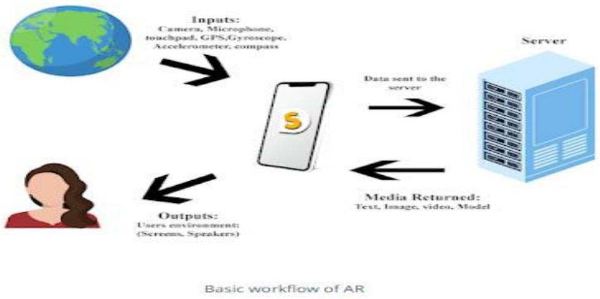
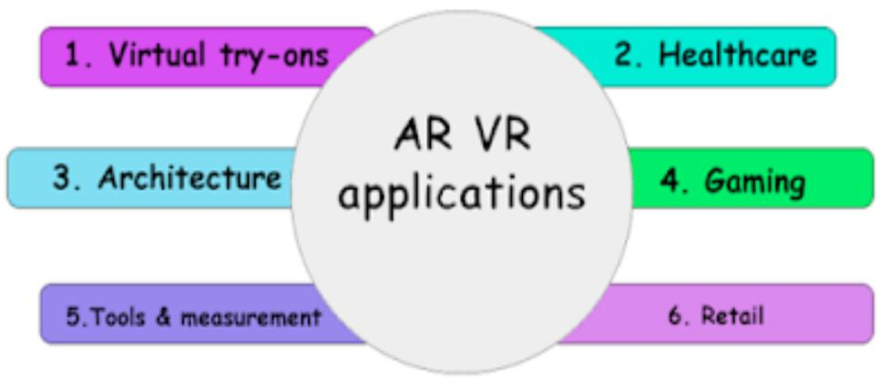
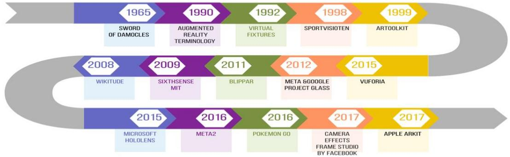
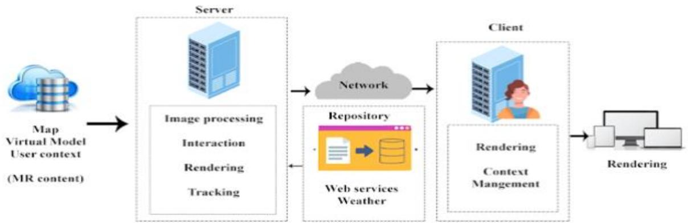

# St. Francis Institute of Technology Department of Information Technology

Class-BE(INFT) Div- A &B

# Module1:

# Introduction to Augmented Reality and Mixed Reality

# Definition and Scope

# What is augmented reality?

-Augmented reality holds the promise of creating direct, automatic, and actionable links between the physical world and electronic information. It provides a simple and immediate user interface to an electronically enhanced physical world.

- Augmented reality (AR) is the integration of digital information with the user's environment in real time. Unlike virtual reality (VR), which creates a totally artificial environment, AR users experience a real-world environment with generated perceptual information overlaid on top of it. -Augmented reality is used to either visually change natural environments in some way or to provide additional information to users. The primary benefit of AR is that it manages to blend digital and three-dimensional (3D) components with an individual's perception of the real world. AR has a variety of uses, from helping in decision-making to entertainment.

There are three characteristics that define augmented reality:

1. Combines real and virtual   
2. Interactive in real time   
3. Registered in 3D

# Key aspects (ingredients)/features of augmented reality:

1.The physical world is augmented by digital information superimposed on a view of the physical world.

2.The information is displayed in registration with the physical world.

3. The information displayed is dependent on the location of the real world and the physical rspective of the person in the physical world.

# St. Francis Institute of Technology Department of Information Technology

Academic Year: 2025-26

Class-BE(INFT) Div- A &B

4. The augmented reality experience is interactive, that is, a person can sense the information and make changes to that information if desired.

5. The level of interactivity can range from simply changing the physical perspective (e.g., seeing it from a different point of view) to manipulating and even creating new information.

Augmented reality: A medium in which digital information is overlaid on the physical world that is in both spatial and temporal registration with the physical world and that is interactive in real time.

Augmented reality (AR) is a term for a live direct or indirect view of a physical, real-world environment whose elements are augmented by computer- generated sensory input such as sound, video,graphics or GPS data.

# How does augmented reality work?

Augmented reality can be delivered in a variety of formats, including within smartphones, tablets and glasses. AR delivered through contact lenses is also being developed.

# St. Francis Institute of Technology Department of Information Technology

Academic Year: 2025-26

Class-BE(INFT) Div- A &B

- The technology requires hardware components, such as a processor, sensors, a display and in devices. Mobile devices already typically have this hardware available, with sensors includi cameras, accelerometers, Global Positioning System (GPS) and solid-state compasses.

- This helps make AR more accessible to the everyday user. A GPS is used to pinpoint the user's location, and its compass is used to detect device orientation, for example. Sophisticated AR programs used by the military for training can also include machine vision, object recognition and gesture recognition. AR can be computationally intensive, so if a device lacks processing power, data processing can be offloaded to a different machine.

- Augmented reality apps are written in special 3D programs that enable developers to tie animation or contextual digital information in the computer program to an augmented reality marker in the real world. When a computing device's AR app or browser plugin receives digital information from a known marker, it begins to execute the marker's code and layer the correct image or images.

# AR use cases

1) Retail – Consumers can use a store's online app to see how products, such as furniture, will look in their own homes before buying. E.g ‘IKEA’ App

2) Entertainment and gaming- AR can be used to overlay a virtual game in the real world or enable sers to animate their faces in different and creative ways on social media.

# St. Francis Institute of Technology Department of Information Technology

Academic Year: 2025-26

Class-BE(INFT) Div- A &B

3) Architecture- AR can help architects visualize a building project.E.g.ARki App

4) Tools and measurement- Mobile devices can use AR to measure different 3D points in the use environment.E.g.AirMeasure

5) Navigation –AR can be used to overlay a route to the user's destination over a live view of a road. E.g.Phiar-AI powered navigation tool

# A Brief History of Augmented Reality

# HISTORY

1968: Ivan Sutherland, a Harvard professor and computer scientist, created the first headmounted display called ‘The Sword of Damocles’. The user experienced computer-generated graphics that enhanced their sensory perception of the world.

1974: Myron Kruger, a computer researcher and artist, built a laboratory at the University of Connecticut called ‘Videoplace’ that was entirely dedicated to artificial reality.

1990: Tom Caudell, a Boeing researcher, coined the term ‘augmented reality’.

1992: Louis Rosenburg, a researcher in the USAF Armstrong's Research Lab, created ‘Virtual Fixtures’, which was one of the first fully functional augmented reality systems. The system allowed military personnel to virtually control and guide machinery to perform tasks like training eir US Air Force pilots on safer flying practices.

# St. Francis Institute of Technology Department of Information Technology

Academic Year: 2025-26

Class-BE(INFT) Div- A &B

1994: Julie Martin, a writer and producer, brought augmented reality to the entertainment indus for the first time with the theater production titled Dancing in Cyberspace.

1998: Sportsvision broadcasts the first live NFL game with the virtual 1st & Ten graphic system – aka the yellow yard marker. The technology displays a yellow line overlayed on top of the feed so that views can quickly see where the team just advanced to get a first down. This system is still used today, although admittedly more advanced than it was in the late ‘90s.

1999: NASA created a hybrid synthetic vision system of their X-38 spacecraft. The system leveraged AR technology to assist in providing better navigation during their test flights.

2000: Hirokazu Kato developed an open-source software library called the ARToolKit. This package helps other developers build augmented reality software programs. The library uses video tracking to overlay virtual graphics on top of the real world.

2003: Sportvision enhanced the 1st & Ten graphic to include the feature on the new Skycam system – providing viewers with an aerial shot of the field with graphics overlaid on top of it.

2009: Esquire Magazine used augmented reality in print media for the first time in an attempt to make the pages come alive. When readers scanned the cover, the augmented reality equipped magazine.

2013: Volkswagen debuted the MARTA app (Mobile Augmented Reality Technical Assistance) which primarily gave technicians step-by-step repair instructions within the service manual. This adaptation of AR technology was groundbreaking, as it could and would be applied to many different industries to align and streamline processes.

2014: Google unveiled its Google Glass devices, a pair of augmented reality glasses that users could wear for immersive experiences. Users wore the AR tech and communicated with the Internet via natural language processing commands. With this device, users could access a variety of applications like Google Maps, Google+, Gmail, and more.

2016: Microsoft starts shipping its version of wearable AR technology called the HoloLens, which is more advanced than the Google Glass, but came with a hefty price tag. It’s definitely not an everyday type of accessory.

017: IKEA released its augmented reality app called IKEA Place that changed the retail industry orever.

# St. Francis Institute of Technology Department of Information Technology

Academic Year: 2025-26

Class-BE(INFT) Div- A &B

# AR Architecture

Augmented reality architecture comprised by six key elements with some of the feature definition and the typical AR examples. The interactive relationship between different elements has been shown Fig.

1) User – It’s refer to an individual who manipulates and controls, is the immediate intended beneficiary of an AR system. For example, doctors could use augmented reality as a visualization aid and possibly collect 3-D dataset of a patient in real time during the surgery. AR system brings the benefits for both doctors and patient.

2) Interaction – Interaction is composed of two components including inter- and action. Inter means the state between or among things. Action means there is an influence and something that has been done. Therefore, interaction can be simply speaking that one entity does something and the other entity responds in some way

3) Device – The term of device means the carrier or object could acquire physical world information and provide the compelling augmentation. It could be the mobile device, desktop computer, and big screen with projector or etc.

4) Virtual Content – Virtual content means the digital information presented by AR device, which plays the most important role in the AR architecture. The modality of virtual content could be 3D animation, 2D image, text, website, audio information or even vibration. AR users will not concern too much on devices, but will be attracted by different virtual content.

5) Real content – Real content is the real-world information directly presented by device without any rendering, which includes geographic location, physical objects and real-world environment.

6) Tracking - Tracking describes the way of generating virtual content based on the real content, omprising three different features: synchronicity, antecedent and partial one to one . Due to the hanges of the real content, an AR virtual counterpart has to be updated synchronously. Once the

# St. Francis Institute of Technology Department of Information Technology

Academic Year: 2025-26

Class-BE(INFT) Div- A &B

user changes his or her point of view to another word, the displayed translation on the device rapidly changes in the same time. Antecedent means the real content (physical text) exist happens before the virtual content (the translated digital word). Partial one to one describes ano tracking feature of augmented reality. There is one and only one real content to correspond with the virtual content. However, there might be one or more than one piece of virtual information to correspond with the real-world content.

# Related Fields of AR

Difference between Mixed Reality, Virtual Reality, Immersive Reality, Extended Reality   

<table><tr><td rowspan=1 colspan=1>Parameters</td><td rowspan=1 colspan=1>MR</td><td rowspan=1 colspan=1>VR</td><td rowspan=1 colspan=1>AR</td><td rowspan=1 colspan=1>XR</td></tr><tr><td rowspan=1 colspan=1>Stands for</td><td rowspan=1 colspan=1>Mixed Reality</td><td rowspan=1 colspan=1>VirtualReality</td><td rowspan=1 colspan=1>AugmentedReality</td><td rowspan=1 colspan=1>Extended reality</td></tr><tr><td rowspan=1 colspan=1>Definition</td><td rowspan=1 colspan=1>Mixed reality isaterm  used  todescribe      themerging  of  areal-worldenvironment anda      computer-generated one.</td><td rowspan=1 colspan=1>Virtual reality isasimulatedexperience   thatemploys     posetrackingand 3Dnear-eye displaysto give the user animmersive feel ofa virtual world</td><td rowspan=1 colspan=1>Augmentedreality (AR)istheintegration ofdigitalinformationwith the user&#x27;senvironmentin real time.</td><td rowspan=1 colspan=1>Extended Reality(XR)    is    anumbrella     termencapsulatingAugmentedReality     (AR),Virtual    Reality(VR)      MixedReality (MR), andeverything      inbetween.</td></tr><tr><td rowspan=1 colspan=1>Display</td><td rowspan=1 colspan=1>Translucentdisplay</td><td rowspan=1 colspan=1>Occlusiondisplay</td><td rowspan=1 colspan=1>Translucentdisplay</td><td rowspan=1 colspan=1>Head mounteddisplay</td></tr><tr><td rowspan=1 colspan=1>Devices</td><td rowspan=1 colspan=1>Headsetandmobilel</td><td rowspan=1 colspan=1>VRheadset</td><td rowspan=1 colspan=1>ARwearables</td><td rowspan=1 colspan=1>3Glasses</td></tr><tr><td rowspan=1 colspan=1>Example</td><td rowspan=1 colspan=1>Interactivevirtual content</td><td rowspan=1 colspan=1>Virtual gaming</td><td rowspan=1 colspan=1>Augmentedvirtual mapand direction</td><td rowspan=1 colspan=1>Gaming,</td></tr></table>

# Mixed Reality

Definition: Mixed reality is a term used to describe the merging of a real-world environment and a computer-generated one. Physical and virtual objects may co-exist in mixed reality environments and interact in real time. Mixed reality is largely synonymous with augmented reality. It is a combination of virtual and augmented reality.

It combines both physical as well as virtual worlds to form a new environment where interaction etween both worlds is possible.

# St. Francis Institute of Technology Department of Information Technology

Academic Year: 2025-26

Class-BE(INFT) Div- A &B

# Applications of MR

Mixed reality have wide range of real time application following are some of them. 1) Education – There are many potential use cases for Mixed Reality in both educational settings and professional training settings.

Mixed reality technologies are being used within the education industry to both enhance students’ ability to learn and take in information. It also gives the students the opportunity to personalize the way they learn.

Using 3D projections and simulations, students can interact with and manipulate virtual objects in order to study them in a way that is relevant to themselves and their studies. By inserting threedimensional objects into a classroom as a means of gauging the size, shape, or other features of a defined “virtual” object, students can gain a deeper sense of understanding as to what it is they’re studying.

# Some ways that MR can help in the classroom?

Interact with the environment in an immersive experience.   
● Touch and manipulate objects.   
● It is an engaging and fun way of learning. MR can teach any kind of subject.

2) Entertainment- From television shows to game consoles, mixed reality has many applications in the field of entertainment.

VR entertainment has been around for decades and because of this, it’s the most acclimatized and most widely available of the three technologies. Augmented reality games and apps are coming out thick and fast since the success of Pokémon Go

But the mixed reality in entertainment is not only reserved for gaming.

AR and VR technology is improving so much that the film and big screen industry are after the vision of incorporating them into their movies. The idea of interactive storytelling which is a mix between a game and movie will open up lots of new doors for mixed reality. An example is the new Netflix series, You vs. Wild with adventure survivalist Bear Grylls, which lets you make cisions and change endings.

# St. Francis Institute of Technology Department of Information Technology

Academic Year: 2025-26

Class-BE(INFT) Div- A &B

Mixed reality entertainment is already here with companies like Magic Leap, Lucasfilm, a Industrial Light And Magic all looking to delve into mixed reality entertainment. For exampl Magic Leap’s is embracing mixed reality in cinema by using what they call a Dynamic Digitis Lightfield Signal. Magic Leap’s tech projects images directly into the eye, without the need for it to bounce off an object and then head towards the eyes. This tricks the brain into thinking the object is there when in reality, it is a projection.

3) Business firms - Mixed reality allows sellers to show the customers how a certain commodity will suit their demands.

This technology is used more and more to create business profits by incorporating a digital sense through virtual elements onto businesses thereby easing their complex processes and activities and saving time and money.

1. Easy recruiting and screening

2.Immersive and interactive marketing strategies-“try before you buy” concept. With mixed reality, product marketing becomes easy as consumers can try something before paying for it from their pockets.

3.3. Incredible training programs-Training is an essential part of any business. It is important to have experience before taking on any work in hand. A good investment is required to train workers. They are made to practice on dummy objects, before working on actual expensive objects as in the case of aircraft, automobiles, etc. It involves risk to money, property, and one’s life as well.

Mixed reality by creating an environment, where both real and virtual objects are used together to create an environment similar to real-life conditions is the best platform for training.

4. Communicating and collaborating tool

5. Help support staff connect to consumers in real-time and improve consumer analytics

4) Product content management - With mixed reality technology improvements, new forms of teractive product content management has emerged.

# St. Francis Institute of Technology Department of Information Technology

Academic Year: 2025-26

Class-BE(INFT) Div- A &B

# \*\*All AR applications are mixed reality, but not all mixed reality applications are AR

# General Architecture of Mixed Reality System

The MR content includes useful data for MR applications, such as maps, three virtual-mode models, and user context. User context contains data such as location. These data are obtained from external databases, sensors or wearable devices, and social networks. - The server component is the core of the system, which manages the MR content, executes the necessary processes, and sends the result along with the network mechanism to the client. Servers perform different analyses, such as image processing, user tracking, and 3D rendering, and set properties, such as the LOD. - If necessary, additional data through the repository is provided for the server. A good example in this regard is weather data, which is obtained from online sources. The client responds to the user to visualize the result using mechanisms such as rendering and context management. - The context management increases the level of inclusion of user preferences during rendering.

# Algorithm Steps in Mixed Reality

The algorithm is an important part of any MR application. It contains analytical mathematical models to improve the accuracy of the MR system.

Calibration - Calibration models are used to set MR devices, such as see-through tools and cameras. Such models offer many benefits. For example, the calibration model in HMD installed the user’s eyes solves the instability between the tool and the hand to enable good interaction

# St. Francis Institute of Technology Department of Information Technology

Academic Year: 2025-26

Class-BE(INFT) Div- A &B

with the virtual object (such as a virtual button), thereby allowing for more accurate cam parameter estimation

Various algorithms have been developed

● Latent Active correction algorithm - solves problem of instability Projection model using matrix transformation formula to calculate camera parameters MR Based Needle Navigation system - rendering needle trajectory and ultrasonic scanning images scanning using HMD

Model of the space and simulation - Implementing any MR scenario requires real space modeling to create the MR environment. The space modeling contains two parts: modeling a large space such as a room, and a real object such as an apple. The modeling of a large space such as a room should preserve constraints such as relationships related to the room's objects and users. The simulation of a real-world object such as apple must consider constraints such as the modeling deformation of the object.

# Algorithms :

1. Geometric symbolic modeling using VRML Formats $:$ model a room for MR applications, uses descriptor was sued to provide information regarding user and user’s location in Mr space   
2. A Toolkit for Constructing Mixed Reality Apps with Real-Time Roaming in Large Indoor Physical Spaces, this toolkit help in building virtual spaces in the form of 2d(maps), 3D scenes using sweeping analysis. It consists of anchor data located in the environment to reduce error of matching the virtual model and the reality. it also uses voronoi-based structures to edit paths, adjusting virtual object layers and fast rendering visibility preservation for the user

3. A paper on Virtual reality based on machine learning for storytelling

4. point-primitive and elastic theory model to simulate the deformation of soft tissues for surgical applications

# St. Francis Institute of Technology Department of Information Technology

Academic Year: 2025-26

Class-BE(INFT) Div- A &B

Object Recognition - Identifying a real object and tracking enables the embedding of a vir object in real space in order to implement an MR scenario. In object recognition, the object be static or dynamic in nature. A good example of dynamic object recognition is moving hu recognition.

# Algorithms:

1. image processing based approach using probability -based segmentation to detect a moving object (a human ) from the foreground to insert the virtual object such as home in a real scene   
2. image processing based on semantic segmentation using a random field as a recurrent neural networks(CRN-RNN) to provide appropriate context for display in material-aware platforms   
3. image processing using deep learning and labeling based on voice commands for object detection from images.

Object Tracking - The interaction of virtual and real objects requires them to be positioned, which is achieved using appropriate tracking techniques. The MR tracking method is divided into three classes: sensor-based, vision-based, and hybrid. The hybrid method is a combination of the first two methods to improve the shortcomings associated with each of them. Sensor-based tracking uses sensing devices. This method is categorized into categories such as GPS, visual markers, acoustical tracking systems, magnetic and inertial sensors, and hybrid systems. Vision based tracking uses computer vision with image processing. it may be feature based or model based.

# Algorithms:

circle based tracking in virtual factory layout planning   
markerless tracking using feature based tracking in Business information modeling(BIM)   
-based markerless MR   
markerless tracking driven by ICP algorithm for Mr applications for trying on shoes   
model based tracking for contour detection and spatial based tracking for depth information   
for self inspection in the BIM Model

Registration and Mapping - Interaction among virtual and real objects requires mapping and registration of the virtual model in real space. This model was implemented for heritage building inspections. This method handles the problem of mapping and registration for large data using the referred key object. The key objects were selected by the user on a presented miniature virtual odel.

# St. Francis Institute of Technology Department of Information Technology

Academic Year: 2025-26

Class-BE(INFT) Div- A &B

# Algorithms:

markerless registration tracking for surgery to register medical images on the pati uses facial features to find transformation parameters for registrations based on camera’s intrinsic parameters and headset positions   
ray tracing algorithms to locate objects in real scene.

Visualization and Rendering - Displaying MR content requires the use of appropriate analytical algorithms that handle different challenges, e.g., adding a virtual file to video images to enrich it, close-to-reality representation of the virtual object using lighting and shadow, managing the level of details regarding user position, solving occlusion and screen off for an invisible object, using standard schema for faster display, managing bulky 3D large data such as point cloud, and synthesize different display information sources.

# Algorithms:

Chroma keying with PCA fo5r immersion of virtual objects in video images used for foreground identification with separation images to the back and foreground   
Spherical harmonics light probe estimator for light estimation base on deep learning in which it processes the raw images without the need of previous knowledge about the scene DIR model for lighting modeling   
fuzzy logic model to add soft shadows to the virtual objects during embedding in a real scene.   
LOD model for visualizing the virtual historical sites   
combination of visibility-based blending and semantic segmentation to handle the occlusion problem in space MR

Information Transfer for Portable Devices - Portable MR applications require the use of appropriate models to transfer information for reconstructing scenes using mobile camera images. This model enhances the necessary objects such as a player in a game.

# Algorithms:

probabilistic methods based on Expectation maximization( EM) algorithm to create camera based model to send video files for scene reconstruction

# St. Francis Institute of Technology Department of Information Technology

Academic Year: 2025-26

Class-BE(INFT) Div- A &B

# Exercise Questions:

Q1. Write down the Algorithm steps of Mixed Reality.

Q2. Explain In general architecture of MR.

Q3. Distinguish Between AR VR and MR?

Q4. What is Visualization and Rendering?

Q.5 Explain real world applications of ARVR.

Q6. What are Key aspects (ingredients)/features of augmented reality?

Q7. What is MR, explain algorithms used in MR?