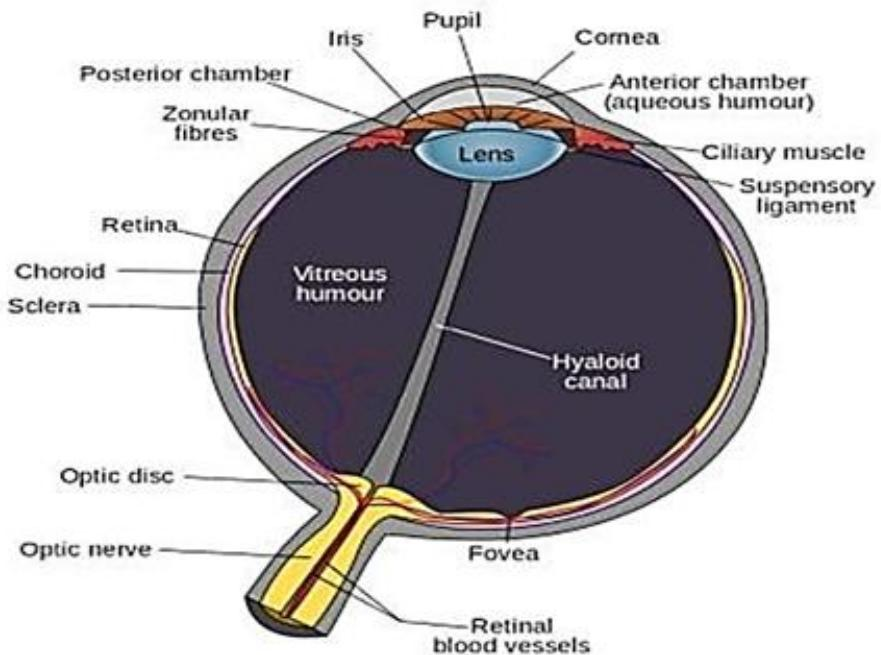
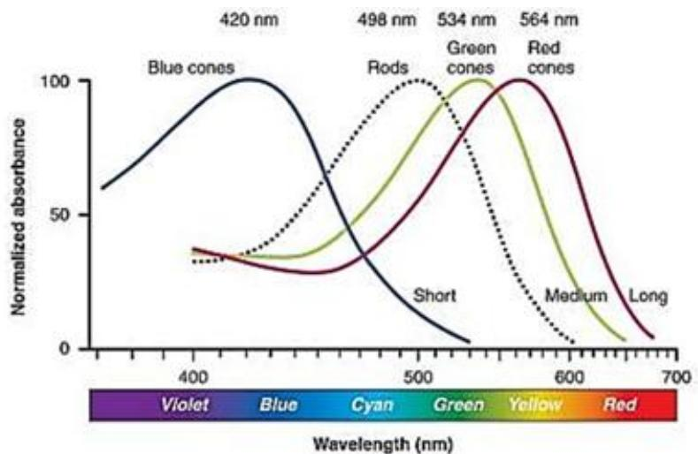
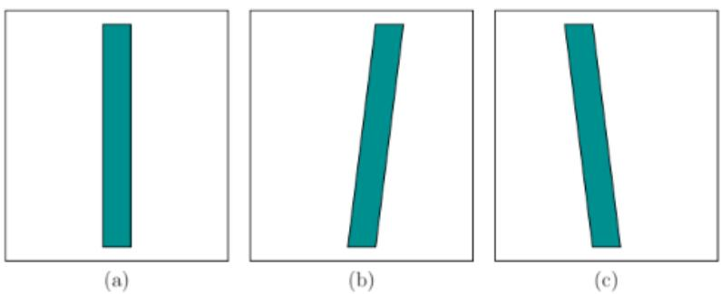

# St. Francis Institute of Technology Department of Information Technology

Academic Year: 2025-26

Class-BE(INFT) Div- A &B

# Module6:Visual Physiology, perception and tracking

6.1. Functioning of Eye with photoreceptors

6.1.1 Definition

Special cells in the eye's retina that are responsible for converting light into signals that are sent to the brain. Photoreceptors give us our color vision and night vision. There are two types of photoreceptor cells: rods and cones. A number of eye problems can involve photoreceptor cells.

  
Figure5.1:Physiology of the human cye.This viewpoint shows how the right eyewouldappearifslicedhorizontally(thenosewouldbetotheleft).(From WikipediauserRhcastilhos.

The above figure shows the physiology of a human eye. The shape is approximately spherical, with a diameter of around $2 4 \mathrm { m m }$ and only slight variation among people. The cornea is a hard, ansparent surface through which light enters and provides the greatest optical power.

# St. Francis Institute of Technology Department of Information Technology

Academic Year: 2025-26

Class-BE(INFT) Div- A &B

The rest of the outer surface of the eye is protected by a hard, white layer called the sclera. M of the eye interior consists of vitreous humor, which is a transparent, gelatinous mass that allo light rays to penetrate with little distortion or attenuation. As light rays cross the cornea, they p through a small chamber containing aqueous humour, which is another transparent, gelatinous mass.

After crossing this, rays enter the lens by passing through the pupil. The size of the pupil is controlled by a disc-shaped structure called the iris, which provides an aperture that regulates the amount of light that is allowed to pass.

The optical power of the lens is altered by ciliary muscles. After passing through the lens, rays pass through the vitreous humor and strike the retina, which lines more than $1 8 0 \textdegree$ of the inner eye boundary.

Since Figure shows a 2D cross section, the retina is shaped like an arc; however, keep in mind that it is a 2D surface. Imagine it as a curved counterpart to a visual display. To catch the light from the output pixels, it is lined with photoreceptors, which behave like “input pixels”. The most important part of the retina is the fovea; the highest visual acuity, which is a measure of the sharpness or clarity of vision, is provided for rays that land on it. The optic disc is a small hole in the retina through which neural pulses are transmitted outside of the eye through the optic nerve. It is on the same side of the fovea as the nose.

Photoreceptors The retina contains two kinds of photoreceptors for vision: 1) rods, which are triggered by very low levels of light, and 2) cones, which require more light and are designed to distinguish between colors.

# St. Francis Institute of Technology Department of Information Technology

Academic Year: 2025-26

Class-BE(INFT) Div- A &B

  
Figure5.3:Thesensitivityofrodsatd cones asafunction ofwavelength [29]. (FigureadaptedbyOpenStaxCollege.)

Figure shows the detection capabilities of each photoreceptor type. Rod sensitivity peaks at $4 9 8 \mathrm { n m }$ , between blue and green in the spectrum. Three categories of cones exist, based on whether they are designed to sense blue, green, or red light. Photoreceptors respond to light levels over a large dynamic range.

# 6.1.2 Photoreceptor density

The density of photoreceptors across the retina varies greatly.The most interesting region is the fovea, which has the greatest concentration of photoreceptors. The innermost part of the fovea has a diameter of only $0 . 5 \mathrm { m m }$ or an angular range of $\pm 0 . 8 5$ degrees, and contains almost entirely cones. This implies that the eye must be pointed straight at a target to perceive a sharp, colored image. The entire fovea has diameter $1 . 5 \mathrm { m m }$ $( \pm 2 . 6 $ degrees angular range), with the outer ring having a dominant concentration of rods.

Rays that enter the cornea from the sides land on parts of the retina with lower rod density and very low cone density. This corresponds to the case of peripheral vision. We are much better at detecting movement in our periphery, but cannot distinguish colors effectively. Peripheral vement detection may have helped our ancestors from being eaten by predators. Finally, the

# St. Francis Institute of Technology Department of Information Technology

Academic Year: 2025-26

Class-BE(INFT) Div- A &B

most intriguing part of the plot is the blind spot, where there are no photoreceptors. This is due our retinas being inside-out and having no other way to route the neural signals to the brain.

# 6.2 Resolution for VR

Resolution is defined as the number of pixels that can be displayed. The $1 9 2 0 \mathrm { ~ x ~ } 1 0 8 0$ designation on your computer monitor is the device’s resolution. In this case, a landscape-orientation monitor is 1920 pixels wide and 1080 pixels high.

Perfect Resolution for VR: 8K per Eye

Resolution is a phrase that extends beyond VR. Resolution is defined as the number of pixels that can be displayed. The $1 9 2 0 \mathrm { ~ x ~ } 1 0 8 0$ designation on your computer monitor is the device’s resolution. In this case, a landscape-orientation monitor is 1920 pixels wide and 1080 pixels high.

On a 27-inch monitor, that might not seem like much. On a VR screen measuring 3.4 or 3.6 inches, that is a lot of pixel density. However there’s a tradeoff, in that your eyes’ proximity to those tiny screens means that greater resolution is needed to avoid the dreaded screen door effect.

There are several components that go into creating a more immersive virtual experience. Some of the best VR headsets today offer around 210-degree fields of view, and high resolution spread across both eyes. Current standounts include the 2.3 megapixel Valve Index $( 1 , 4 4 0 \mathrm { ~ x ~ } 1 , 6 0 0$ pereye LCD) and the 4.7 megapixel HP Reverb G2 $( 2 , 1 6 0 \mathrm { x } 2 , 1 6 0$ per-eye LCD). Meanwhile, Varjo’s headsets have become the gold standard in VR resolution including the new consumer-geared Aero $\left. 2 , 8 8 0 \mathrm { ~ x ~ } 2 , 7 2 0 \right.$ per-eye LCD).

6.3 Eye movements and issues with it in VR

# 6.3.1 Eye Movements

Eye rotations are a complicated and integral part of human vision. They occur both voluntarily and nvoluntarily, and allow a person to fixate on features in the world, even as his head or target eatures are moving.

# St. Francis Institute of Technology Department of Information Technology

Academic Year: 2025-26

Class-BE(INFT) Div- A &B

One of the main reasons for eye movement is to position the feature of interest on the fovea .o the fovea can sense dense, color images, and it unfortunately spans a very narrow field of vie To gain a coherent, detailed view of a large object, the eyes rapidly scan over it while fixating points of interest.

Another reason for eye movement is that our photoreceptors are slow to respond to stimuli due to their chemical nature. They take up to $1 0 \mathrm { m s }$ to fully respond to stimuli and produce a response for up to $1 0 0 \mathrm { m s }$ .

Eye movements help keep the image fixed on the same set of photoreceptors so that they can fully charge. This is similar to the image blurring problem that occurs in cameras at low light levels and slow shutter speeds.

Additional reasons for eye movement are to maintain a stereoscopic view and to prevent adaptation to a constant stimulation. To support the last claim, it has been shown experimentally that when eye motions are completely suppressed, visual perception disappears completely . As movements combine to build a coherent view, it is difficult for scientists to predict and explain how people interpret some stimuli.

Eye muscles The rotation of each eye is controlled by six muscles that are each attached to the sclera (outer eyeball surface) by a tendon. The tendons pull on the eye in opposite pairs.

For example, to perform a yaw (side-to-side) rotation, the tensions on the medial rectus and lateral rectus are varied while the other muscles are largely unaffected. To cause a pitch motion, four muscles per eye become involved. All six are involved to perform both a pitch and yaw, for example, looking upward and to the right. A small amount of roll can be generated; however, our eyes are generally not designed for much roll motion. Imagine if you could turn your eyeballs upside-down inside of their sockets! Thus, it is reasonable in most cases to approximate eye rotations as a 2D set that includes only yaw and pitch, rather than the full 3 DOFs obtained for rigid body rotations

Types of movements We now consider movements based on their purpose, resulting in six categories:

1) saccades   
2) smooth pursuit   
3) vestibulo-ocular reflex,   
) optokinetic reflex,   
) vergence,

# St. Francis Institute of Technology Department of Information Technology

Academic Year: 2025-26

Class-BE(INFT) Div- A &B

# 6) microsaccades.

All of these motions cause both eyes to rotate approximately the same way, except for vergen which causes the eyes to rotate in opposite directions:

1. Saccades -The eye can move in a rapid motion called a saccade, which lasts less than $4 5 \mathrm { m s }$ with rotations of about $9 0 0 \mathrm { { o } }$ per second. The purpose is to quickly relocate the fovea so that important features in a scene are sensed with highest visual acuity. Each transition between features is accomplished by a saccade. Interestingly, our brains use saccadic masking to hide the intervals of time over which saccades occur from our memory. Although saccades frequently occur while we have little or no awareness of them, we have the ability to consciously control them as we choose features for fixation.

2. Smooth pursuit -In the case of smooth pursuit, the eye slowly rotates to track a moving target feature. Examples are a car, a tennis ball, or a person walking by. The rate of rotation is usually less than $3 0 \textdegree$ per second, which is much slower than for saccades. The main function of smooth pursuit is to reduce motion blur on the retina; this is also known as image stabilization. The blur is due to the slow response time of photoreceptors, If the target is moving too fast, then saccades may be intermittently inserted into the pursuit motions to catch up to it.

3. Vestibulo-ocular reflex -One of the most important motions to understand for VR is the vestibulo-ocular reflex or VOR. Hold your finger at a comfortable distance in front of your face and fixate on it. Next, yaw your head back and forth (like you are nodding “no”), turning about 20 or 30 degrees to the left and right sides each time. You may notice that your eyes are effortlessly rotating to counteract the rotation of your head so that your finger remains in view. The eye motion is involuntary. If you do not believe it, then try to avoid rotating your eyes while paying attention to your finger and rotating your head. It is called a reflex because the motion control bypasses higher brain functions. Based on angular accelerations sensed by vestibular organs, signals are sent to the eye muscles to provide the appropriate counter motion. The main purpose of the VOR is to provide image stabilization, as in the case of smooth pursuit.

. Optokinetic reflex -The next category is called the optokinetic reflex, which occurs when a fast bject speeds along. This occurs when watching a fastmoving train while standing nearby on fixed

# St. Francis Institute of Technology Department of Information Technology

Academic Year: 2025-26

Class-BE(INFT) Div- A &B

ground. The eyes rapidly and involuntarily choose features for tracking on the object, wh alternating between smooth pursuit and saccade motions.

5. Vergence -Stereopsis refers to the case in which both eyes are fixated on the same object, resulting in a single perceived image. Two kinds of vergence motions occur to align the eyes with an object. If the object is closer than a previous fixation, then a convergence motion occurs. This means that the eyes are rotating so that the pupils are becoming closer. If the object is further, then divergence motion occurs, which causes the pupils to move further apart. The eye orientations resulting from vergence motions provide important information about the distance of objects.

# 6.3.2 Issues in VR applications due to eye movement

Eye Strain Eye strain is not unique to VR headsets, but it is nonetheless a risk. Eye strain happens when the eyes are put through intense use. It is a form of fatigue. Any eye discomfort caused by focusing the eyes on an object (or objects) for long periods of time would be considered eye strain, whether this happens while looking at a computer screen, reading in poor visibility, driving for extended periods of time, or using a virtual reality headset.

Eye strain is known as asthenopia, and it is also referred to as eye fatigue. Symptoms include tired eyes, which simply means difficulty with focusing vision, blurry vision, headaches, and sometimes double vision. These usually result from intense use of the eyes for visual tasks, often without adequate eye care and breaks.

Dry Eyes Most people tend to blink less than normal when carrying out visual tasks that require concentration, especially in gaming. A decrease in blinking can cause the surface of the eyes to become dry, which leads to eye pain and dry eyes. This is particularly true with a VR headset, which can be both heavy and hot to use

Foveated rendering One of the frustrations with this analysis is that we have not been able to exploit that fact that photoreceptor density decreases away from the fovea. We had to keep the ixel density high everywhere because we have no control over which part of the display the user ill be look at. If we could track where the eye is looking and have a tiny, movable display that is

# St. Francis Institute of Technology Department of Information Technology

Academic Year: 2025-26

Class-BE(INFT) Div- A &B

always positioned in front of the pupil, with zero delay, then much fewer pixels would be need This would greatly decrease computational burdens on graphical rendering systems Instead moving a tiny screen, the process can be simulated by keeping the fixed display but focusing graphical rendering only in the spot where the eye is looking. This is called foveated rendering, which has been shown to work [106], but is currently too costly and there is too much delay and other discrepancies between the eye movements and the display updates. In the near future, it may become an effective approach for the mass market.

VOR gain adaptation The VOR gain is a ratio that compares the eye rotation rate (numerator) to counter the rotation and translation rate of the head (denominator). Because head motion has six DOFs, it is appropriate to break the gain into six components. In the case of head pitch and yaw, the VOR gain is close to 1.0. For example, if you yaw your head to the left at $1 0 ~ \textdegree$ per second, then your eyes yaw at $1 0 \textdegree$ per second in the opposite direction. The VOR roll gain is very small because the eyes have a tiny roll range. The VOR translational gain depends on the distance to the features.The VOR comfortably adapts to this problem by changing the gain. Now suppose that you are wearing a VR headset that may suffer from flaws such as an imperfect optical sys- tem, tracking latency, and incorrectly rendered objects on the screen. In this case, adaptation may occur as the brain attempts to adapt its perception of stationarity to compensate for the flaws. In this case, your visual system could convince your brain that the headset is functioning correctly, and then your perception of stationarity in the real world would become distorted until you readapt. For example, after a flawed VR experience, you might yaw your head in the real world and have the sensation that truly stationary objects are sliding back and forth!2

Display scanout cameras have either a rolling or global shutter based on whether the sensing elements are scanned line-by-line or in parallel. Displays work the same way, but whereas cameras are an input device, displays are the output analog. Most displays today have a rolling scanout (called raster scan), rather than global scanout. This implies that the pixels are updated line by line This procedure is an artifact of old TV sets and monitors, which each had a cathode ray tube (CRT) with phosphor elements on the screen. An electron beam was bent by electromagnets so that it would repeatedly strike and refresh the glowing phosphors. Due to the slow charge and response time of photoreceptors, we do not perceive the scanout pattern during normal use. However, when ur eyes, features in the scene, or both are moving, then side effects of the rolling scanout may ecome perceptible.\

# St. Francis Institute of Technology Department of Information Technology

Academic Year: 2025-26

Class-BE(INFT) Div- A &B

Figure 5.26 shows how a rectangle would distort under cases of smooth pursuit and VOR. O possibility is to fix this by rendering a distorted image that will be corrected by the distortion d to the line-by-line scanout [217] (this was later suggested in [1]). Constructing these imag requires precise calculations of the scanout timings. Yet another problem with displays is that the pixels could take so long to switch (up to $2 0 \mathrm { m s }$ ) that sharp edges appear to be blurred.

Retinal image slip Recall that eye movements contribute both to maintaining a target in a fixed location on the retina (smooth pursuit, VOR) and also to changing its location slightly to reduce perceptual fading (microsaccades). During ordinary activities (not VR), the eyes move and the image of a feature may move slightly on the retina due to motions and optical distortions. This is called retinal image slip. Once a VR headset is used, the motions of image features on the retina might not match what would happen in the real world. This is due tomany factors already mentioned, such as optical distortions, tracking latency, and display scanout. Thus, the retinal image slip due to VR artifacts does not match the retinal image slip encountered in the real world. The consequences of this have barely been identified, much less characterized scientifically. They are likely to contribute to fatigue, and possibly VR sickness.

Vergence-accommodation mismatch accommodation is the process of changing the eye lens’ optical power so that close objects can be brought into focus. This normally occurs with both eyes fixated on the same object, resulting in a stereoscopic view that is brought into focus. In the real world, the vergence motion of the eyes and the accommodation of the lens are tightly coupled. For example, if you place your finger $1 0 \mathrm { c m }$ in front of your face, then your eyes will try to increase he lens power while the eyes are strongly converging. If a lens is placed at a distance of its focal ength from a screen, then with normal eyes it will always be in focus while the eye is relaxed.

# St. Francis Institute of Technology Department of Information Technology

Academic Year: 2025-26

Class-BE(INFT) Div- A &B

What if an object is rendered to the screen so that it appears to be only $1 0 \mathrm { { c m } }$ away? In this ca the eyes strongly converge, but they do not need to change the optical power of the eye lens. T eyes may nevertheless try to accommodate, which would have the effect of blurring the perceiv image. The result is called vergence-accommodation mismatch because the stimulus provided by VR is inconsistent with the real world. Even if the eyes become accustomed to the mismatch, the user may feel extra strain or fatigue after prolonged use. The eyes are essentially being trained to allow a new degree of freedom: Separating vergence from accommodation, rather than coupling them. New display technologies may provide some relief from this problem, but they are currently too costly and imprecise. For example, the mismatch can be greatly reduced by using eye tracking to estimate the amount of vergence and then altering the power of the optical system.

# 6. 4 Neuroscience of vision

Visual Neuroscience is a branch of neuroscience that focuses on the visual system of the human body, mainly located in the brain's visual cortex. The main goal of visual neuroscience is to understand how neural activity results in visual perception, as well as behaviors dependent on vision. In the past, visual neuroscience has focused primarily on how the brain (and in particular the Visual Cortex) responds to light rays projected from static images and onto the retina. While this provides a reasonable explanation for the visual perception of a static image, it does not provide an accurate explanation for how we perceive the world as it really is, an ever-changing, and ever-moving 3-D environment. The topics summarized below are representative of this area, but far from exhaustive. To be less topic specific, one can see this textbook for the computational link between neural activities and visual perception and behavior: "Understanding vision: theory, models, and data" , published by Oxford University Press 2014.

# 6.5 Depth and motion perception

# Depth Perception

If a depth cue is derived from the photoreceptors or movements of a single eye, then it is called a monocular depth cue. If both eyes are required, then it is a stereo depth cue. There are many more monocular depth cues than stereo, which explains why we are able to infer so much depth formation from a single photograph.

# St. Francis Institute of Technology Department of Information Technology

Academic Year: 2025-26

Class-BE(INFT) Div- A &B

# Monocular Depth Cues—

Retinal image size-Many cues result from the geometric distortions caused by perspec projection . For a familiar object, such as a human, coin, or basketball, we often judge its distance by how “large” is appears to be.The size of the image on the retina is proportional to $1 / z .$ , in which z is the distance from the eye (or the common convergence point for all projection lines). The same thing happens when taking a picture with a camera: A picture of a basketball would occupy larger part of the image, covering more pixels, as it becomes closer to the camera. This cue is called retinal image size.

Two important factors exist. First, the viewer must be familiar with the object to the point of comfortably knowing its true size. For familiar objects, such as people or cars, our brains performance size constancy scaling by assuming that the distance, rather than the size, of the person is changing if they come closer.

Size constancy falls of the general heading of subjective constancy, which appears through many aspects of perception, including shape, size, and color. The second factor is that, the object must be appear naturally so that it does not conflict with other depth cues. If there is significant uncertainty about the size of an object, then knowledge of its distance should contribute to estimating its size.

This falls under size perception, which is closely coupled to depth perception. Cues for each influence the other, in a way discussed in Section 6.4. One controversial theory is that our perceived visual angle differs from the actual visual angle. The visual angle is proportional to the retinal image size. This theory is used to explain the illusion that the moon appears to be larger when it is near the horizon.

# Height in the visual field

Suppose that we can see over a long distance without obstructions. Due to perspective projection, the horizon is a line that divides the view in half. The upper half is perceived as the sky, and the lower half is the ground. The distance of objects from the horizon line corresponds directly to their distance due to perspective projection: The closer to the horizon, the further the perceived distance. ize constancy scaling, if available, combines with the height in the visual field.

# St. Francis Institute of Technology Department of Information Technology

Academic Year: 2025-26

Class-BE(INFT) Div- A &B

Subject-ARVR

Accommodation-The human eye lens can change its optical power through the process accommodation. For young adults, the amount of change is around 10D (diopters), but it decrea to less than 1D for adults over 50 years old. The ciliary muscles control the lens and their tensi level is reported to the brain through efference copies of the motor control signal. This is the first depth cue that does not depend on signals generated by the photoreceptors.

Motion parallax- Up until now, the depth cues have not exploited motions. If you have ever looked out of the side window of a fast-moving vehicle, you might have noticed that the nearby objects race by much faster than further objects.

The relative difference in speeds is called parallax and is an important depth cue; see Even two images, from varying viewpoints within a short amount of time, provide strong depth information. Imagine trying to simulate a stereo rig of cameras by snapping one photo and quickly moving the camera sideways to snap another. If the rest of the world is stationary, then the result is roughly equivalent to having two side-by-side cameras. Pigeons frequently bob their heads back and forth to obtain stronger depth information than is provided by their pair of eyes. Finally, closely related to motion parallax is optical flow, which is a characterization of the rates at which features move across the retina.

# Stereo Depth Cues—---

As you may expect, focusing both eyes on the same object enhances depth perception. Humans perceive a single focused image over a surface in space called the horopter. Similar to the accommodation cue case, motor control of the eye muscles for vergence motions provides information to the brain about the amount of convergence, thereby providing a direct estimate of distance. Each eye provides a different viewpoint, which results in different images on the retina. This phenomenon is called binocular disparity. The viewpoint is shifted to the right or left to provide a lateral offset for each of the eyes. The transform essentially shifts the virtual world to either side. The same shift would happen for a stereo rig of side-by-side cameras in the real world. owever, the binocular disparity for humans is different because the eyes can rotate to converge, n addition to having a lateral offset. Thus, when fixating on an object, the retinal images between

# St. Francis Institute of Technology Department of Information Technology

Academic Year: 2025-26

Class-BE(INFT) Div- A &B

the left and right eyes may vary only slightly, but this nevertheless provides a powerful cue us by the brain

Furthermore, when converging on an object at one depth, we perceive double images of objects other depths (although we usually pay no attention to it).

This double-image effect is called diplopia. You can perceive it by placing your finger about $2 0 \mathrm { c m }$ in front of your face and converging on it. While fixating on your finger, you should perceive double images of other objects around the periphery. You can also stare into the distance while keeping your finger in the same place. You should see a double image of your finger. If you additionally roll your head back and forth, it should appear as if the left and right versions of your finger are moving up and down with respect to each other. These correspond to dramatic differences in the retinal image, but we are usually not aware of them because we perceive both retinal images as a single image.

Motion Perception

We rely on our vision to perceive motion for many crucial activities. One use is to separate a moving figure from a stationary background. For example, a camouflaged animal in the forest might only become noticeable when moving. This is clearly useful whether humans are the hunter or the hunted. Motion also helps people to assess the 3D structure of an object. Imagine assessing the value of a piece of fruit in the market by rotating it around. Another use is to visually guide actions, such as walking down the street or hammering a nail. VR systems have the tall order of replicating these uses in a virtual world in spite of limited technology. Just as important as the perception of motion is the perception of nonmotion, which we called perception of stationarity Stroboscopic apparent motion Nearly everyone on Earth has seen a motion picture, whether through a TV, smartphone, or movie screen. The motions we see are an illusion because a sequence of still pictures is being flashed onto the screen. This phenomenon is called stroboscopic apparent motion; it was discovered and refined across the 19th century . The zoetrope, shown in Figure 6.15 was developed around 1834. It consists of a rotating drum with slits that allow each frame to be visible for an instant while the drum rotates.

6.6 Frame rates and display

# 6.1 Frame Rates

# St. Francis Institute of Technology Department of Information Technology

Academic Year: 2025-26

Class-BE(INFT) Div- A &B

How many frames per second are appropriate for a motion picture?

The answer depends on the intended use. Stroboscopic apparent motion begins at 2 FPS. Imagi watching a security video at this rate. It is easy to distinguish individual frames, but the motion a person would also be perceived. Once 10 FPS is reached, the motion is obviously more smooth and we start to lose the ability to distinguish individual frames. Early silent films ranged from 16 to 24 FPS. The frame rates were often fluctuating and were played at a faster speed than they were filmed. Once sound was added to film, incorrect speeds and fluctuations in the speed were no longer tolerated because both sound and video needed to be synchronized. This motivated playback at the fixed rate of 24 FPS, which is still used today by the movie industry. Personal video cameras remained at 16 or 18 FPS into the 1970s. The famous Zapruder film of the Kennedy assassination in 1963 was taken at 18.3 FPS. Although 24 FPS may be enough to perceive motions smoothly, a large part of cinematography is devoted to ensuring that motions are not so fast that jumps are visible due to the low frame rate. Video see-through displays are one of the most popular and widely used display technologies when it comes to virtual reality. It generally takes video images from one or two cameras and superimposes it with digitally generated imagery. The combined image then becomes the display that the user views.

6.7 Orientation tracking, tilt and yaw drift correction

# 6.7.1 Tracking 2D Orientation

This section explains how the orientation of a rigid body is estimated using an inertial measurement unit (IMU). The main application is determining the viewpoint orientation,while the user is wearing a VR headset.

Another application is estimating the orientation of a hand-held controller. For example, suppose we would like to make a laser pointer that works in the virtual world, based on a direction indicated by the user. The location of a bright red dot in the scene would be determined by the estimated orientation of a controller. More generally, the orientation of any human body part or moving object in the physical world can be determined if it has an attached IMU.

Four general problems must be solved to make an effective tracking system, even for this simple case:

Calibration: If a better sensor is available, then the two can be closely paired so that the outputs f the worse sensor are transformed to behave as closely to the better sensor as possible.

# St. Francis Institute of Technology Department of Information Technology

Academic Year: 2025-26

Class-BE(INFT) Div- A &B

2. Integration: The sensor provides measurements at discrete points in time, resulting in a sampli rate. The orientation is estimated by aggregating or integrating the measurements.

3. Registration: The initial orientation must somehow be determined, either by an additional sensor, or a clever default assumption .

4. Drift error: As the error grows over time, other sensors are needed to directly estimate it and compensate for it. The process of combining information from multiple sensor readings is often called sensor fusion or filtering

# 6.7.2 Tracking 3D Orientation

Calibration - The sensor outputs are distorted due to calibration issues. In the one-dimensional angular velocity case, there were only two parameters, for scale and offset. In the 3D setting, this would naturally extend to 3 scale and 3 offset parameters; however, the situation is worse because there may also be errors due to non-orthogonality of the MEMS elements. All of these can be accounted for by 12 parameters arranged in a homogeneous transform matrix:

There are 12 and not 6 DOFs because the upper left, 3-by-3, matrix is not constrained to be a rotation matrix. The j, $\mathbf { k }$ , and ℓ parameters correspond to offset, whereas all others handle scale and non-orthogonality

Integration - Now consider the problem converting the sequence of gyroscope outputs into an estimate of the 3D orientation.

At each stage $\mathrm { k \Omega }$ a vector $\boldsymbol { \omega } \mathrm { [ k ] } = \mathrm { ( \hat { \omega } ) ( \omega \mathrm { x [ k ] , \omega \mathrm { \hat { y } [ k ] , \omega \mathrm { \hat { z } [ k ] ) } } } }$ arrives from the sensor. In Section 9.1, the sensor output $\mathrm { { \hat { \omega } } _ { \mathrm { { G } } } [ k ] }$ was converted to a change $\Delta \Theta [ \mathrm { k } ]$ in orientation. For the 3D case, the change in orientation is expressed as a quaternion

Registration - The registration problem for the yaw component is the same.The forward direction may be chosen from the initial orientation of the rigid body or it could be determined with respect to a fixed direction in the world. The pitch and roll components should be determined so that they align with gravity. The virtual world should not appear to be tilted with respect to the real world less that is the desired effect, which is rarely the case).

# St. Francis Institute of Technology Department of Information Technology

Academic Year: 2025-26

Class-BE(INFT) Div- A &B

Tilt correction -The drift error $\mathrm { d ( t ) }$ in was a single angle, which could be positive or negati If added to the estimate $\cdot \Theta ( \mathfrak { t } )$ , the true orientation $\Theta ( \mathfrak { t } )$ would be obtained. It is similar for t 3D case, but with quaternion algebra. The 3D drift error is expressed as $\mathsf { d } ( \mathsf { t } ) = \mathsf { q } ( \mathsf { t } )$ $\hat { \mathsf { q } } ^ { \star } - 1$ (t), Yaw correction -The remaining drift error component is detected by a   
“compass”, which outputs a vector that lies in the world xz plane and always points “north”. Suppose this is ${ \bf { \hat { n } } } = \left( { 0 , 0 , - 1 } \right)$ . Once again, the sensor output occurs in the coordinate frame of the body, and needs to be transformed by   
$\mathrm { \hat { \varphi } q [ k ] }$ . The difference between $\scriptstyle \mathbf { \hat { n } }$ and the $- \mathbf { Z }$ axis is the resulting yaw drift error.   
6.8 Tracking with camera

# 6.8.1 Tracking Position and Orientation

Six-DOF tracking enables eye from to be fully derived from sensor data, rather than inventing positions from a plausible head model. By estimating the position, the powerful depth cue of parallax becomes much stronger as the user moves her head from side to side. She could even approach a small object and look at it from any viewpoint, such as from above, below, or the sides. The methods in this section are also useful for tracking hands in space or objects that are manipulated during a VR experience.

Make your own waves The IMU-based approach to tracking was passive in the sense that it relied on sources of information that already exist in the environment. Instead, an active approach can be taken by transmitting waves into the environment. Since humans operate in the same environment, waves that are perceptible, such as light and sound, are not preferred. Instead, common energy sources in active tracking systems include infrared, ultrasound, and electromagnetic fields. Consider transmitting an ultrasound pulse (above 20, $0 0 0 ~ \mathrm { H z } )$ from a speaker and using a microphone to listen for its arrival. This is an example of an emitterdetector pair: The speaker is the emitter, and the microphone is the detector. If time measurement is synchronized between source and destination, then the time of arrival (TOA or time of flight) can be calculated. This is the time that it took for the pulse to travel the distance d between the emitter and detector. Based on the known propagation speed in the medium $3 3 0 ~ \mathrm { m / s }$ for ultrasound), the distance $\mathrm { \hat { \Omega } d }$ is stimated. One frustrating limitation of ultrasound systems is reverberation between surfaces, ausing the pulse to be received multiple times at each detector.

# St. Francis Institute of Technology Department of Information Technology

Academic Year: 2025-26

Class-BE(INFT) Div- A &B

The power of visibility The most powerful paradigm for 6-DOF tracking is visibility. T idea is to identify special parts of the physical world called features and calculate their positio along a line-of-sight ray to a known location. Figure 9.11 shows an example inspired by a came but other hardware could be used. One crucial aspect for tracking is distinguishability. If all features appear to be the same, then it may become difficult to determine and maintain “which is which” during the tracking process. Each feature should be assigned a unique label that is invariant over time, as rigid bodies in the world move.

The most common sensor used to detect features is a digital camera. Detecting, labeling, and tracking features are common tasks in computer vision or image processing. here are two options for features:

1. Natural: The features are automatically discovered, assigned labels, and maintained during the tracking process.

2. Artificial: The features are engineered and placed into the environment so that they can be easily detected, matched to preassigned labels, and tracked. For artificial features, one of the simplest solutions is to print a special tag onto the object to be tracked. For example, one could print bright red dots onto the object and then scan for their appearance as red blobs in the image. To solve the distinguishability problem, multiple colors, such as red, green, blue, and yellow dots, might be needed. Trouble may occur if these colors exist naturally in other parts of the image. A more reliable method is to design a specific tag that is clearly distinct from the rest of the image. Such tags can be coded to contain large amounts of information, including a unique identification number. One of the most common coded tags is the QR code.

# St. Francis Institute of Technology Department of Information Technology

Academic Year: 2025-26

Class-BE(INFT) Div- A &B

# References:

https://jov.arvojournals.org/article.aspx?articleid=2191910

https://www.aao.org/eye  
health/anatomy/photoreceptors#:\~:tex $\underline { { \underline { { \mathbf { \Pi } } } } }$ Special%20cells%20in%20the%20eye%27s,problems% 20can%20involve%20photoreceptor%20cells.

https://arinsider.co/2021/12/09/vr-resolution-field-of-view-and-the-science-of-the-human-eye/

https://en.wikipedia.org/wiki/List_of_virtual_reality_headsets#/media/File:Resolution_VR_head sets.png

https://www.youtube.com/watch?v=bjL-Z7fW2FM